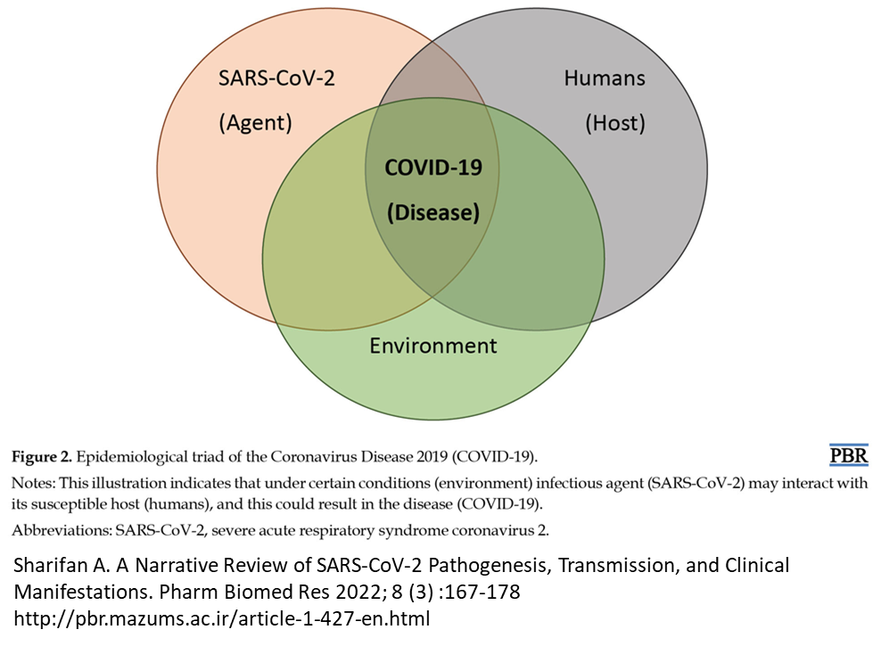
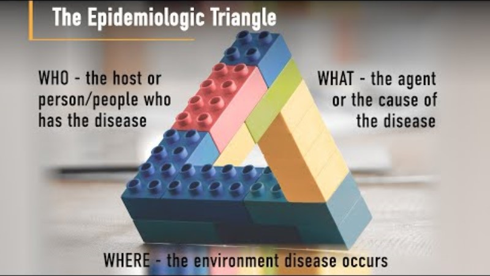
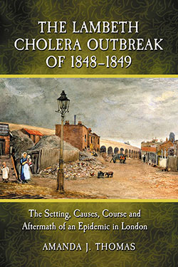
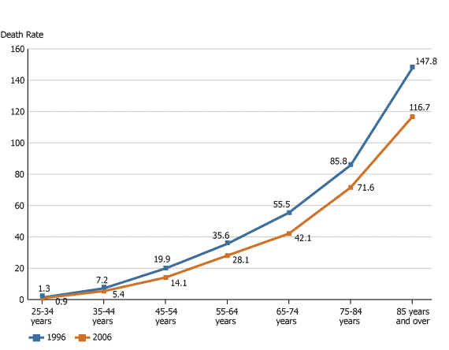
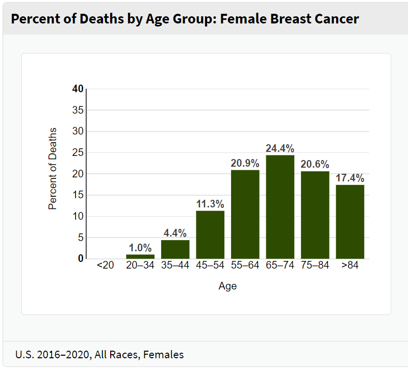
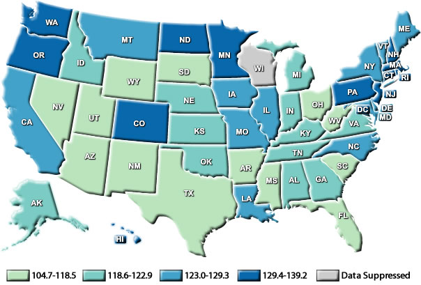
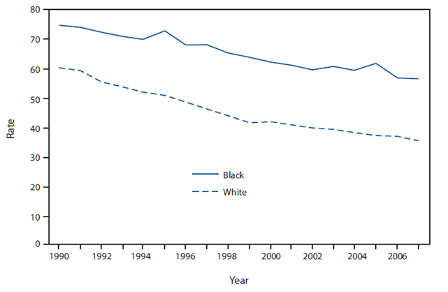
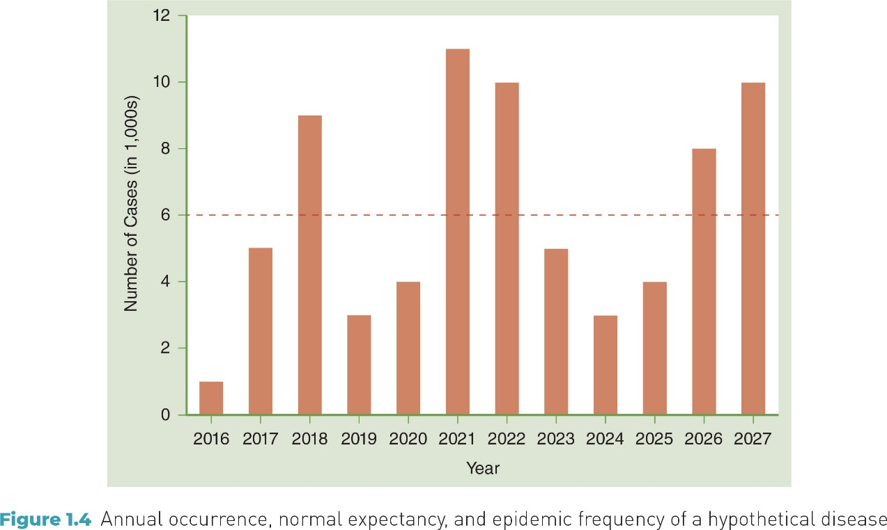
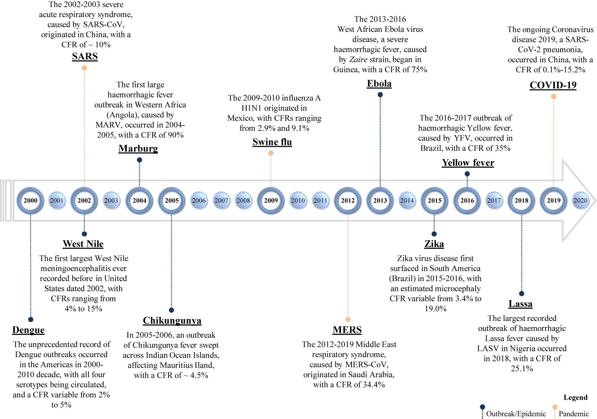

## Course Learning objectives

1. Define epidemiology and key associated terminology, especially confounding.
2. Distinguish among association, prediction, and causation.
3. Explain the Rothman model of sufficient-component causes (RMSCC) and the concept of multifactorial causation.
4. Explain the limitations of anecdotal evidence in drawing epidemiologic conclusions.
5. Explain why disseminating risk information is sometimes necessary but rarely sufficient to improve population health.

::: {.notes}
By the end of this course, my goal is for you to be able to:
:::

## Lecture Learning objectives

<!-- Improve -->

1. Unpack the definition and assumptions of epidemiology
2. Identify key events in the history of epidemiology
3. Distinguish between disease distribution patterns: epidemics, endemics, and pandemics
4. Describe at least three uses of epidemiology

## What is Epidemiology? {.compact}

<!-- Replace the graphic on this slide. Replace with a Poll Everywhere questions. What is Epidemiology? -->

::: {.grid-2 .align-center}
::: {.definition-copy}
**EPIDEMIOLOGY**

- epi -- “on, upon”
- demo -- “people”
- ology -- “study of”

**Definition:** the study of the distribution and determinants of health-related states or events (e.g. infectious disease) in specified (human) populations and the application of this study to control health problems

\--- James Last, 1995, *A Dictionary of Epidemiology*
:::

::: {.figure-frame}
{fig-alt="Venn diagram showing SARS-CoV-2 as the agent, humans as the host, and the environment overlapping around COVID-19 as the disease."}
:::
:::

## The Epidemiologic Triangle {.figure-only}

<!-- REVIEW COMMENT — Source slide 6: Update the graphic -->

{fig-alt="A triangle built from toy blocks labels who as the host, what as the agent, and where as the environment in which disease occurs."}

## Scenario Exercise {.compact}

<!-- Add a Poll Everywhere quiz or replace with a Poll Everywhere quiz. -->
<!-- I'm also not sure what answer she was looking for here. -->

1. **Scenario:** A city health department notices that one neighborhood has twice the rate of asthma ER visits compared to another neighborhood in the same city. This difference has been observed every year for the past three years.
2. **Questions:** Do you think this difference is mostly due to random chance—yes or no? If it’s not random, what is one thing that might explain the difference?
3. **What are we assuming if we believe those factors matter?**

## Assumptions of Epidemiology

<!-- Is this in the book? -->

::: {.grid-2 .assumption-grid}
::: {.panel}
**ASSUMPTION 1**

### Human disease does not occur at random

Disease frequency and distribution vary because of identifiable factors that increase or decrease risk.
:::

::: {.panel}
**ASSUMPTION 2**

### Determinants of disease can be identified

Causal and preventive factors can be studied through systematic investigation of populations.
:::
:::

## Descriptive and Analytic Epidemiology

**Descriptive Epidemiology Is A Necessary Antecedent Of Analytic Epidemiology** <!-- I'm not sure this is accurate -->

::: {.grid-2}
::: {.panel}
**DISTRIBUTION**

### Descriptive epidemiology

- When was the population affected?
- Where was the population affected?
- Who was affected?
:::

::: {.panel}
**DETERMINANTS**

### Analytic epidemiology

- How was the population affected?
- Why was the population affected?
:::
:::

## Cholera Outbreak In London {.compact}

<!-- Replace with a Poll Everywhere question. -->

::: {.grid-2 .book-grid}
::: {}
**Cholera Symptoms**

Cholera is an extremely virulent disease that can cause severe acute watery diarrhea. Cholera affects both children and adults and can kill within hours if untreated.

It takes between 12 hours and 5 days for a person to show symptoms after ingesting contaminated food or water.
:::

::: {.figure-frame .book-cover}
{fig-alt="Book cover for The Lambeth Cholera Outbreak of 1848–1849 by Amanda J. Thomas."}
:::
:::

## Micro-Activity: Thinking Like an Epidemiologist {.compact}

1. Watch the short video on John Snow and cholera. [John Snow: Pioneer of Epidemiology](https://kera.pbslearningmedia.org/resource/envh10.sci.life.nathis.johnsnow/john-snow-pioneer-of-epidemiology/)
2. As you watch, focus on these questions:  
   What patterns did Snow observe? *(Who, where, when — descriptive epidemiology)*
3. What explanation was he testing? *(How, why — analytic epidemiology)*  
   **Descriptive epidemiology comes first, analytic epidemiology builds on it.**

::: {.notes}
[Sources]
- PBS LearningMedia, John Snow: Pioneer of Epidemiology, https://kera.pbslearningmedia.org/resource/envh10.sci.life.nathis.johnsnow/john-snow-pioneer-of-epidemiology/ (inherited link).
[/Sources]
:::

## History of Epidemiology: Key Events {.history-table}

<!-- Replace with a Poll Everywhere question. Is matching an option? -->

<!-- REVIEW COMMENT — Source slide 12:
Discussion: No need to memorize these. But, let's talk about why they are important.
-->

| Event | Time Period | Description |
|---|---|---|
| Bubonic Plague Epidemics (Black Death) | 1347 - 1351 | One of the deadliest pandemics, causing 75–200 million deaths in Eurasia. |
| Development of Toxicology | 16th Century | Paracelsus, "Father of Toxicology," introduced the principle: "The dose makes the poison." |
| Development of Biostatistics | 18th Century | John Graunt pioneered statistical analysis, using Bills of Mortality to study disease patterns in London. |
| Development of Smallpox Vaccine | 1796 | Edward Jenner created the first vaccine by using cowpox to confer immunity to smallpox. |
| 1918 Influenza Pandemic | 1918-19 | The "Spanish flu" infected a third of the global population, killing 50–100 million. |
| Identification of Smoking as a Cause of Cancer | 1950 | Landmark studies linked smoking to lung cancer, driving public health campaigns against tobacco use. |
| Eradication of Smallpox | 1980 | WHO declared smallpox eradicated, marking the success of global vaccination efforts. |

## Renowned Epidemiology Scholars {.compact}

<!-- REVIEW COMMENT — Source slide 13: We can probably drop this slide. -->

**How Epidemiologists Learned to Think:**

Hippocrates → Environment and behavior influence health  
John Graunt → Counting populations reveals disease patterns  
William Farr → Vital statistics and surveillance systems  
John Snow → Using population data to identify causes  
Alexander Louis → Quantitative reasoning in medicine  
Bradford Hill → Systematic thinking about causality

## The Contemporary Era: 1940 to Present {.compact}

<!-- REVIEW COMMENT — Source slide 14: Drop? -->

::: {.grid-3}
::: {.panel}
**01**

### Long-term population studies

Framingham Heart Study → identification of risk factors
:::

::: {.panel}
**02**

### Expanded causal thinking

Chronic disease linked to behaviors, infections, and genetics
:::

::: {.panel}
**03**

### Ethics and equity in research

William Carter Jenkins → accountability in public health studies
:::
:::

## From History to Practice

<!-- Is this in the book? -->

**Epidemiology began by asking:**

**Who** is affected?  
**Where** does disease occur?  
**When** does it change over time?

**Next:** Applying these questions to real data  
*(Person, Place, and Time)*

## Who: personal characteristics e.g. age or gender {.data-slide}

<!-- REVIEW COMMENT — Source slide 16: Use my own graphics? -->

::: {.grid-2 .chart-grid}
{fig-alt="Line chart of breast cancer death rates by age group for all persons in the United States in 1996 and 2006."}

{fig-alt="Bar chart showing the percent of female breast cancer deaths by age group."}
:::

::: {.source-line}
Age-Specific Death Rates Associated With Breast Cancer Among All Persons by Age Group, United States, 1996 and 2006

Note: The death rates refer to the number of deaths due to breast cancer per 100,000 persons in the particular age group (including both females and males). Source: National Center for Health Statistics. Available at http://www.prb.org/Articles/2009/breastcancer.aspx?p=1
:::

## Where: Geographically restricted or widespread (pandemic)? {.data-slide}

<!-- Should we look this up on a live website? -->

{fig-alt="Map of female breast cancer incidence rates by state in 2009."}

::: {.source-line}
*Rates are per 100,000 and are age-adjusted to the 2000 U.S. standard population. ‡Data are suppressed at the state's request. †Source: U.S. Cancer Statistics Working Group. United States Cancer Statistics: 1999–2009 Incidence and Mortality Web-based Report. Atlanta (GA): Department of Health and Human Services, Centers for Disease Control and Prevention, and National Cancer Institute; 2013. Available at: http://www.cdc.gov/cancer/breast/statistics/state.htm

**Female Breast Cancer Incidence Rates* by State, 2009†**
:::

## When: change over time {.data-slide}

<!-- REVIEW COMMENT — Source slide 18: Use my own graphic? -->

{fig-alt="Line chart of breast cancer death rates among Black and White women aged 45–64 years in the United States from 1990 through 2007."}

::: {.source-line}
* Rates per 100,000 women aged 45--64 years for whom breast cancer was the underlying cause of death (based on International Classification of Diseases, Ninth Revision [ICD-9] codes 174--175 for 1990--1998 and ICD-10 code C50 for 1999--2007). Sources: CDC Morbidity and Mortality Weekly Report (MMWR), July 30, 2010 / 59(29);915. Available at http://www.cdc.gov/mmwr/preview/mmwrhtml/mm5929a5.htm

**Breast Cancer Death Rates Among Women Aged 45--64 Years,* by Race --- United States, 1990--2007**
:::

## From Patterns to Classification

<!-- REVIEW COMMENT — Source slide 19: Create a Poll Everywhere question -->

::: {.grid-3 .classification-grid}
::: {.panel}
**01**

### Endemic
:::

::: {.panel}
**02**

### Epidemic
:::

::: {.panel}
**03**

### Pandemic
:::
:::

We use person, place, and time to describe disease patterns. These patterns are commonly classified as endemic, epidemic, and pandemic. These terms describe patterns over time and place, not disease severity.

## Disease Distribution Patterns {.compact}

::: {.grid-3 .definition-grid}
::: {.panel}
**01**

### Endemic

Disease or condition consistently present in a population

- Relatively stable over time
- Expected level of occurrence in a given place
:::

::: {.panel}
**02**

### Epidemic (Outbreak)

Disease occurrence in excess of what is normally expected

- Sudden increase over a short period
- Often limited to a specific region
:::

::: {.panel}
**03**

### Pandemic

An epidemic that spreads across multiple countries or continents

- Global distribution
- Affects a large proportion of the population
:::
:::

## Epidemic: Visual Illustration {.figure-only}

{fig-alt="Bar chart illustrating annual occurrence, normal expectancy, and epidemic frequency for a hypothetical disease from 2016 through 2027."}

## Global Context: Epidemics and Pandemics {.figure-only}

<!-- REVIEW COMMENT — Source slide 22: I'm not sure what the value of this slide is. -->

{fig-alt="Timeline of selected epidemics and pandemics, with events arranged chronologically above and below a horizontal timeline."}

## Exercise: Apply the Concepts {.compact}

<!-- REVIEW COMMENT — Source slide 23: Poll Everywhere -->

**Match each term with the correct example.**

A. endemic  B. pandemic  C. epidemic

1. Malaria is always present in Africa due to the presence of infected mosquitoes. Malaria is _____ in Africa.
2. Ebola virus cases in parts of Africa exceed what is normally expected for that region. This virus represents an________.
3. COVID-19 spread across countries and continents worldwide. COVID-19 is a_________.

## Exercise: Apply the Concepts {.compact}

**Match each term with the correct example.**

A. endemic  B. pandemic  C. epidemic

1. Malaria is always present in Africa due to the presence of infected mosquitoes. Malaria is **endemic** in Africa.
2. Ebola virus cases in parts of Africa exceed what is normally expected for that region. This virus represents an **epidemic**.
3. COVID-19 spread across countries and continents worldwide.COVID-19 is a **pandemic**.

## Exercise: Check Your Understanding

<!-- REVIEW COMMENT — Source slide 25: Poll Everywhere -->

**TRUE OR FALSE**

1. A pandemic is always a form of epidemic.
2. An endemic disease always represents an epidemic.

**Pause & think**

## Exercise: Check Your Understanding {.compact}

1. **A pandemic is always a form of epidemic.**
   - Answer: True
   - Explanation: A pandemic is an epidemic that has spread across multiple countries or continents. It still meets the definition of an epidemic—occurrence in excess of what is normally expected—but on a global scale.
2. **An endemic disease always represents an epidemic.**
   - Answer: False
   - Explanation: An endemic disease is consistently present at an expected level within a population or region. Because it does not exceed normal expectations, it is not considered an epidemic, even though cases may occur continuously.

::: {.notes}
[Sources]

- Yan Zhang, APHS 20203 W1-Overview and Epi Intro.pptx, source slide 36.

[/Sources]
:::

## Use of Epidemiology

**In this course Epi Group Presentation, you will:**

**Describe** a health problem  
*(Who is affected? Where? When?)*

**Explain** possible reasons  
*(Risk factors or exposures)*

**Interpret** evidence  
*(Patterns and associations)*

**Propose** prevention or control strategies

## Revisit Learning objectives

**1. Unpack the definition and assumptions of epidemiology**

1. Identify epidemiology key events
2. Distinguish between disease distribution patterns: epidemics, endemics, and pandemics
3. Describe at least three uses of epidemiology
