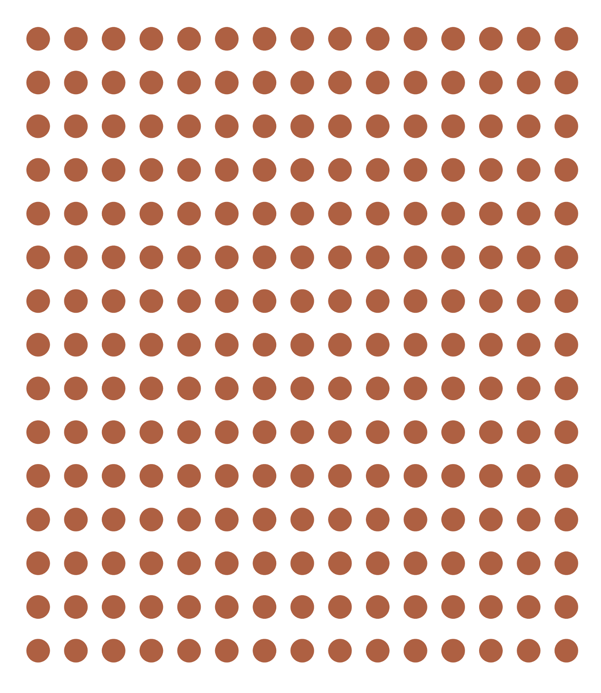

## Course Learning objectives

1. Define epidemiology and key associated terminology, especially confounding.
2. Distinguish among association, prediction, and causation.
3. Explain the Rothman model of sufficient-component causes (RMSCC) and the concept of multifactorial causation.
4. Explain the limitations of anecdotal evidence in drawing epidemiologic conclusions.
5. Explain why disseminating risk information is sometimes necessary but rarely sufficient to improve population health.

::: {.notes}
By the end of this course, my goal is for you to be able to:
:::

## Lecture Learning objectives

<!-- Revise these objectives. -->

By the end of this lesson, you'll be able to:

1. Define counts and rates.
2. Distinguish crude, specific, adjusted rates.
3. Compute and interpret prevalence and incidence.

## Measurement, Uncertainty, and Study Design {.three-step}

::: {.notes}
- We have already had some exposure to the basics of what epidemiology _is_. 
- This week, we will begin to learn how to _do_ epidemiology. 
- However, before getting into specific calcualtions, I want to briefly discuss the concepts of measurement, uncertainty, and study design.
:::

## What is Epidemiology? {.compact}

::: {.fragment}
> Epidemiology is concerned with the distribution and determinants of health and diseases, morbidity, injuries, disability, and mortality in populations. Epidemiologic studies are applied to the control of health problems in populations [@quinlan2025].
:::

::: {.notes}
- We spent some time disecting this definition last week. I don't plan to do that again today.
- However, it may be worth taking a step back and thinking about _how_ we study the occurrence and distribution of these things. 
- Do we consult powerful oracles or deities? Not typically. 
- Do we go into a deep meditative state until the answers just occur to us? Not typically. At least doing that alone would not typically be very convincing evidence to most people.
:::

## Measurement Makes Characteristics Observable {.compact .measurement-feature}

::: {.measurement-layout}
::: {.measurement-visual}

:::

::: {.measurement-copy}
> Epidemiology is concerned with the **distribution** and determinants of health and diseases, morbidity, injuries, disability, and mortality in populations. Epidemiologic studies are applied to the control of health problems in populations [@quinlan2025].

- Observe and assign values to relevant characteristics.
- Look for patterns among those values.
:::
:::

::: {.notes}
- Instead, we almost always study health-related states and populations by **measuring** characteristics of those states or populations. 
- And what do we mean by measure? 
- Typically, that means that we observe some people, places, or events that are thought to be relevant to the population we are interested in. - As we are observing, we assign and record values about the things we are observing that are thought to be relevant. 
- For example, we might ask someone to step on a scale. We could observe their weight and record it somewhere. Or, we might ask someone to fill out a questionnaire about their thoughts and feelings. We could then record those responses somewhere as well.
:::

## What Does It Mean to Observe? {.compact}

::: {.measurement-layout}
::: {.measurement-visual}

:::

::: {.measurement-copy}
> Epidemiology is concerned with the distribution and **determinants** of health and diseases, morbidity, injuries, disability, and mortality in populations. Epidemiologic studies are applied to the control of health problems in populations [@quinlan2025].

- Observe and assign values to relevant characteristics.
- Look for patterns among those values.

::: {.panel}
**OBSERVE**

“To be aware of” or “have knowledge about.”
:::
:::
:::

::: {.notes}
- Notice how we frequently use the word “observe” in epidemiology. 
- In everyday speech, we tend to think of observe as meaning seeing something take place in front of our eyes. 
- In epidemiology, it is common to use the word observe more broadly. Something closer to simply meaning ”to be aware of” or ”have knowledge about”.
:::

## Measurement Produces Data; Statistics Finds Patterns {.three-step .compact}

::: {.notes}
- Then we look for useful patterns in those measurements. Recording those measurements typically results in data and looking for useful patterns typically occurs by applying statistical procedures to the data — hence, data and statistics are probably the two most commonly used tools in an epidemiologist’s toolbox.
:::

## Description, Prediction, and Causation

::: {.grid-3 .panel-grid-spaced}
::: {.panel}
**DESCRIPTION**
:::

::: {.panel}
**PREDICTION**
:::

::: {.panel}
**CAUSATION**
:::
:::

::: {.notes}
- If that all sounds a little too “deep” to be meaningful, I think the relevant take-away for our purposes is that a typical day in the life of most epidemiologists includes attempting to **describe**, **predict**, and/or **causally explain** health-related phenomena in populations of people, and we typically rely heavily on data, statistics, and assumptions to help us do that. 
- There may be some technical definitions somewhere that clearly distinguish each of these measurement and analysis goals, but in my experience, there is often some overlap between them in applied epidemiology. Further, the same study may attempt to do all three to varying degrees. Having said that, I think there is some value in taking a moment to discuss each individually.

:::

## Description Does Not Necessarily Seek Associations {.compact}

- Description examines distributions of single variables: middle, spread, shape, count, and proportion.
- It supports resource management and planning.
- Examples:
  - How many ventilators are available in Texas?
  - What is the average age of people living in Florida?
  - How much time elapses, on average, between exposure to a pathogen and the occurrence of disease symptoms?

::: {.notes}
- When we say describe in this context, we are not necessarily looking for associations in the data between two or more variables. Sometimes, we are simply looking at the distribution of a single variable/measure. Typically, this is done in the context of resource management and planning, or while conducting exploratory analysis.
:::

## Description Can Also Compare Distributions {.compact}

- Sometimes description does look for associations.
- It may compare distributions of single variables within levels of another variable.
- Examples:
  - Are more ventilators available in Texas or New York?
  - Are people older, on average, in Florida or Pennsylvania?
  - Is symptom onset quicker, on average, for cholera or *E. coli*?

::: {.notes}
- However, there are also times when we want to compare the distribution of one variable within levels of another variable. Most people would consider these comparisons to be equivalent to measuring associations. You could also make the case that this starts to overlap with prediction. It sort of just depends on how the information is being used.
:::

## Measures of Occurrence Support Description

- Counts
- Incidence
- Prevalence
- Odds

These measures can be useful on their own and for hypothesis generation.

::: {.notes}
- You can generally think of measures like incidence, prevalence, and odds as descriptive, and we will discuss them in greater detail shortly. Often, these descriptive measures can be very useful in their own right, but they are also used as a foundation for hypothesis generation, prediction, and causal explanation as well. 
- Prediction and causal explanation will be the topic of future modules.
:::

## Sources of Uncertainty: Few Checklists {.uncertainty-list}

1. Few checklists

::: {.notes}
- In epidemiology generally, and parts of this course specifically, it will behoove us to become comfortable with uncertainty. When I say “uncertainty” here, I mean it in both a philosophical sense and in a very practical sense. 
- First, in a very practical sense, all students of epidemiology (including me) must get comfortable with the lack of reliable check-list procedures in epidemiology. What I mean is that students (including me) often wish that there was a simple checklist or algorithm that we could follow that will always lead us to the correct answer. Unfortunately, there are just very few such checklists in epidemiology – and in life for that matter. In reality, we will often have to rely on diligent research and experimentation to inform critical thinking and many (often untestable) assumptions. Clear-cut procedures that provide valid and reliable black and white answers are the exception rather than the rule. On the bright side, this should also provide us with some measure of job security for the foreseeable future. If epidemiology could simply be reduced to a checklist or algorithm, then our jobs would almost certainly be outsourced to computers in no time.
:::

## Sources of Uncertainty: Add Statistical Uncertainty {.uncertainty-list}

1. Few checklists
2. Statistical uncertainty

::: {.notes}
- Second, we should also get comfortable with uncertainty in the statistical sense, which is something we will try to measure and quantify. Indeed, it may be an oversimplification, but not entirely inaccurate, to define statistics as the science of quantifying uncertainty. At least a certain type of uncertainty. It’s important to understand this type of uncertainty and become comfortable with it because, like we discussed earlier, data and statistics are probably the two most commonly used tools in the modern epidemiologist’s toolbox.
:::

## Sources of Uncertainty: Add Causal Uncertainty {.uncertainty-list}

1. Few checklists
2. Statistical uncertainty
3. Causal uncertainty

::: {.notes}
- And finally, we should get comfortable with uncertainty on the level of our conclusions. In epidemiology, the questions we are called to answer are often causal questions. Did this cause that? If we stop this, can we stop that? On one hand, these questions are usually incredibly exciting and have the potential to lead to real, tangible changes in population health. On the other hand, our two primary tools -- data and statistics -- are not typically not sufficient to answer such questions in and of themselves. 
- The conclusions that we are able to make are almost always loaded with caveats and assumptions. This is true even for many non-causal questions. However, the questions being asked are often so important that we don’t have the luxury of completely deferring our conclusions until some imaginary later date when the stars align, and the inner workings of the world are magically revealed to us with complete clarity. No, we must often do our best with the information and resources that are available to us now. Therefore, when we make conclusions, we will have to be comfortable with the fact that they may be wholly or partially incorrect, there may be important exceptions, and/or we may have to revisit them again in the future when circumstances, or the information available to us, changes. Even when they are entirely correct, we will often not be able to prove as much with complete certainty. Said another way, our conclusions will rarely, if ever, be exactly correct or provable; however, sometimes they will still be useful for a given purpose. 
- That is an unsettling thought for many people. But it is true nevertheless and we must accept it and become comfortable with it if we want to practice epidemiology. If it makes you feel any better, the history of public health, including epidemiology, is littered with notable examples of useful conclusions that were not entirely correct or not entirely proven, yet still extremely useful. For example, citrus fruit to prevent and cure scurvy, drinking tainted drinking water as a cause of cholera, and tobacco smoke as a cause of lung cancer (and many other diseases). 
:::

## Occurrence Is Defined Within Populations {.compact}

> Epidemiology is concerned with the distribution and determinants of health and diseases, morbidity, injuries, disability, and mortality in **populations**. Epidemiologic studies are applied to the control of health problems in populations [@quinlan2025].

::: {.notes}
- Another important concept in epidemiology is that of populations. In fact, our concern with populations is embedded in our very definition. In epidemiology, we generally want to describe a population, predict the occurrence of something in a population, or explain the causes of something in a population. 
- But, what is a population?
:::

## Population

::: {.grid-2 .align-center}
::: {.definition-copy}
> The simplest definition of a **population** is a group of people who share characteristics or meet criteria that define membership in the population [@lash2021].
:::
::: {.population-visual}

:::
:::

::: {.notes}
- Well, The simplest definition of a population is a group of people who share characteristics or meet criteria that define membership in the population.
- In other words, we set some criteria of interest and then anyone who meets that criteria is a member of the population. In everyday language, we most often think about the criteria that defines population membership as being geographic. For example, all of the people who live in the United States make up the population of the United States. The criteria that defines them is the fact that they live in the United States.
- But we certainly do not have to limit our criteria of interest to be geographic. We can use pretty much any criteria that is useful for our purposes. For example, people of a particular age, gender, or race or ethnicity; people who work in a particular occupation; people who participate in a particular behavior or activity; or people who have a particular disease. All the people who meet whatever the criteria are de facto members of the population. 
:::

## A Population Also Has a Time Period

::: {.grid-2 .align-center}
::: {.definition-copy}
> The simplest definition of a **population** is a group of people who share characteristics or meet criteria that define membership in the population [**during a defined time period**] [@lash2021].
:::
::: {.population-visual}

:::
:::

::: {.notes}
- I would add the qualifier “during a defined time period” to this definition. As I hope to show you, the inclusion of the time period of interest is is a critical component of making almost every measure we will use in epidemiology meaningful.
- Later in the course, we will discuss populations, samples, and cohorts in greater depth, and we will see more examples of why the definition of time is so important.
:::

## Counts (n): Events in a Population {.count-slide}

::: {.notes}
- This is perhaps the most foundational measure of occurrence we can use. 
- How many people have the characteristic or have experienced the event we are interested in? 
- That is, we simply count the number of people in our sample who experience the event of interest.
:::

## Counts (n): Group the Event Categories {.count-slide}

::: {.notes}
- To make this a little easier, we will visually stratify our sample by event. 
- That means we will gather together all of the people who experienced the event into one group and all of the people who did not experience the event into a second group. 
- Each group can be called a stratum.
:::

## Counts (n): Reveal the Totals {.count-slide}

::: {.notes}
- After doing so, we can simply count the number of people in our event strata. In this case, the count of people who experienced the event is 53.
- Is that enough information? It depends. What is our question? 
  - Do we have enough ventilators?
  - Did a lot of people have the event?
:::

<!-- 
Poll Everywhere:
The basic issue is that counts don't take into account the size of the population.
Introduce ratios, rates, proportions, and percentages at a high level.
-->

<!-- 
Poll Everywhere:
Introduce ratios, rates, proportions, and percentages generally. 
-->

<!-- BEGIN AI-CREATED SLIDES: Ratios, proportions, percentages, and rates. Needs Brad's review. -->

## The Same Count Can Tell Different Stories {.compact}

**AI-created draft — needs review**

Imagine that **10 students have mono today** in each of two dorms.

| | Dorm A | Dorm B |
|---|---:|---:|
| Students with mono | 10 | 10 |
| Total residents | 20 | 500 |
| Percentage with mono | 50% | 2% |

The count helps us plan care. The **denominator** shows how common mono is.

::: {.notes}
- Ask students which dorm has the larger share of residents with mono. Both need care for 10 students, but mono is much more common among residents of Dorm A.
- The numerator is the quantity on top of a fraction; the denominator is the quantity on the bottom. Choosing the denominator determines the question we answer.
- These are hypothetical classroom examples adapted from the reading, not observed campus data.

[Sources]
- Epidemiology 101, third edition, Chapter 3, “Mathematical Terms Used in Epidemiology,” dormitory example; supplied `Page 52-54.pdf`, PDF pages 5–6.
[/Sources]
:::

## A Ratio Compares Two Quantities {.compact}

**AI-created draft — needs review**

A **ratio** divides one quantity by another.

In a hypothetical clinic survey, **15 patients use e-cigarettes and 5 do not**.

$$
\frac{\text{Users}}{\text{Nonusers}} = \frac{15}{5} = 3
$$

There are **3 users for every 1 nonuser**: a ratio of **3:1**.

The denominator does not have to include the numerator.

::: {.notes}
- Read the numerator and denominator aloud before calculating. Here we compare one group with another group, not with all patients.
- Reversing the order changes the answer: nonusers to users is 5/15, or 1:3. Always name the order.
- Ratios are the broad family. Proportions, rates, and odds are particular kinds of ratios with particular choices of denominator.

[Sources]
- Epidemiology 101, third edition, Chapter 3, Table 3.2 and “Ratio”; supplied `Page 52-54.pdf`, PDF page 2.
[/Sources]
:::

## A Proportion Compares a Part With the Whole {.compact}

**AI-created draft — needs review**

For the same **15 users and 5 nonusers**, there are **20 patients in all**.

$$
\text{Proportion who use} = \frac{\text{Users}}{\text{All patients}} = \frac{15}{20} = 0.75
$$

- Everyone counted in the numerator is also in the denominator.
- A proportion ranges from **0 to 1**.
- Here, **three-fourths of the patients** use e-cigarettes.

::: {.notes}
- Contrast 15/5 with 15/20. The numerator is unchanged, but the denominator changes the question and the interpretation.
- If A is the number with a characteristic and B is the number without it, the proportion with the characteristic is A/(A+B), provided the total is greater than zero.
- A proportion of zero means none; a proportion of one means everyone. This part-to-whole structure will be used for prevalence and incidence proportions.

[Sources]
- Epidemiology 101, third edition, Chapter 3, “Proportion”; supplied `Page 52-54.pdf`, PDF pages 3–4.
[/Sources]
:::

## A Percentage Expresses a Proportion per 100 {.compact}

**AI-created draft — needs review**

$$
\text{Percentage who use} = \frac{15}{20} \times 100\% = 75\%
$$

**0.75 and 75% describe the same share of patients.**

- Multiply a proportion by 100 to express it as a percentage.
- Divide a percentage by 100 to recover the proportion: $75/100 = 0.75$.
- “75%” means **75 out of every 100**, even when the actual group has 20 people.

::: {.notes}
- Ask students to convert 0.20 to 20%, then 2% to 0.02.
- Multiplying changes the reporting scale, not the underlying information or the observed number of patients. We did not survey 100 patients.
- A percentage representing a share of a whole ranges from 0% to 100%. Percent change is a different calculation and can exceed 100%; it is not the measure being introduced here.

[Sources]
- Epidemiology 101, third edition, Chapter 3, “Percentage”; supplied `Page 52-54.pdf`, PDF page 4.
[/Sources]
:::

## A Rate Describes How Quickly Events Occur {.compact}

**AI-created draft — needs review**

A **rate** includes time in its denominator.

For an incidence rate, we divide new cases by **person-time at risk**.

$$
\frac{6\text{ new cases}}{120\text{ person-years}} = 5\text{ cases per 100 person-years}
$$

This describes the pace of new cases. It does **not** mean that 5% became ill.

::: {.notes}
- This is a hypothetical example. Person-time adds together the time each person is observed while at risk; Part 2 will show how to calculate it.
- Keep the units when interpreting a rate. Five cases per 100 person-years and five cases per 100 person-months describe different rates.
- A proportion can refer to a specified year without being a rate. The key distinction is whether time is part of the denominator, not whether the question mentions a date.
- The reading warns that epidemiologic names do not always follow strict mathematical definitions. In this course, use the calculation and denominator to distinguish proportions from rates.

[Sources]
- Epidemiology 101, third edition, Chapter 3, Figure 3.1 and “Rate”; supplied `Page 52-54.pdf`, PDF pages 1 and 6.
- Existing Part 2 slides, “Incidence Rate” and “Person-Time,” for the course's person-time definition.
[/Sources]
:::

<!-- END AI-CREATED SLIDES: Ratios, proportions, percentages, and rates. -->

## Prevalence Describes Existing Conditions {.compact}

<!-- Make this slide less wordy. -->

- Prevalence provides information about the presence or absence of a condition of interest, such as a disease, exposure, or characteristic, in a population.
- It describes the extent to which the condition is present in a population during a given time frame.
- Asking about the prevalence of diabetes means asking how many, or more likely what proportion, of people currently living in the population have diabetes.

Source: [@westreich2019]

::: {.notes}
- Placeholder
:::

## Prevalence Count {.compact}

- A count of people in a population with the condition of interest during a given time frame.
- As few as 0 people and as many as all people can be living with the condition.
- Range: 0 to infinity.

Source: [@westreich2019]

::: {.notes}
<!-- Convert this to bullets. -->
- Prevalence counts are sometimes useful in communicating the public health importance of a disease condition or in contexts where incidence is difficult to define and so you want to have a sense of numbers of events for surveillance purposes. Unfortunately, prevalence counts are just as often used to overhype that importance by reporting large-sounding numbers without appropriate context. Prevalence counts are therefore of most use when their context is well-understood by the audience: for example, since most residents of the United States have a general sense of the total population of that country, a report to a US audience of the prevalence count of US residents living with COPD (at this writing, about 13 million) might be adequately contextualized. As with all counts, the prevalence count is an integer between 0 however many possible cases exist in the population being examined. For a recurrent event measured over a sufficiently long period of time (e.g., upper respiratory infections), the prevalence count might exceed the number of individuals in the population: however, in such a case, calculating an incidence might be more straightforward.
:::

## Prevalence Proportion {.compact}

- The proportion or percentage of the population that presently has the condition of interest or presently has a history of the condition during a specified period, such as a history of cancer in the past 10 years.
- Since none, some, or all population members can have the condition or a history of it, prevalence proportion ranges from 0 to 1, much like a probability.

Source: [@westreich2019]

::: {.notes}
- The count of prevalent cases is sometimes of interest all by itself. However, it is more common to report the prevalence as a proportion or percentage.
:::

## Prevalence Proportion: Formula {.big-formula}

$$
\text{Prevalence proportion} = \frac{\text{Count with the condition}}{\text{Living members of the population}}
$$

::: {.notes}
- We can write the information from the previous slide in a slightly more mathy way like this. 
:::

## Follow-Up Experience for 10 People {.status-table}

::: {.notes}
- So, if we came along and did a study of this group of people in month 2, the prevalence of disease would equal the number of people with disease divided by the number of people in the sample. In this case, that would be 2 people (p1 and p2) divided by 10. 
:::

## Prevalence Proportion at Month 2 {.metric-grid}

<!-- Hide the answer so that learners have to interpret. -->

::: {.grid-2 .align-center}
::: {.example-study-visual}

:::

::: {.prevalence-example-formula}

$$
\frac{\text{Count with the condition}}{\text{Living members of the population}}
$$

$$
= \frac{2}{10} = 0.20 = 20\%
$$
:::
:::

::: {.notes}
- So, if we came along and did a study of this group of people in month 2, the prevalence of the condition of interest – in this case disease -- would equal the number of people with disease divided by the number of people in the population. In this case, that would be 2 people (p1 and p2) divided by 10. 
:::

## Interpreting Prevalence Proportion {.metric-grid}

<!-- Hide the answer so that learners have to interpret. -->

::: {.grid-2 .align-center}
::: {.example-study-visual}

:::
::: {.interpretation}
Among the members of the population, the prevalence of disease in month 2 was **0.20**.

Said another way, **20%** of the population had disease in month 2.
:::
:::

## Point Prevalence and Period Prevalence {.compact}

<!-- Add a Poll Everywhere question about point vs period prevalence. -->

- **Point prevalence:** prevalence of a condition of interest at a single point in time.

::: {.fragment}
- **Period prevalence:** prevalence of a condition of interest over a period of time.
:::

::: {.fragment}
- As the duration of the period shrinks, period prevalence converges to point prevalence.
:::

::: {.fragment}
- There is no hard-and-fast rule for what window is sufficiently short to count as point prevalence.
:::

Source: [@westreich2019]

::: {.notes}
- On the other hand, point prevalence is often operationalized (put into practice) as “period prevalence over a reasonably short time window.” - For example, if you want to know the prevalence of HIV infection in a cohort of 1,000 people, it is difficult to imagine getting blood samples to test from all those people simultaneously (e.g., if all 1,000 participants give blood at exactly 1:00 pm this Friday). In practice, you would obtain blood samples over as short a time period as possible and test them thereafter. 
- Alternatively, you could also define such a prevalence as “point prevalence at time of testing” while acknowledging that the testing occurred at a different calendar time for each participant [@westreich2019].
 - Some textbooks and authors spend a fair amount of time trying to draw a distinction between the two. Because the concept is pretty nebulous, I tend to not worry about it too much. Instead, I prefer to just be clear about the time frame used for the calculation.
:::

<!-- AI-created draft slides; needs Brad's review. Sources: /Users/bradcannell/Library/CloudStorage/Dropbox/R4Epi Textbook/r4epi/chapters/Chapters in Development/10_part_epi_foundations/_03_measures_of_occurrence.Rmd (Prevalence Odds, Interpretation of odds less than one); /Users/bradcannell/Library/CloudStorage/Dropbox/R4Epi Textbook/r4epi/chapters/Chapters in Development/10_part_epi_foundations/_06_measures_of_association.Rmd (Probabilities, Incidence odds ratio). -->

## Odds Compare People With and Without a Condition {.compact}

**AI-created draft — needs review**

In a hypothetical survey today, **20 students have a headache** and **80 do not**.

$$
\text{Odds of a headache} = \frac{\text{Students with a headache}}{\text{Students without a headache}} = \frac{20}{80} = 0.25
$$

The odds are **1:4**: for every **1 student with a headache**, there are **4 without one**.

::: {.notes}
- Start with the two groups of people, before asking students to memorize a formula. Both groups come from the same population measured at the same time. Here, we are describing prevalence odds because we asked who has a headache today.
- Read 1:4 as “one to four.” We divided both counts by 20 to simplify 20:80. The ratio preserves the balance between students with and without a headache.

[Sources]
- R4Epi textbook draft, “Measures of Occurrence,” “Prevalence Odds” and “Interpretation of odds less than one.” The headache survey is a hypothetical teaching example.
[/Sources]
:::

## Probability and Odds Use Different Denominators {.compact}

**AI-created draft — needs review**

The same survey has **20 students with a headache** and **80 without one**.

| Measure | Calculation | Interpretation |
|---|---|---|
| Probability | $20/(20+80) = 0.20$ | 20 out of every 100 students have a headache. |
| Odds | $20/80 = 0.25$ | 1 student has a headache for every 4 without one. |

**Probability compares the part to the whole. Odds compare the part to the rest.**

::: {.notes}
- If we select one student at random, with each of these 100 students equally likely to be selected, the probability that the student has a headache is the prevalence proportion: 20/100 = 0.20. The denominator includes everyone, including the 20 students with a headache.
- For the odds, the denominator includes only the 80 students without a headache. An odds of 0.25 therefore corresponds to a probability of 20%, not 25%. They describe the same data on different numerical scales.
- We do not need a different dataset to move from one measure to the other. We need to change the denominator.

[Sources]
- R4Epi textbook draft, “Measures of Occurrence,” “Prevalence proportion” and “Prevalence Odds”; “Measures of Association,” “Frequency probabilities.”
[/Sources]
:::

## Reading Odds Below, Equal to, and Above 1 {.compact}

**AI-created draft — needs review**

Three hypothetical groups surveyed on the same day:

| With a headache | Without a headache | Odds | What the odds tell us |
|---:|---:|---:|---|
| 20 | 80 | $0.25 = 1:4$ | Fewer have a headache than do not. |
| 50 | 50 | $1 = 1:1$ | Equal numbers have and do not have a headache. |
| 80 | 20 | $4 = 4:1$ | More have a headache than do not. |

Odds can be **greater than 1**. A probability cannot.

::: {.notes}
- An odds of 1 means the event and its absence are equally common; the probability is 0.50. An odds below 1 means the event is less common than its absence. An odds above 1 means it is more common.
- For 4:1 odds, say “four students with a headache for every one without a headache.” That is a ratio of groups, not a probability of 400%.
- If no one has the condition, the odds are 0. If everyone has the condition, the count without it is zero, so there is no finite odds value; the usual division is undefined. As the probability approaches 1, the odds increase without bound.

[Sources]
- R4Epi textbook draft, “Measures of Occurrence,” “Prevalence Odds,” including interpretations above and below 1. The 50:50 and 80:20 examples extend the same formula.
[/Sources]
:::

## Move Between Probability and Odds {.compact}

**AI-created draft — needs review**

Let $p$ be the probability, written as a proportion between 0 and 1.

$$
\text{Odds} = \frac{p}{1-p}
\qquad
p = \frac{\text{Odds}}{1 + \text{Odds}}
$$

- Probability **0.20** gives odds $0.20/0.80 = \mathbf{0.25}$.
- Odds **4:1** give probability $4/(4+1) = \mathbf{0.80}$, or **80%**.

For odds written as **a:b**, the probability is **a/(a+b)**.

::: {.notes}
- Emphasize the count intuition behind the inverse formula. Four with a headache for every one without means four with a headache out of five students total.
- The expression 1-p represents the probability of the condition being absent. Use 0.20 in the formula for a probability of 20%; entering 20 would give a meaningless result.
- For one more connection to the first example, odds of 0.25 give probability 0.25/1.25 = 0.20. Equivalently, 1:4 odds give 1/(1+4) = 1/5 = 0.20.

[Sources]
- R4Epi textbook draft, “Measures of Occurrence,” “Prevalence Odds.” The inverse formula is an algebraic rearrangement of odds = p/(1-p).
[/Sources]
:::

## Prevalence Odds {.compact}

- Prevalence odds is a simple function of prevalence proportion, just as odds in general is a simple function of probability.
- It is typically reported for convenience or desirable statistical properties.
- Prevalence odds is prevalence proportion divided by 1 minus prevalence proportion.
- Range: 0 to infinity.

Source: [@westreich2019]

::: {.notes}
- Why do we calculate this? Sometimes it is mathematically convenient.
:::

## Prevalence Odds: Formula {.big-formula}

$$
\text{Prevalence odds} = \frac{\text{Prevalence proportion}}{1 - \text{Prevalence proportion}}
$$

::: {.notes}
- We can write the information from the previous slide in a slightly more mathy way like this.
:::

## Prevalence Odds at Month 2 {.metric-grid}

<!-- Hide the answer so that learners have to interpret. -->

::: {.grid-2 .align-center}
::: {.example-study-visual}

:::

::: {.prevalence-example-formula}

$$
\frac{\text{Prevalence proportion}}{1 - \text{Prevalence proportion}}
$$

$$
\text{Prevalence odds} = \frac{0.20}{1 - 0.20} = 0.25
$$
:::
:::

## Interpreting Prevalence Odds {.metric-grid}

<!-- Hide the answer so that learners have to interpret. -->

::: {.grid-2 .align-center}
::: {.example-study-visual}

:::
::: {.interpretation}
Among the members of the population, the odds of disease in month 2 were **0.25**.

For every person who had disease at month 2, there were four people who did not.
:::
:::

## Why Learn to Calculate Odds? {.compact}

**AI-created draft — needs review**

- **Describe a condition:** compare how many people have it with how many do not.
- **Compare groups:** an *odds ratio* compares the odds in one group with the odds in another.
- **Understand statistical results:** some models use odds to describe how outcomes vary with other characteristics.

Understanding odds helps us translate those results into statements about people.

::: {.notes}
- Odds contain the same information about a binary condition as the corresponding proportion. Calculating them does not add new observations; it expresses the same information in a form that is useful for some statistical methods.
- Brad's R4Epi draft explains that odds may arise from regression models used later in the book. Students do not need to learn those models today. The immediate goal is to recognize and correctly interpret the scale.
- Keep the terms separate: the odds describe one group, while an odds ratio compares two groups. The next slide is a short preview of that comparison, which later lessons will develop more fully.

[Sources]
- R4Epi textbook draft, “Measures of Occurrence,” introduction to “Prevalence Odds”; “Measures of Association,” “Incidence odds ratio.”
[/Sources]
:::

## An Odds Ratio Compares Two Groups {.compact}

**AI-created draft — needs review**

In two hypothetical groups surveyed today:

| Group | With a headache | Without a headache | Odds |
|---|---:|---:|---:|
| A | 60 | 40 | $60/40 = 1.5$ |
| B | 50 | 50 | $50/50 = 1.0$ |

$$
\text{Odds ratio} = \frac{\text{Odds in A}}{\text{Odds in B}} = \frac{1.5}{1.0} = 1.5
$$

Group A has **1.5 times the odds** of a headache compared with Group B today.

::: {.notes}
- Each group's odds first compare people with and without a headache within that group. The odds ratio then compares those two odds. Here it is a prevalence odds ratio because we are describing headaches present today.
- Be precise about “1.5 times the odds.” The probabilities are 60% in A and 50% in B, so the probability ratio is 0.60/0.50 = 1.2. We cannot replace the word “odds” with “probability” and retain the same interpretation.
- This is a descriptive comparison. The numbers alone do not explain why the groups differ or establish a cause.
- The hypothetical counts preserve the odds of 1.5 and 1.0 used in the R4Epi association example, while using equally sized groups and a single-day survey so that the arithmetic and time frame stay simple.

[Sources]
- R4Epi textbook draft, “Measures of Association,” “Incidence odds ratio” and “Interpretation of the incidence odds ratio.” The comparison is adapted to prevalence odds for consistency with Part 1.
[/Sources]
:::

<!-- 
This is were we will stop on day one.
Add a section break slide here.
-->

## Questions?



## References {.references-slide}

::: {#refs}
:::
