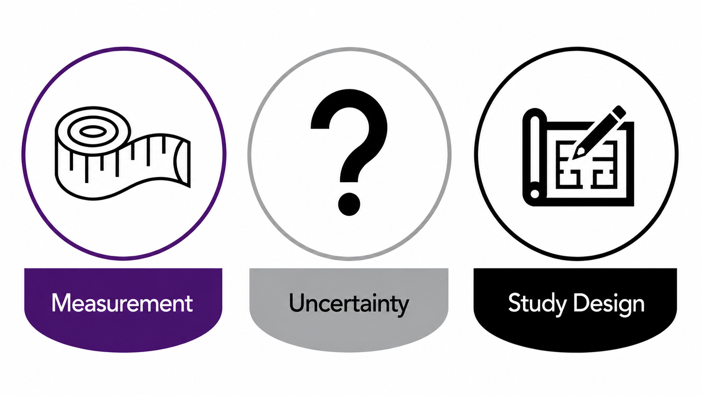
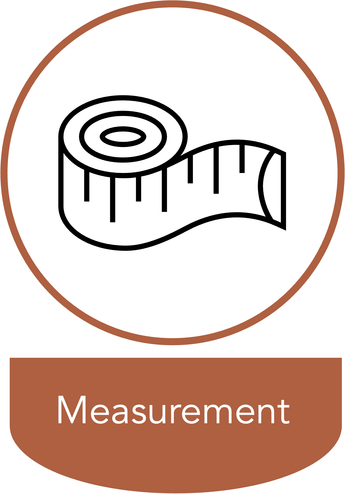
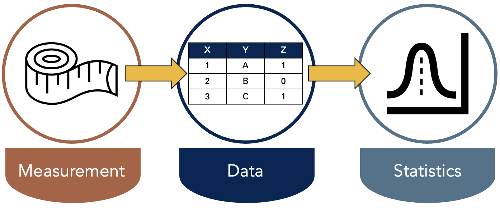
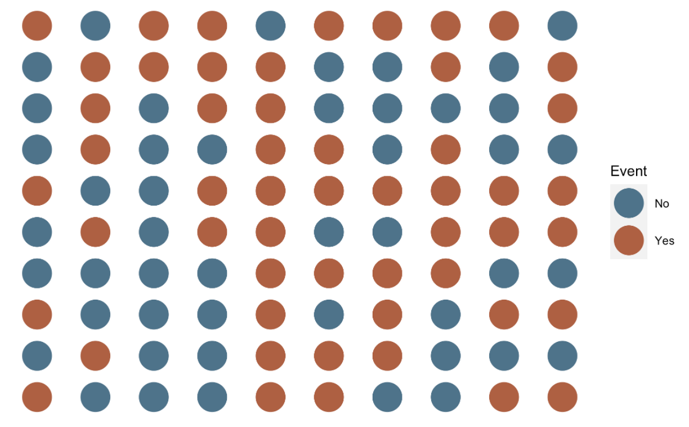
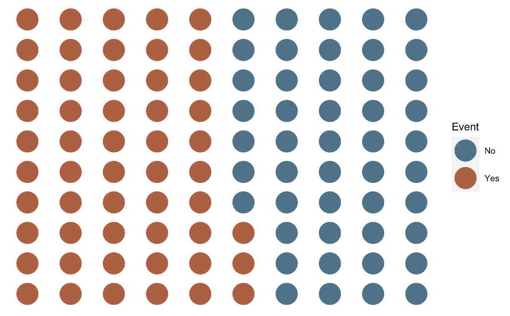
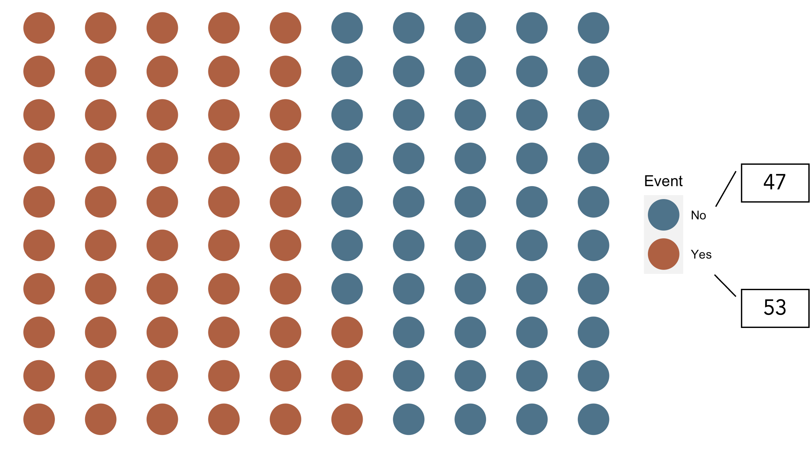

## Course Learning objectives

1. Define epidemiology and key associated terminology, especially confounding.
2. Distinguish among association, prediction, and causation.
3. Explain the Rothman model of sufficient-component causes (RMSCC) and the concept of multifactorial causation.
4. Explain the limitations of anecdotal evidence in drawing epidemiologic conclusions.
5. Explain why disseminating risk information is sometimes necessary but rarely sufficient to improve population health.

::: {.notes}
By the end of this course, my goal is for you to be able to:
:::

## Lecture Learning objectives

<!-- Revise these objectives. -->

By the end of this lesson, you'll be able to:

1. Define counts and rates.
2. Distinguish crude, specific, adjusted rates.
3. Compute and interpret prevalence and incidence.

## Measurement, Uncertainty, and Study Design {.three-step}

::: {.notes}
- We have already had some exposure to the basics of what epidemiology _is_. 
- This week, we will begin to learn how to _do_ epidemiology. 
- However, before getting into specific calcualtions, I want to briefly discuss the concepts of measurement, uncertainty, and study design.
:::

## What is Epidemiology? {.compact}

::: {.fragment}
> Epidemiology is concerned with the distribution and determinants of health and diseases, morbidity, injuries, disability, and mortality in populations. Epidemiologic studies are applied to the control of health problems in populations [@quinlan2025].
:::

::: {.notes}
- We spent some time disecting this definition last week. I don't plan to do that again today.
- However, it may be worth taking a step back and thinking about _how_ we study the occurrence and distribution of these things. 
- Do we consult powerful oracles or deities? Not typically. 
- Do we go into a deep meditative state until the answers just occur to us? Not typically. At least doing that alone would not typically be very convincing evidence to most people.
:::

## Measurement Makes Characteristics Observable {.compact .measurement-feature}

::: {.measurement-layout}
::: {.measurement-visual}

:::

::: {.measurement-copy}
> Epidemiology is concerned with the **distribution** and determinants of health and diseases, morbidity, injuries, disability, and mortality in populations. Epidemiologic studies are applied to the control of health problems in populations [@quinlan2025].

- Observe and assign values to relevant characteristics.
- Look for patterns among those values.
:::
:::

::: {.notes}
- Instead, we almost always study health-related states and populations by **measuring** characteristics of those states or populations. 
- And what do we mean by measure? 
- Typically, that means that we observe some people, places, or events that are thought to be relevant to the population we are interested in. - As we are observing, we assign and record values about the things we are observing that are thought to be relevant. 
- For example, we might ask someone to step on a scale. We could observe their weight and record it somewhere. Or, we might ask someone to fill out a questionnaire about their thoughts and feelings. We could then record those responses somewhere as well.
:::

## What Does It Mean to Observe? {.compact}

::: {.measurement-layout}
::: {.measurement-visual}

:::

::: {.measurement-copy}
> Epidemiology is concerned with the distribution and **determinants** of health and diseases, morbidity, injuries, disability, and mortality in populations. Epidemiologic studies are applied to the control of health problems in populations [@quinlan2025].

- Observe and assign values to relevant characteristics.
- Look for patterns among those values.

::: {.panel}
**OBSERVE**

“To be aware of” or “have knowledge about.”
:::
:::
:::

::: {.notes}
- Notice how we frequently use the word “observe” in epidemiology. 
- In everyday speech, we tend to think of observe as meaning seeing something take place in front of our eyes. 
- In epidemiology, it is common to use the word observe more broadly. Something closer to simply meaning ”to be aware of” or ”have knowledge about”.
:::

## Measurement Produces Data; Statistics Finds Patterns {.three-step .compact}

::: {.notes}
- Then we look for useful patterns in those measurements. Recording those measurements typically results in data and looking for useful patterns typically occurs by applying statistical procedures to the data — hence, data and statistics are probably the two most commonly used tools in an epidemiologist’s toolbox.
:::

## Description, Prediction, and Causation

::: {.grid-3 .panel-grid-spaced}
::: {.panel}
**DESCRIPTION**
:::

::: {.panel}
**PREDICTION**
:::

::: {.panel}
**CAUSATION**
:::
:::

::: {.notes}
- If that all sounds a little too “deep” to be meaningful, I think the relevant take-away for our purposes is that a typical day in the life of most epidemiologists includes attempting to **describe**, **predict**, and/or **causally explain** health-related phenomena in populations of people, and we typically rely heavily on data, statistics, and assumptions to help us do that. 
- There may be some technical definitions somewhere that clearly distinguish each of these measurement and analysis goals, but in my experience, there is often some overlap between them in applied epidemiology. Further, the same study may attempt to do all three to varying degrees. Having said that, I think there is some value in taking a moment to discuss each individually.

:::

## Description Does Not Necessarily Seek Associations {.compact}

- Description examines distributions of single variables: middle, spread, shape, count, and proportion.
- It supports resource management and planning.
- Examples:
  - How many ventilators are available in Texas?
  - What is the average age of people living in Florida?
  - How much time elapses, on average, between exposure to a pathogen and the occurrence of disease symptoms?

::: {.notes}
- When we say describe in this context, we are not necessarily looking for associations in the data between two or more variables. Sometimes, we are simply looking at the distribution of a single variable/measure. Typically, this is done in the context of resource management and planning, or while conducting exploratory analysis.
:::

## Description Can Also Compare Distributions {.compact}

- Sometimes description does look for associations.
- It may compare distributions of single variables within levels of another variable.
- Examples:
  - Are more ventilators available in Texas or New York?
  - Are people older, on average, in Florida or Pennsylvania?
  - Is symptom onset quicker, on average, for cholera or *E. coli*?

::: {.notes}
- However, there are also times when we want to compare the distribution of one variable within levels of another variable. Most people would consider these comparisons to be equivalent to measuring associations. You could also make the case that this starts to overlap with prediction. It sort of just depends on how the information is being used.
:::

## Measures of Occurrence Support Description

- Counts
- Incidence
- Prevalence
- Odds

These measures can be useful on their own and for hypothesis generation.

::: {.notes}
- You can generally think of measures like incidence, prevalence, and odds as descriptive, and we will discuss them in greater detail shortly. Often, these descriptive measures can be very useful in their own right, but they are also used as a foundation for hypothesis generation, prediction, and causal explanation as well. 
- Prediction and causal explanation will be the topic of future modules.
:::

## Sources of Uncertainty: Few Checklists {.uncertainty-list}

1. Few checklists

::: {.notes}
- In epidemiology generally, and parts of this course specifically, it will behoove us to become comfortable with uncertainty. When I say “uncertainty” here, I mean it in both a philosophical sense and in a very practical sense. 
- First, in a very practical sense, all students of epidemiology (including me) must get comfortable with the lack of reliable check-list procedures in epidemiology. What I mean is that students (including me) often wish that there was a simple checklist or algorithm that we could follow that will always lead us to the correct answer. Unfortunately, there are just very few such checklists in epidemiology – and in life for that matter. In reality, we will often have to rely on diligent research and experimentation to inform critical thinking and many (often untestable) assumptions. Clear-cut procedures that provide valid and reliable black and white answers are the exception rather than the rule. On the bright side, this should also provide us with some measure of job security for the foreseeable future. If epidemiology could simply be reduced to a checklist or algorithm, then our jobs would almost certainly be outsourced to computers in no time.
:::

## Sources of Uncertainty: Add Statistical Uncertainty {.uncertainty-list}

1. Few checklists
2. Statistical uncertainty

::: {.notes}
- Second, we should also get comfortable with uncertainty in the statistical sense, which is something we will try to measure and quantify. Indeed, it may be an oversimplification, but not entirely inaccurate, to define statistics as the science of quantifying uncertainty. At least a certain type of uncertainty. It’s important to understand this type of uncertainty and become comfortable with it because, like we discussed earlier, data and statistics are probably the two most commonly used tools in the modern epidemiologist’s toolbox.
:::

## Sources of Uncertainty: Add Causal Uncertainty {.uncertainty-list}

1. Few checklists
2. Statistical uncertainty
3. Causal uncertainty

::: {.notes}
- And finally, we should get comfortable with uncertainty on the level of our conclusions. In epidemiology, the questions we are called to answer are often causal questions. Did this cause that? If we stop this, can we stop that? On one hand, these questions are usually incredibly exciting and have the potential to lead to real, tangible changes in population health. On the other hand, our two primary tools -- data and statistics -- are not typically not sufficient to answer such questions in and of themselves. 
- The conclusions that we are able to make are almost always loaded with caveats and assumptions. This is true even for many non-causal questions. However, the questions being asked are often so important that we don’t have the luxury of completely deferring our conclusions until some imaginary later date when the stars align, and the inner workings of the world are magically revealed to us with complete clarity. No, we must often do our best with the information and resources that are available to us now. Therefore, when we make conclusions, we will have to be comfortable with the fact that they may be wholly or partially incorrect, there may be important exceptions, and/or we may have to revisit them again in the future when circumstances, or the information available to us, changes. Even when they are entirely correct, we will often not be able to prove as much with complete certainty. Said another way, our conclusions will rarely, if ever, be exactly correct or provable; however, sometimes they will still be useful for a given purpose. 
- That is an unsettling thought for many people. But it is true nevertheless and we must accept it and become comfortable with it if we want to practice epidemiology. If it makes you feel any better, the history of public health, including epidemiology, is littered with notable examples of useful conclusions that were not entirely correct or not entirely proven, yet still extremely useful. For example, citrus fruit to prevent and cure scurvy, drinking tainted drinking water as a cause of cholera, and tobacco smoke as a cause of lung cancer (and many other diseases). 
:::

## Occurrence Is Defined Within Populations {.compact}

> Epidemiology is concerned with the distribution and determinants of health and diseases, morbidity, injuries, disability, and mortality in **populations**. Epidemiologic studies are applied to the control of health problems in populations [@quinlan2025].

::: {.notes}
- Another important concept in epidemiology is that of populations. In fact, our concern with populations is embedded in our very definition. In epidemiology, we generally want to describe a population, predict the occurrence of something in a population, or explain the causes of something in a population. 
- But, what is a population?
:::

## Population

::: {.grid-2 .align-center}
::: {.definition-copy}
> The simplest definition of a **population** is a group of people who share characteristics or meet criteria that define membership in the population [@lash2021].
:::
::: {.population-visual}

:::
:::

::: {.notes}
- Well, The simplest definition of a population is a group of people who share characteristics or meet criteria that define membership in the population.
- In other words, we set some criteria of interest and then anyone who meets that criteria is a member of the population. In everyday language, we most often think about the criteria that defines population membership as being geographic. For example, all of the people who live in the United States make up the population of the United States. The criteria that defines them is the fact that they live in the United States.
- But we certainly do not have to limit our criteria of interest to be geographic. We can use pretty much any criteria that is useful for our purposes. For example, people of a particular age, gender, or race or ethnicity; people who work in a particular occupation; people who participate in a particular behavior or activity; or people who have a particular disease. All the people who meet whatever the criteria are de facto members of the population. 
:::

## A Population Also Has a Time Period

::: {.grid-2 .align-center}
::: {.definition-copy}
> The simplest definition of a **population** is a group of people who share characteristics or meet criteria that define membership in the population [**during a defined time period**] [@lash2021].
:::
::: {.population-visual}

:::
:::

::: {.notes}
- I would add the qualifier “during a defined time period” to this definition. As I hope to show you, the inclusion of the time period of interest is is a critical component of making almost every measure we will use in epidemiology meaningful.
- Later in the course, we will discuss populations, samples, and cohorts in greater depth, and we will see more examples of why the definition of time is so important.
:::

## Counts (n): Events in a Population {.count-slide}

::: {.notes}
- This is perhaps the most foundational measure of occurrence we can use. 
- How many people have the characteristic or have experienced the event we are interested in? 
- That is, we simply count the number of people in our sample who experience the event of interest.
:::

## Counts (n): Group the Event Categories {.count-slide}

::: {.notes}
- To make this a little easier, we will visually stratify our sample by event. 
- That means we will gather together all of the people who experienced the event into one group and all of the people who did not experience the event into a second group. 
- Each group can be called a stratum.
:::

## Counts (n): Reveal the Totals {.count-slide}

::: {.notes}
- After doing so, we can simply count the number of people in our event strata. In this case, the count of people who experienced the event is 53.
- Is that enough information? It depends. What is our question? 
  - Do we have enough ventilators?
  - Did a lot of people have the event?
:::

<!-- 
Poll Everywhere:
The basic issue is that counts don't take into account the size of the population.
Introduce ratios, rates, proportions, and percentages at a high level.
-->

<!-- 
Poll Everywhere:
Introduce ratios, rates, proportions, and percentages generally. 
-->

## Prevalence Describes Existing Conditions {.compact}

<!-- Make this slide less wordy. -->

- Prevalence provides information about the presence or absence of a condition of interest, such as a disease, exposure, or characteristic, in a population.
- It describes the extent to which the condition is present in a population during a given time frame.
- Asking about the prevalence of diabetes means asking how many, or more likely what proportion, of people currently living in the population have diabetes.

Source: [@westreich2019]

::: {.notes}
- Placeholder
:::

## Prevalence Count {.compact}

- A count of people in a population with the condition of interest during a given time frame.
- As few as 0 people and as many as all people can be living with the condition.
- Range: 0 to infinity.

Source: [@westreich2019]

::: {.notes}
<!-- Convert this to bullets. -->
- Prevalence counts are sometimes useful in communicating the public health importance of a disease condition or in contexts where incidence is difficult to define and so you want to have a sense of numbers of events for surveillance purposes. Unfortunately, prevalence counts are just as often used to overhype that importance by reporting large-sounding numbers without appropriate context. Prevalence counts are therefore of most use when their context is well-understood by the audience: for example, since most residents of the United States have a general sense of the total population of that country, a report to a US audience of the prevalence count of US residents living with COPD (at this writing, about 13 million) might be adequately contextualized. As with all counts, the prevalence count is an integer between 0 however many possible cases exist in the population being examined. For a recurrent event measured over a sufficiently long period of time (e.g., upper respiratory infections), the prevalence count might exceed the number of individuals in the population: however, in such a case, calculating an incidence might be more straightforward.
:::

## Prevalence Proportion {.compact}

- The proportion or percentage of the population that presently has the condition of interest or presently has a history of the condition during a specified period, such as a history of cancer in the past 10 years.
- Since none, some, or all population members can have the condition or a history of it, prevalence proportion ranges from 0 to 1, much like a probability.

Source: [@westreich2019]

::: {.notes}
- The count of prevalent cases is sometimes of interest all by itself. However, it is more common to report the prevalence as a proportion or percentage.
:::

## Prevalence Proportion: Formula {.big-formula}

$$
\text{Prevalence proportion} = \frac{\text{Count with the condition}}{\text{Living members of the population}}
$$

::: {.notes}
- We can write the information from the previous slide in a slightly more mathy way like this. 
:::

## Follow-Up Experience for 10 People {.status-table}

::: {.notes}
- So, if we came along and did a study of this group of people in month 2, the prevalence of disease would equal the number of people with disease divided by the number of people in the sample. In this case, that would be 2 people (p1 and p2) divided by 10. 
:::

## Prevalence Proportion at Month 2 {.metric-grid}

<!-- Hide the answer so that learners have to interpret. -->

::: {.grid-2 .align-center}
::: {.example-study-visual}

:::

::: {.prevalence-example-formula}

$$
\frac{\text{Count with the condition}}{\text{Living members of the population}}
$$

$$
= \frac{2}{10} = 0.20 = 20\%
$$
:::
:::

::: {.notes}
- So, if we came along and did a study of this group of people in month 2, the prevalence of the condition of interest – in this case disease -- would equal the number of people with disease divided by the number of people in the population. In this case, that would be 2 people (p1 and p2) divided by 10. 
:::

## Interpreting Prevalence Proportion {.metric-grid}

<!-- Hide the answer so that learners have to interpret. -->

::: {.grid-2 .align-center}
::: {.example-study-visual}

:::
::: {.interpretation}
Among the members of the population, the prevalence of disease in month 2 was **0.20**.

Said another way, **20%** of the population had disease in month 2.
:::
:::

## Point Prevalence and Period Prevalence {.compact}

<!-- Add a Poll Everywhere question about point vs period prevalence. -->

- **Point prevalence:** prevalence of a condition of interest at a single point in time.

::: {.fragment}
- **Period prevalence:** prevalence of a condition of interest over a period of time.
:::

::: {.fragment}
- As the duration of the period shrinks, period prevalence converges to point prevalence.
:::

::: {.fragment}
- There is no hard-and-fast rule for what window is sufficiently short to count as point prevalence.
:::

Source: [@westreich2019]

::: {.notes}
- On the other hand, point prevalence is often operationalized (put into practice) as “period prevalence over a reasonably short time window.” - For example, if you want to know the prevalence of HIV infection in a cohort of 1,000 people, it is difficult to imagine getting blood samples to test from all those people simultaneously (e.g., if all 1,000 participants give blood at exactly 1:00 pm this Friday). In practice, you would obtain blood samples over as short a time period as possible and test them thereafter. 
- Alternatively, you could also define such a prevalence as “point prevalence at time of testing” while acknowledging that the testing occurred at a different calendar time for each participant [@westreich2019].
 - Some textbooks and authors spend a fair amount of time trying to draw a distinction between the two. Because the concept is pretty nebulous, I tend to not worry about it too much. Instead, I prefer to just be clear about the time frame used for the calculation.
:::

## Prevalence Odds {.compact}

- Prevalence odds is a simple function of prevalence proportion, just as odds in general is a simple function of probability.
- It is typically reported for convenience or desirable statistical properties.
- Prevalence odds is prevalence proportion divided by 1 minus prevalence proportion.
- Range: 0 to infinity.

Source: [@westreich2019]

::: {.notes}
- Why do we calculate this? Sometimes it is mathematically convenient.
:::

## Prevalence Odds: Formula {.big-formula}

$$
\text{Prevalence odds} = \frac{\text{Prevalence proportion}}{1 - \text{Prevalence proportion}}
$$

::: {.notes}
- We can write the information from the previous slide in a slightly more mathy way like this.
:::

## Prevalence Odds at Month 2 {.metric-grid}

<!-- Hide the answer so that learners have to interpret. -->

::: {.grid-2 .align-center}
::: {.example-study-visual}

:::

::: {.prevalence-example-formula}

$$
\frac{\text{Prevalence proportion}}{1 - \text{Prevalence proportion}}
$$

$$
\text{Prevalence odds} = \frac{0.20}{1 - 0.20} = 0.25
$$
:::
:::

## Interpreting Prevalence Odds {.metric-grid}

<!-- Hide the answer so that learners have to interpret. -->

::: {.grid-2 .align-center}
::: {.example-study-visual}

:::
::: {.interpretation}
Among the members of the population, the odds of disease in month 2 were **0.25**.

For every person who had disease at month 2, there were four people who did not.
:::
:::

<!-- 
This is were we will stop on day one.
Add a section break slide here.
-->

## Incidence Describes New Occurrences {.compact}

- Prevalence measures how many cases are present at a moment or over a period; incidence measures how many **new cases** arise over a specified period.
- Unlike prevalence, incidence measures occurrences or events: transitions from a condition being absent in an individual to the condition being present over a specified period.

Source: [@westreich2019]

::: {.notes}
- We can measure the incidence of both one-time events (incidence of Parkinson’s disease or incidence of first cancer diagnosis) and recurrent events (number of respiratory infections in a calendar year). Thus, to measure incidence, we must start from a population at risk of the disease outcome: for example, to measure the incidence of Parkinson’s disease in our cohort, we must not include people who already have Parkinson’s disease at cohort inception. It is important to note that we can turn a recurrent event into a one-time event by restricting our study to the first occurrence of that event: for example, first respiratory infection for each individual in the calendar year. We measure incidence in many of the same ways as we measure prevalence: as incidence proportions, incidence odds, and incidence counts (i.e., counts of new cases of disease in a population). In addition, we use incidence rates and measures of elapsed time to an event. All of these measures, however, can be productively viewed as derivations, or simplifications, of a survival curve or cumulative incidence curve. Thus, we discuss the survival curve.
:::

## Incidence Proportion and Risk

- Incidence proportion and “risk” are sometimes used interchangeably in epidemiology.
- Risk can be ambiguous. Incidence proportion is less so.

Source: [@westreich2019]

::: {.notes}
- Placeholder
:::

## Incidence Count {.compact}

- A count of new occurrences of a condition in a population at risk for the occurrence during a given time frame.
- Range: 0 to infinity.

Source: [@westreich2019]

::: {.notes}
- Placeholder
:::

## Incidence Proportion {.compact}

- The proportion of the population that experiences a new occurrence of the condition among those at risk of experiencing a new occurrence during a given time frame.
- Like all proportions, it falls between 0 and 1.

Source: [@westreich2019]

::: {.notes}
- The incidence proportion can be estimated without reference to the survival curve: you could obtain the same estimate of risk as from Figure 1.2 (or the data in Table 1.1) directly, simply by observing that 930 individuals were alive at age 40, noting that this means 70 had died, and dividing 70 by the original number in the study (1,000) to get 7%.
- It is critical to reiterate that incidence proportions are only meaningful when paired with a fixed period of time. This may be illustrated most clearly with the outcome of death: the “risk of death” in humans is universally 1, in that all humans will eventually die. Thus, telling someone that, in your study, the “risk of death was 10%” is unhelpful; more helpful would be to tell them that, for example, the “1-year risk of death was 10%.”
:::

## Incidence Proportion: Formula {.big-formula}

$$
\text{Incidence proportion} = \frac{\text{Count of new occurrences}}{\text{Population at risk}}
$$

::: {.notes}
- We can write the information from the previous slide in a slightly more mathy way like this.
:::

## Follow-Up Experience and New Occurrences {.status-table}

| Person | At risk | New disease | Deceased |
|---:|:---|:---|:---|
| 1 | 0 months | Prevalent before follow-up | — |
| 2 | 0–2 | Month 2 | 5–12 |
| 3 | 0–4 | Month 4 | — |
| 4 | 0–5 | Month 5 | — |
| 5 | 0–7 | Month 7 | — |
| 6 | 0–8 | Month 8 | 11–12 |
| 7 | 0–9 | — | 9–12 |
| 8 | 0–5 | — | 5–12 |
| 9 | 0–12 | — | — |
| 10 | 0–12 | — | — |

Month of follow-up. Source: [@lash2021]

::: {.notes}
- So, let’s take another look at our example population. 
- How many were at risk of experiencing a new occurrence of disease during the period of observation? 9 (person 1 was not at risk).
- How many of the people at risk developed a new occurrence of disease? 5 (p2, p3, p4, p5, p6).
:::

## Incidence Proportion Over 12 Months {.metric-grid}

::: {.grid-2 .align-center}
::: {.status-summary}
- 5 people developed disease.
- 9 people were at risk at baseline.
- Person 1 was already diseased and therefore not at risk for a new occurrence.
:::

::: {.big-formula}
$$
\frac{5}{9} = 0.56 = 56\%
$$
:::
:::

::: {.notes}
- Placeholder
:::

## Interpreting Incidence Proportion

Among the members of the population, the incidence of disease over 12 months of follow-up was **0.56**.

Fifty-six percent of the population developed disease over 12 months of follow-up.

::: {.notes}
- Placeholder
:::

## Incidence Odds: Formula {.big-formula}

$$
\text{Incidence odds} = \frac{\text{Incidence proportion}}{1 - \text{Incidence proportion}}
$$

::: {.notes}
- We can write the information from the previous slide in a slightly more mathy way like this.
:::

## Incidence Odds Over 12 Months {.big-formula}

$$
\text{Incidence odds} = \frac{0.56}{1 - 0.56} = 1.27
$$

::: {.notes}
- Placeholder
:::

## Interpreting Incidence Odds {.compact}

Among the members of the population, the odds of incident disease over 12 months of follow-up were **1.27**.

For every 127 people who developed incident disease over 12 months of follow-up, 100 people did not.

::: {.notes}
- Placeholder
:::

## Incidence Rate {.compact}

- A measure of the average intensity at which an event occurs in people's experience over time.
- For a population followed from baseline, it is the number of cases divided by the person-time at risk accumulated by the population.
- Range: 0 to infinity.
- **Not a proportion.**
- The denominator is reciprocal time, usually person-time.
- The numeric value depends on the selected time unit and therefore has no interpretation by itself.

Source: [@westreich2019]

::: {.notes}
- Accurately calculating the incidence proportion requires complete follow-up of a closed population. In other words, no new members once enrollment is complete, and no members leave the population except through death. Unfortunately, these conditions are pretty rare in the real world.
- One way to deal with this complication is to develop measures that take into account the length of time each individual was in the population at risk for the event. This length or span of time is called the person-time contribution of the individual.
:::

## Person-Time

**Person-time** is the amount of time observed for all people under study while they are at risk of experiencing an incident outcome.

Source: [@westreich2019]

::: {.notes}
- If a woman is followed for 1 month, then she experiences (and contributes to analysis) 1 person-month of time. If 10 women are followed for 1 year, they contribute 10 × 1 = 10 person-years; if 1 woman is followed for 10 years, she also contributes 1 × 10 = 10 person-years. This calls attention to a basic assumption of person-time: that any unit of person-time is exchangeable with any other unit of person-time under study.
:::

## Follow-Up Experience and Time at Risk {.status-table}

| Person | Time at risk | Outcome after risk time |
|---:|---:|:---|
| 1 | 0 months | Prevalent disease |
| 2 | 2 months | Disease, then death |
| 3 | 4 months | Disease |
| 4 | 5 months | Disease |
| 5 | 7 months | Disease |
| 6 | 8 months | Disease, then death |
| 7 | 9 months | Death |
| 8 | 5 months | Death |
| 9 | 12 months | None observed |
| 10 | 12 months | None observed |

Source: [@lash2021]

::: {.notes}
- So, let’s take another look at our example population. 
- How many were at risk of experiencing a new occurrence of disease during the period of observation? 9 (person 1 was not at risk).
- For how many months were these 9 people under observation and at risk of developing a new occurrence of disease?
:::

## Calculating Person-Time {.metric-grid}

$$
\sum_{\text{people}} \text{Time at risk}
$$

$$
0 + 2 + 4 + 5 + 7 + 8 + 9 + 5 + 12 + 12 = 64\text{ person-months}
$$

::: {.notes}
- Placeholder
:::

## Interpreting Person-Time

The population accumulated **64 person-months at risk** during 12 months of follow-up.

The same amount is **5.33 person-years at risk** during 12 months of follow-up.

::: {.notes}
- Placeholder
:::

## Follow-Up Experience for the Incidence Rate {.status-table}

| Person | Time at risk | New occurrence? |
|---:|---:|:---:|
| 1 | 0 months | No; prevalent |
| 2 | 2 months | Yes |
| 3 | 4 months | Yes |
| 4 | 5 months | Yes |
| 5 | 7 months | Yes |
| 6 | 8 months | Yes |
| 7 | 9 months | No |
| 8 | 5 months | No |
| 9 | 12 months | No |
| 10 | 12 months | No |

Source: [@lash2021]

::: {.notes}
- How many of the people at risk developed a new occurrence of disease? 5 (p2, p3, p4, p5, p6).
:::

## Incidence Rate: Calculation {.big-formula}

$$
\text{Incidence rate} = \frac{\text{Count of new occurrences}}{\text{Person-time at risk}}
$$

$$
= \frac{5}{64\text{ person-months}} \approx 7.8\text{ per 100 person-months}
$$

::: {.notes}
- Placeholder
:::

## Interpreting the Incidence Rate {.compact}

The incidence rate of disease among the members of the population was **5 cases per 64 person-months** during 12 months of follow-up.

Equivalently, the incidence rate was **7.8 cases per 100 person-months** during 12 months of follow-up.

::: {.notes}
- Placeholder
:::

## References {.references-slide}

::: {#refs}
:::
