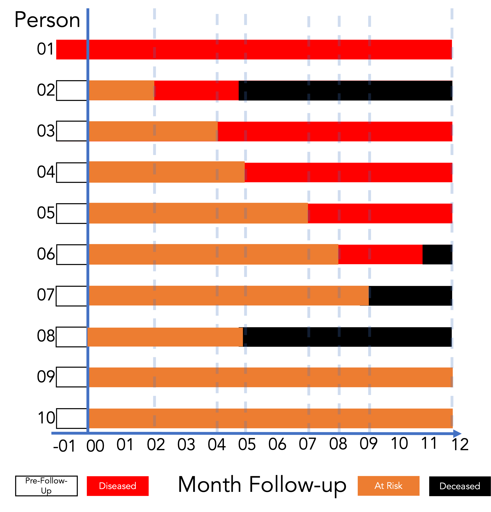
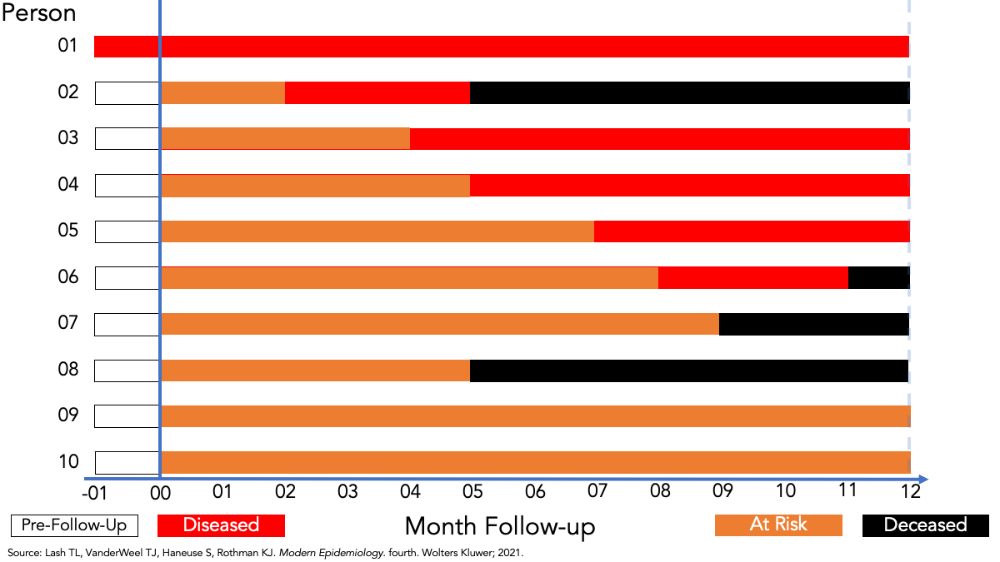
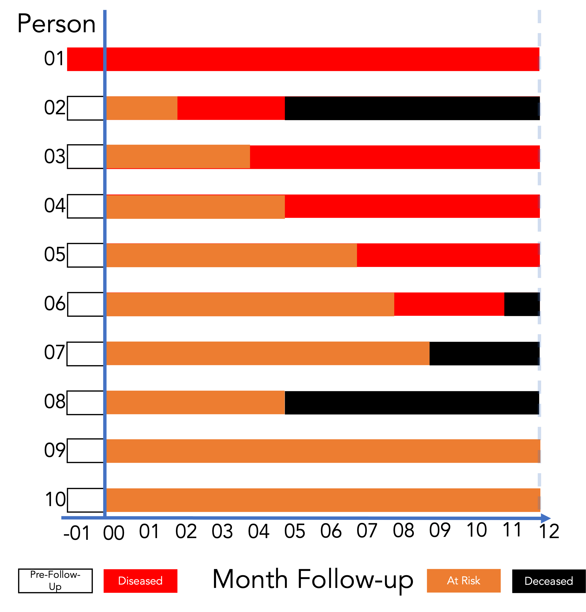

## Course Learning Objectives

1. Define epidemiology and key associated terminology, especially confounding.
2. Distinguish among association, prediction, and causation.
3. Explain the Rothman model of sufficient-component causes (RMSCC) and the concept of multifactorial causation.
4. Explain the limitations of anecdotal evidence in drawing epidemiologic conclusions.
5. Explain why disseminating risk information is sometimes necessary but rarely sufficient to improve population health.

::: {.notes}
By the end of this course, my goal is for you to be able to:
:::

## Lecture Learning Objectives

<!-- 
Revise these objectives. 
Do this last, after the slides are ready.
-->

By the end of this lesson, you'll be able to:

1. Define counts and rates.
2. Distinguish crude, specific, adjusted rates.
3. Compute and interpret prevalence and incidence.

## Review: Choose the Snapshot

<!-- Calculate the correct answers and have them ready. -->

:::: {.columns .align-center}
::: {.column width="58%"}

:::

::: {.column width="42%"}
With your group:

1. Choose **month 2, 6, or 10**.
2. Count the people living with disease.
3. Count the living members of the population.
4. Calculate and interpret the prevalence proportion.

Be ready to explain your numerator and denominator.
:::
::::

::: {.notes}
- Allow groups about 3 minutes to work, then ask one group assigned to each month to report its numerator, denominator, prevalence proportion, and interpretation.
- **Ask** why groups obtained different prevalence estimates even though they examined the same population. Emphasize that a measure of occurrence requires both a defined population and a defined time frame.
- Reinforce that counts describe burden, while proportions place that burden in the context of the population size.
- Transition to incidence by asking: “These snapshots tell us who had the disease at each point, but how could we describe who developed it during follow-up?”
:::

## Prevalence Describes a State {auto-animate=true auto-animate-id="occurrence-transition" auto-animate-duration="0.7" auto-animate-easing="ease-in-out"}

::: {.occurrence-transition}
::: {.transition-row .prevalence-row}
::: {.state-node .disease-present data-id="disease-present"}
Disease present
:::
:::

::: {.measure-question data-id="measure-question"}
Who has disease?
:::

::: {.measure-type data-id="measure-type"}
A **state** observed at a moment or over a period
:::
:::

::: {.notes}
- Prevalence measures how many cases are present at a moment or over a period.
- It answers the question, "who has disease?" (outcome of interest)
- Advance to the next slide to shift from observing disease status to observing a change in disease status.
:::

## Incidence Describes a Transition {auto-animate=true auto-animate-id="occurrence-transition" auto-animate-duration="0.7" auto-animate-easing="ease-in-out"}

::: {.occurrence-transition}
::: {.transition-row}
::: {.state-node .disease-absent data-id="disease-absent" auto-animate-delay="0.55"}
Disease absent
:::

::: {.transition-arrow data-id="transition-arrow" auto-animate-delay="0.55"}
→
:::

::: {.state-node .disease-present data-id="disease-present"}
Disease present
:::

::: {.state-label .at-risk-label auto-animate-delay="0.55"}
At risk
:::

::: {.transition-label .follow-up-label auto-animate-delay="0.55"}
during follow-up
:::
:::

::: {.measure-question data-id="measure-question"}
Who developed disease?
:::

::: {.measure-type data-id="measure-type"}
Incidence counts **new transitions** during a specified period.
:::
:::

::: {.notes}
- Incidence begins with people who are at risk: the outcome is absent at the start of follow-up.
- The event of interest is the transition into the outcome. That transition creates a new case.
- People who already have the outcome at the start are not at risk of becoming a new case of that outcome.
:::

## One-Time vs. Recurrent Events

<!-- Make this slide more visual and less wordy. -->

We can measure the incidence of:

- **One-time events**, such as Parkinson’s disease or a first cancer diagnosis
- **Recurrent events**, such as respiratory infections during a calendar year

::: {.notes}
- We can measure the incidence of:
  - **One-time events**, such as Parkinson’s disease or a first cancer diagnosis
  - **Recurrent events**, such as respiratory infections during a calendar year
- To measure incidence, we must begin with a population **at risk** of the outcome. For example, a cohort used to measure Parkinson’s disease incidence must exclude people who already have the disease at cohort inception.
- We can turn a recurrent event into a one-time event by studying only its first occurrence—for example, each person’s first respiratory infection during the calendar year.
:::

## Incidence Proportion and Risk

<!-- Make this slide more visual and less wordy. -->

- Incidence proportion and “risk” are sometimes used interchangeably in epidemiology.
- Risk can be ambiguous. Incidence proportion is less so.

::: {.notes}
- We will use the more precise terminology in this course.
:::

## Incidence Measures

<!-- Make this slide more visual and less wordy. -->

<!-- Create a table with the measure in the left column and the formula in the right column. -->

::: {.notes}
- As with prevalence, we can measure incidence using proportions, odds, and counts of new cases in a population.
- We can also use incidence rates and measures of elapsed time to an event.
:::

## Incidence Count

<!-- Make this slide more visual and less wordy. For example, use a double-headed arrow to represent time and the range of possible values. -->

- A count of new occurrences of a condition in a population at risk for the occurrence during a given time frame.
- Range: 0 to infinity.

::: {.notes}
- A count of new occurrences of a condition in a population at risk for the occurrence during a given time frame.
- Range: 0 to infinity.
:::

## Incidence Proportion

<!-- Make this slide more visual and less wordy. For example, use a double-headed arrow to represent time and the range of possible values. -->

- The proportion of the population that experiences a new occurrence of the condition among those at risk of experiencing a new occurrence during a given time frame.
- Like all proportions, it falls between 0 and 1.

::: {.notes}
- It is critical to reiterate that incidence proportions are only meaningful when paired with a fixed period of time. 
- This may be illustrated most clearly with the outcome of death: the **“risk of death”** in humans is universally 1, in that all humans will eventually die. 
- Thus, telling someone that, in your study, the “risk of death was 10%” is unhelpful; more helpful would be to tell them that, for example, the “1-year risk of death was 10%.”
:::

## Incidence Proportion: Formula {.big-formula}

$$
\text{Incidence proportion} = \frac{\text{Count of new occurrences}}{\text{Population at risk}}
$$

::: {.notes}
- We can write the information from the previous slide in a slightly more mathy way like this.
:::

## Follow-Up Experience and New Occurrences {.status-table}

::: {.notes}
- So, let’s take another look at our example population. 
- How many were at risk of experiencing a new occurrence of disease during the period of observation? 9 (person 1 was not at risk).
- How many of the people at risk developed a new occurrence of disease? 5 (p2, p3, p4, p5, p6).
:::

## Incidence Proportion Over 12 Months

:::: {.columns .align-center}
::: {.column width="60%"}

:::

::: {.column width="40%"}
$$
\frac{\text{Count of new occurrences}}{\text{Population at risk}}
$$
 
$$
\frac{5}{9}
$$
 
$$
\approx 0.56 \text{ or } 56\%
$$
:::
::::

## Interpreting Incidence Proportion

:::: {.columns .align-center}
::: {.column width="60%"}

:::

::: {.column style="width: 40%; text-align: center;"}
Among the members of the population, the incidence of disease over 12 months of follow-up was **0.56**.
 
 

Fifty-six percent of the population developed disease over 12 months of follow-up.
:::
::::

## Incidence Odds: Formula {.big-formula}

$$
\text{Incidence odds} = \frac{\text{Incidence proportion}}{1 - \text{Incidence proportion}}
$$

::: {.notes}
- We can write the information from the previous slide in a slightly more mathy way like this.
:::

## Incidence Odds Over 12 Months

:::: {.columns .align-center}
::: {.column width="60%"}

:::

::: {.column width="40%"}
$$
\frac{\text{Incidence proportion}}{1 - \text{Incidence proportion}}
$$
 
$$
\frac{0.56}{1 - 0.56}
$$

 
$$
\approx 1.27
$$
:::
::::

## Exact Incidence Odds Over 12 Months

:::: {.columns .align-center}
::: {.column width="60%"}

:::

::: {.column width="40%"}
$$
\frac{\text{Incident cases}}{\text{Non-incident cases}}
$$
 

::: {.fragment}
$$
\text{5:4} \text{ or } \frac{5}{4}
$$

 
$$
= 1.25
$$
:::
:::
::::

::: {.notes}
- We can also calculate the incidence odds more precisely as...
:::

## Interpreting Incidence Odds

:::: {.columns .align-center}
::: {.column width="60%"}

:::

::: {.column style="width: 40%; text-align: center;"}
Among the members of the population, the odds of incident disease over 12 months of follow-up were **1.25**.
 
 

For every 5 people who developed incident disease over 12 months of follow-up, 4 people did not.
:::
::::

::: {.notes}
- Notice that we don't say **had** disease.
- And how do we get from 1.25 back to 5:4?
- Express the decimal as a fraction: 1.25 = 125/100
- Then simplify by dividing numerator and denominator by 25: 125/100 = 5/4 or 5:4.
:::

## Incidence Rate

<!-- Make this less wordy and/or make it interactive. -->

::: {.incremental}
- A measure of the average intensity at which an event occurs in people's experience over time.
- For a population followed from baseline, it is the number of cases divided by the person-time at risk accumulated by the population.
- Range: 0 to infinity.
- **Not a proportion.**
<!-- AI correction — needs review: person-time is the denominator; reciprocal time describes the resulting rate units. -->
- The denominator is person-time at risk
- The resulting rate has units of inverse/reciprocal time ($\text{time}^{-1}$).
- The numeric value depends on the selected time unit and therefore has no interpretation by itself.
:::

::: aside
Source: [@westreich2019]
:::

::: {.notes}
- Accurately calculating the incidence proportion requires complete follow-up of a closed population. In other words, no new members once enrollment is complete, and no members leave the population except through death. Unfortunately, these conditions are pretty rare in the real world.
- One way to deal with this complication is to develop measures that take into account the length of time each individual was in the population at risk for the event. This length or span of time is called the person-time contribution of the individual.
:::

## Person-Time

<!-- Add Poll Everywhere or exercise. -->

::: {.incremental}
- **Person-time** is the amount of time observed for all people under study while they are at risk of experiencing an incident outcome.
- If a woman is followed for 1 month, then she experiences (and contributes to analysis) 1 person-month of time.
- If 10 women are followed for 1 year, they contribute 10 × 1 = 10 person-years.
- If 1 woman is followed for 10 years, she also contributes 1 × 10 = 10 person-years. 
:::

::: aside
Source: [@westreich2019]
:::

::: {.notes}
- This calls attention to a basic assumption of person-time: that any unit of person-time is **exchangeable** with any other unit of person-time under study.
:::

## Follow-Up Experience and Time at Risk {.status-table}

::: {.notes}
- So, let’s take another look at our example population. 
- How many were at risk of experiencing a new occurrence of disease during the period of observation? 9 (person 1 was not at risk).
- For how many months were these 9 people under observation and at risk of developing a new occurrence of disease?
:::

## Calculating Person-Time

:::: {.columns .align-center}
::: {.column width="60%"}

:::

::: {.column width="40%"}
$$
\sum_{\text{people}} \text{Time at risk}
$$
 
$$
\begin{aligned}
&= 0 + 2 + 4 + 5 + 7 \\
&+ 8 + 9 + 5 + 12 + 12
\end{aligned}
$$

 
$$
= 64\text{ person-months}
$$
:::
::::

## Interpreting Person-Time

:::: {.columns .align-center}
::: {.column width="60%"}

:::

::: {.column style="width: 40%; text-align: center;"}
The population accumulated **64 person-months at risk** during 12 months of follow-up.
 
 

The same amount is **5.33 person-years at risk** during 12 months of follow-up.
:::
::::

## Follow-Up Experience for the Incidence Rate {.status-table}

::: {.notes}
- How many of the people at risk developed a new occurrence of disease? 5 (p2, p3, p4, p5, p6).
:::

## Incidence Rate: Calculation

:::: {.columns .align-center}
::: {.column width="60%"}

:::

::: {.column width="40%"}
$$
\frac{\text{Count of new occurrences}}{\text{Person-time at risk}}
$$
 
$$
= \frac{5}{64\text{ person-months}}
$$

 
$$
\approx 7.8\text{ per 100 person-months}
$$
:::
::::

## Interpreting the Incidence Rate

:::: {.columns .align-center}
::: {.column width="60%"}

:::

::: {.column style="width: 40%; text-align: center;"}
The incidence rate of disease among the members of the population was **5 cases per 64 person-months** during 12 months of follow-up.
 
 

Equivalently, the incidence rate was **7.8 cases per 100 person-months** during 12 months of follow-up.
:::
::::

## Inverse/Reciprocal Time ($\text{time}^{-1}$)

::: {.incremental}
- If a study follows 100 people for 5 years, what is the total person-time?
  - The total person-time is 500 person-years.
- If 10 people experience the event of interest, what is the incidence rate?
  - The incidence rate is: $\frac{10 \text{ cases}}{500 \text{ person-years}} = \text{0.02 cases per person-year}$
  - The unit is $\text{0.02} \text{ time}^{-1}$. This reciprocal time unit means that, on average, 2% of the population at risk will experience the event each year.
- But why is it called "reciprocal time" and why is it written as $\text{time}^{-1}$?
:::

::: {.notes}
- Did you notice the funny unit of time two slides ago?
- It's called inverse or reciprocal time, and it can seem very confusing, but really it's just basic algebra.
:::

## Why Is It Called Inverse/Reciprocal Time?

::: {.incremental}
- It is called reciprocal time and written as $\text{time}^{-1}$ because of basic algebra and the rules of mathematical exponents.
- In mathematics, the reciprocal of any number or variable is just 1 divided by that variable.
  - The reciprocal of 5 is $\frac{1}{5}$
  - The reciprocal of Time is $\frac{1}{\text{Time}}$.
  - When we calculate an incidence rate, the formula is: $\frac{\text{Count of new occurrences}}{\text{Person-time at risk}}$
- Because the unit of time sits in the **denominator** (the bottom of the fraction), we are multiplying the number of cases by the reciprocal of time.
:::

::: {.notes}
- Why is it called inverse/reciprocal time?
:::

## Why the Negative Exponent ($\text{time}^{-1}$)?

::: {.incremental}
- In algebra, a negative exponent is a shorthand way of writing a fraction where the variable is on the bottom. The standard rule is: $\frac{1}{x} = x^{-1}$
- If our unit of time is years, then: $\frac{1}{\text{year}} = \text{year}^{-1}$
- So, when we see a rate written as $\text{0.02} \text{ time}^{-1}$, it literally means 0.02 per year or $\frac{0.02}{\text{year}}$.
- Using the negative exponent is simply the standard scientific way to write "per year" on a single line without needing to draw a fraction bar.
:::

::: {.notes}
- Why the negative exponent?
:::

<!--  
Add content about the relationship between incidence and prevalence.
Add content about the relationship between odds and proportions.
-->

## Mortality Rates: Incidence of Death {.compact}

Death is another **new event** we can count over time.

$$
\text{Crude mortality rate} = \frac{\text{Deaths during the year}}{\text{Midyear population}} \times 1{,}000
$$

**Hypothetical town:** 80 deaths during one year; 10,000 residents at midyear.

$$
\frac{80}{10{,}000} \times 1{,}000 = 8\text{ deaths per 1,000 residents that year}
$$

- **Crude:** all causes of death, across the whole population.
- **Specific:** narrow the cause or population, such as cancer deaths or deaths among adults ages 65+.

::: {.notes}
- Connect this measure to the incidence rate students just learned: the event is death rather than a new disease diagnosis.
- Midyear population multiplied by one year approximates the population's person-time during that year. This works best when population size changes reasonably smoothly; the denominator is not a count of a closed cohort followed from baseline.
- For an age-specific mortality rate, both numerator and denominator must use the same age group: deaths among adults ages 65+ divided by the midyear population ages 65+. A sex-specific mortality rate uses the same principle.
- A cause-specific mortality rate restricts the numerator to deaths from the selected cause and uses the relevant population as the denominator. For example, cancer deaths divided by the midyear population describes population mortality from cancer; it does not describe the proportion of cancer patients who die.
- The multiplier changes how the rate is displayed. Eight deaths per 1,000 is equivalent to 800 deaths per 100,000 over the same year.
:::

## Natality Rates: Counting Births {.compact}

**Natality** refers to births. We again relate new events to a population over time.

$$
\text{Crude birth rate} = \frac{\text{Live births during the year}}{\text{Midyear population}} \times 1{,}000
$$

**Hypothetical town:** 120 live births; 10,000 residents at midyear.

$$
\frac{120}{10{,}000} \times 1{,}000 = 12\text{ live births per 1,000 residents that year}
$$

- This describes births in relation to the **whole population**.
- The **general fertility rate** uses women ages 15–44 as its denominator, by U.S. statistical convention.

::: {.notes}
- The familiar structure remains: define the event, choose the population denominator, specify the time period, and choose a multiplier.
- As with the annual crude death rate, midyear population multiplied by one year approximates population person-time. The crude birth rate describes the population's production of births; it is not an individual's probability of giving birth because the denominator includes all residents.
- For the U.S. general fertility rate, divide all live births during the year, regardless of maternal age, by the midyear number of women ages 15–44 and multiply by 1,000. This is a conventional population measure, not a perfect count of everyone capable of giving birth.
- Birth counts count babies, so a delivery of live-born twins contributes two live births. Birth counts help plan services, and birth rates help compare populations of different sizes.
:::

## A Familiar Name Can Hide a Different Denominator {.compact}

Always check **what is being divided by what**.

| Measure | Numerator | Denominator |
|---|---|---|
| Case-fatality proportion | Deaths from the disease among a defined group of cases | All cases in that group |
| Infant mortality rate | Deaths before age 1 during a year | Live births during that year |

**Hypothetical examples:**

- **Case fatality:** 3 deaths among 100 cases followed through illness → **3%** of those cases died from the disease.
- **Infant mortality:** 6 infant deaths and 1,200 live births → **5 deaths before age 1 per 1,000 live births** that year.

::: {.notes}
- Ask students to connect case fatality to a familiar proportion: the numerator is part of the denominator. Although often called the “case-fatality rate,” it is a proportion, not a person-time rate. Define the cases and follow-up period; the example assumes outcomes are known for all 100 cases.
- Infant mortality uses a conventional ratio of two event counts, rather than a person-time denominator. Some infants who die this year were born last year, so the numerator is not necessarily a subset of this year's births. Avoid interpreting the annual period measure as an exact observed risk for the babies born that year.
- The infant mortality calculation is 6 divided by 1,200, multiplied by 1,000. Describe the result as deaths per 1,000 live births and name the year and population.
- These examples extend the earlier distinction between ratios, proportions, and rates. The name alone does not identify the mathematical structure.
:::

## Why Adjust a Rate? {.compact}

A town with more older adults can have a higher crude death rate **even when its age-specific rates are the same**.

**Hypothetical example: one year, 10,000 residents in each town.**

| Age group | Town A population | Town B population | Deaths per 1,000 in both towns |
|---|---:|---:|---:|
| Under 65 | 9,000 | 5,000 | 2 |
| 65+ | 1,000 | 5,000 | 20 |

- **Town A:** 18 + 20 = 38 deaths → **3.8 per 1,000**.
- **Town B:** 10 + 100 = 110 deaths → **11 per 1,000**.

What would the comparison look like if both towns had the **same age mix**?

::: {.notes}
- Walk through the death counts: Town A has 9,000 × 2/1,000 = 18 deaths below age 65 and 1,000 × 20/1,000 = 20 deaths at ages 65+. Town B has 10 and 100 deaths, respectively.
- These are midyear population counts used to approximate person-time during the year. The crude rate combines the age-specific rates using each town's own age distribution.
- Neither town has a higher death rate within either age group in this deliberately simple example. The difference in crude rates comes entirely from the different age distributions.
- An adjusted rate summarizes the comparison after applying a common population composition. Adjustment can also be used for other factors, but age is especially useful for illustrating mortality comparisons.
:::

## Age Adjustment: Use the Same Age Mix {.compact}

**AI-created draft — needs review**

**Direct age adjustment** takes a weighted average of age-specific rates using the **same age weights** for every population.

For our example, choose a standard population that is **80% under 65** and **20% ages 65+**.

$$
\text{Adjusted rate} = (0.80 \times 2) + (0.20 \times 20) = 5.6
$$

Both towns have an adjusted rate of **5.6 deaths per 1,000 standard population per year**.

- This is the rate expected if each town had the standard age mix.
- Age adjustment supports comparisons; it does **not** remove every difference or bias between populations.

::: {.notes}
- Keep each town's own age-specific death rates, replace its age weights with the common standard weights, and add the weighted rates. The weights must sum to 1.
- In this example, both towns have age-specific rates of 2 and 20 per 1,000 per year, so applying the same 0.80 and 0.20 weights produces 5.6 for each. The crude rates remain 3.8 and 11; the adjusted calculation is a comparison under the chosen common age distribution, not a change in the actual deaths observed.
- Explain the hypothetical standard in counts if helpful: among 1,000 people with this age mix, 800 are under age 65 and 200 are ages 65+. Applying the age-specific rates gives 1.6 + 4 = 5.6 expected deaths per year. Expected counts need not be whole numbers.
- The 80%/20% standard and two broad age groups are teaching simplifications. U.S. published mortality statistics commonly use the projected 2000 U.S. standard population with more detailed age groups. Compare adjusted rates that use compatible age groups and the same standard.
- Adjustment addresses differences in the included factor. It does not automatically correct measurement error, differences in other characteristics, or confounding within broad age groups, and it does not establish causation.
- The supplied reading also introduces indirect adjustment, which applies standard age-specific rates to the population being studied and compares observed with expected deaths. Keep that method as optional context; these slides teach the intuition behind direct adjustment.
:::

## Incidence Rates {#incidence-rates .quiz}



## Review: Ratios, Proportions, and Percentages {#review-ratio-proportion-percentage .quiz}



::: {.fragment}
- Riders to nonriders = 12/28 = 3/7, or 3:7: three riders for every seven nonriders. 
- The proportion who ride is 12/(12+28) = 12/40 = 0.30. 
- The percentage is 0.30 × 100 = 30%. 
- The ratio compares riders with nonriders; the proportion and percentage compare riders with all surveyed students. 
- All three descriptions refer to this survey today.
:::

## Review: Prevalence and Incidence {#review-prevalence-and-incidence .quiz}



## Review: Person-Time and Rates {#review-person-time-rate .quiz}



## Review: Interpret the Odds {#review-odds-interpretation .quiz}



## Review: Convert Odds to Probability {#review-odds-to-probability .quiz}



## Review: Compare Two Odds {#review-odds-ratio .quiz}



## Review: Why Adjust Rates? {#review-why-adjust-rates .quiz}



## Review: Mortality Rates {#review-mortality-rate .quiz}



## Review: Birth and Fertility Rates {#review-birth-and-fertility-rates .quiz}



## References {.references-slide}

::: {#refs}
:::
