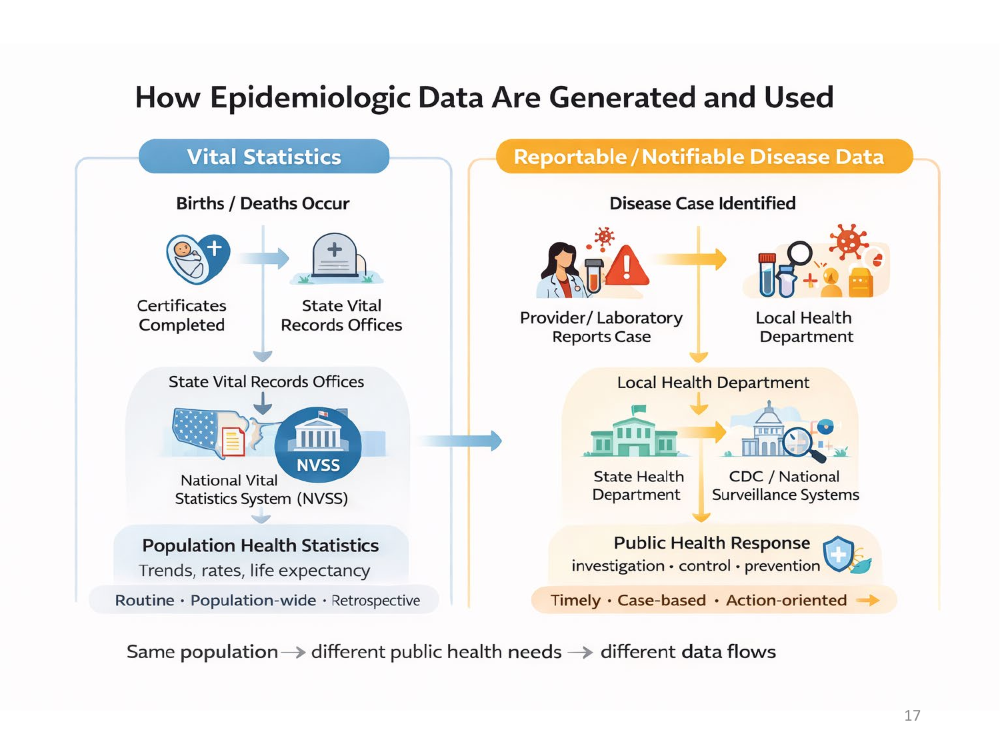
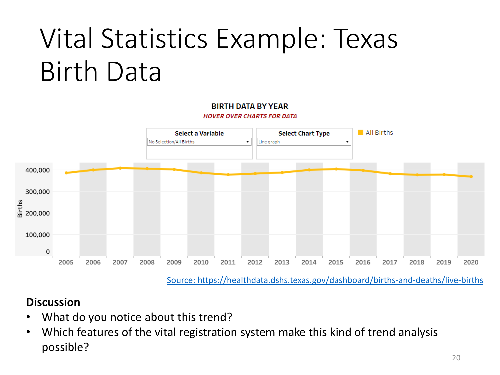
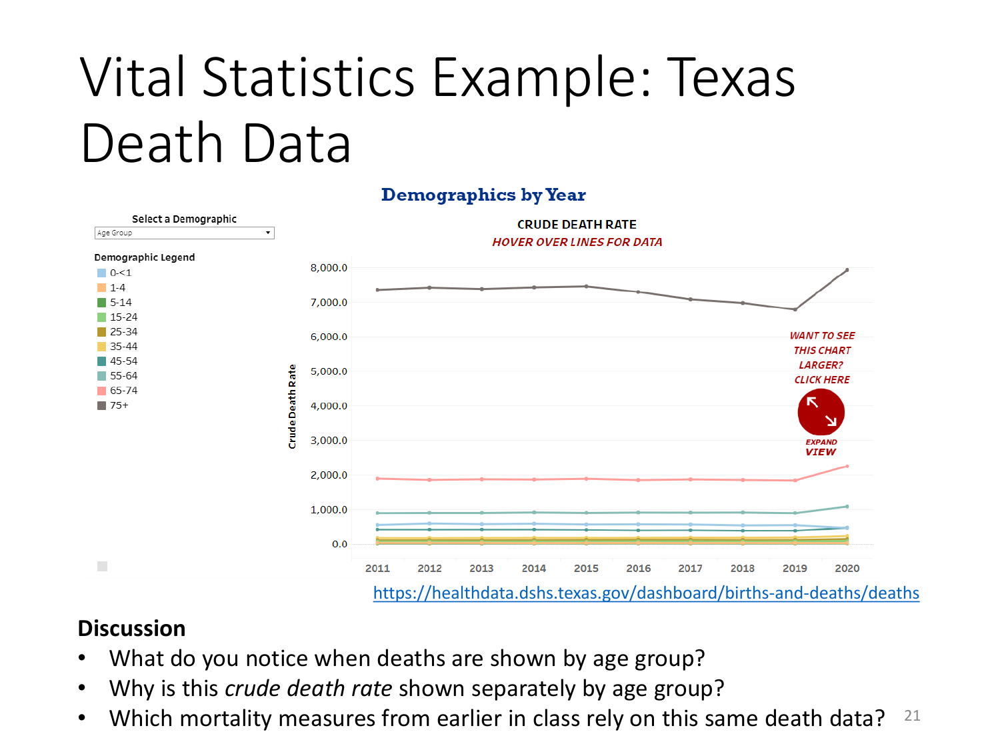

<!--  
Add something about big data.
-->

## Learning Objectives {.compact}

<!--  
Revise and update the learning objectives last.
-->

By the end of this week, you should be able to:

1. Identify key factors that influence **epidemiologic data quality**.
2. Distinguish between **vital statistics** and **reportable/notifiable disease data**.
3. Identify major **surveillance programs in the United States**.
4. Describe major **sources of epidemiologic data** used in public health.
5. Explain the role of **international organizations** in collecting and disseminating epidemiologic data.

::: {.notes}
- We learned a little bit about what to do with data last time.
- But where do we get the data? That's today's topic.
:::

## Review of Mortality: Real Data (CDC NVSS, 2023) {.compact}

<!--  
Update to: https://www.cdc.gov/nchs/products/databriefs/db548.htm
- What does the death rate tell us?
- What does the age-adjusted death rate tell us?
-->

- Source: [CDC NCHS Data Brief 521](https://www.cdc.gov/nchs/products/databriefs/db521.htm#Key_finding)
- Selected findings:
  - Life expectancy: **78.4 years** (↑ 0.9 from 2022)
  - Age-adjusted death rate: ↓ **6.0%** (798.8 → 750.5 per 100,000)
  - Age-specific death rates decreased for all age groups ≥5 years.
  - Leading causes unchanged: heart disease, cancer, injuries.
  - Infant mortality: **560.2 per 100,000 live births** (no change).

::: {.notes}
:::

## Leading Cause ≠ Highest Risk {.compact}

<!--  
This is an important concept.
Let's make this more interactive somehow.
-->

- **Leading causes of death** are ranked by **proportion of total deaths (PMR)**.
- Ranking answers “**how many deaths?**” → **Burden**.
- **Risk** answers “**how likely is death?**” → measured by rates (e.g., **CSMR**).
- A cause with a lower rank can still pose **high risk** to specific populations.
- Public health concern depends on **context**, not rank alone.

> **Burden ≠ Risk**

::: {.notes}
:::

## Example: Suicide {.compact}

<!--  
I think it's also a leading cause of death in older white men.
-->

- Suicide is **not a top-ranked cause of death overall**.
- But it is a **leading cause of death among young adults**.
- This reflects **high cause-specific mortality rates** in certain groups.
- Key contrast:
  - PMR (overall): low
  - CSMR (subgroups): high

::: {.notes}
:::

## Conceptual Transition {.compact}

<!--  
I need to figure out what she was trying to get them to think about.
If I figure it out, I should make this slide a little more direct. If the current wording was too vague for me, it's going to be too vague for students.
If I'm not able to figure it out, then delete this slide.
-->

- You just interpreted multiple mortality measures using one short summary.
- **Question:** What assumptions are we making about the data behind these numbers?
- *(Write down your responses; we will revisit soon.)*

::: {.notes}
:::

## Epidemiologic Data {.compact}

<!--  
This is too wordy. Either:
- Break it up into multiple separate slides
- Make it more visual
- Turn it into an interactive exercise
-->

- Epidemiologic data are **population-based data** used to:
  - Describe disease occurrence
  - Monitor health trends
  - Identify disparities
- Epidemiologic data capture:
  - **Morbidity** (disease, illness)
  - **Mortality** (death)
- Major sources of epidemiologic data:
  - Vital statistics
  - Reportable/notifiable disease data
  - Survey and surveillance data

::: {.notes}
:::

## Factors Affecting Epidemiologic Data Quality {.compact}

<!--  
These are good concepts for students to consider.
We may want to give each concept its own slide and visual.
-->

- Data quality reflects whether the assumptions behind our measures hold.
- Key dimensions:
  - **Coverage:** Who is included?
  - **Accuracy:** Are events classified correctly?
  - **Consistency:** Are the same definitions used over time and place?
  - **Timeliness:** How current are the data?
  - **Processing and quality control:** Errors and checks

::: {.notes}
:::

## Two Types of Epidemiologic Data Systems {.compact}

Epidemiologic data systems serve **different public health purposes**.

::: {.grid-2}
::: {.panel}
**VITAL STATISTICS**

- Track *life events* (births, deaths)
- Population-wide and complete
- Designed for **long-term patterns**
:::

::: {.panel}
**REPORTABLE/NOTIFIABLE DISEASE DATA**

- Track *specific diseases*
- Focus on timeliness and rapid detection
- Designed for **public health action**
:::
:::

> Same population → different questions → different systems

::: {.notes}
:::

## How Epidemiologic Data Are Generated and Used {.visual-only}

<!-- REVIEW: The source credit for this complex vital-statistics/reportable-disease data-flow diagram was not visible in the PDF. The complete slide image is retained because its illustrated process cannot be reconstructed reliably from the PDF alone. -->

<!-- 
Consider remaking these graphics and using a TCU theme. 
- Additionally, they are kind of busy. How can we make the key takeaway(s) jump out?
-->

::: {.notes}
:::

## Vital Registration System {.compact}

<!-- This slide is bland. Consider turning it into an interactive activity. -->

- **Vital events:** births, deaths, fetal deaths, marriages, divorces
- In the United States, these events are compiled through the **National Vital Statistics System (NVSS)**.
- <https://www.cdc.gov/nchs/nvss/index.htm>

::: {.notes}
:::

## Information Collected by Birth and Fetal Death Certificates {.table-slide}

<!-- REVIEW: The PDF did not identify the source of Table 4.3 or the certificate image. The visible table content has been transcribed, but its bibliographic source is unresolved. -->

| Variable | U.S. Certificate of Live Birth | U.S. Report of Fetal Death |
|---|---|---|
| Name | Child’s name | Name of fetus (optional) |
| Disposition (e.g., burial) | Not applicable | Disposition of fetus |
| Location | Facility name | Where delivered |
| Mother identifying information | Name, age, and place of residence | Name, age, and place of residence |
| Mother | Height, weight, number of previous live births | Height, weight, number of previous live births |
| Conditions contributing to fetal death | Not applicable | Initiating cause and other causes (e.g., pregnancy complications, fetal anomalies) |
| Risk factors in pregnancy | Diabetes, hypertension, infections | Diabetes, hypertension, infections |
| Congenital anomalies | Anencephaly, cleft palate, Down syndrome | Anencephaly, cleft palate, Down syndrome |
| Father | Name and age | Name and age |

::: {.notes}
:::

## Vital Statistics Example: Texas Birth Data {.visual-only}

<!-- REVIEW: The dashboard chart’s underlying plotted values were not provided in the PDF text and cannot be reconstructed faithfully. The full source slide is retained as a local asset. -->

<!-- Consider turning this slide into an interactive activity. -->

::: {.notes}
:::

## Vital Statistics Example: Texas Death Data {.visual-only}

<!-- REVIEW: The dashboard chart’s underlying plotted values were not provided in the PDF text and cannot be reconstructed faithfully. The full source slide is retained as a local asset. -->

<!-- Consider turning this slide into an interactive activity. -->

::: {.notes}
:::

## Why Do Some Diseases Have to Be Reported? {.compact}

<!-- This slide is bland. -->

- Some diseases require **immediate public health action**.
- Waiting for routine statistics is too slow.
- These data support **detection, response, and control**.

> Different purpose → different data system

::: {.notes}
:::

## Reportable/Notifiable Disease Data {.compact}

<!-- This slide is bland. -->

- **Case-based surveillance**
- Focus on **specific diseases** of public health importance
- Information typically includes:
  - Case counts (incidence)
  - Basic person, place, and time
  - Key clinical outcomes
- Key tradeoff:
  - Strength: **Timeliness**
  - Limitation: **Incomplete population coverage**
- Designed for action, not completeness.

::: {.notes}
:::

## Reportable vs. Notifiable — What’s the Difference? {.compact}

::: {.grid-2}
::: {.panel}
**REPORTABLE DISEASES**

- Reported to **local or state** health departments
- Used for **local public health action**
- Lists vary by jurisdiction
:::

::: {.panel}
**NOTIFIABLE DISEASES**

- Reported to **national authorities** (e.g., CDC)
- Aggregated for **national monitoring**
- De-identified (age, sex, location)
:::
:::

- Every notifiable disease is first reported locally.

> Same case → different reporting level → different purpose

::: {.notes}
:::

<!-- Add a slide with examples of reportable diseases as well. -->

## Examples of Nationally Notifiable Diseases {.text-small}

<!-- Source PDF page 18; split for slide readability. -->

**National Notifiable Diseases Surveillance System (NNDSS):** the endpoint of the data-report flow

::: {.grid-2}
::: {}
- Anthrax
- COVID-19
- Botulism
- Gonorrhea
- Hepatitis A, hepatitis B, hepatitis C
- Human immunodeficiency virus (HIV) infection
- Meningococcal disease
:::

::: {}
- Mumps
- Syphilis
- Tuberculosis
- Viral hemorrhagic fever (includes Ebola virus)
- Zika virus disease
:::
:::

Source: Centers for Disease Control and Prevention. National Notifiable Diseases Surveillance System (NNDSS). 2022 Nationally Notifiable Conditions. Available at: <https://ndc.services.cdc.gov/event-code-list-other-surveillance-resources/>. Accessed February 20, 2025.

::: {.notes}
:::

## Discussion: Nationally Notifiable Diseases {.compact}

<!-- Source PDF page 18; split for slide readability. -->

<!-- I kind of like an interactive exercise, but I'm not sure that I like this one. -->

1. Pick one disease on the list. At what level would it first be reported?
2. Why would CDC want to track this nationally?
3. Would birth or death data ever appear on this list? Why not?

::: {.notes}
:::

## Surveillance: From Reporting to Monitoring {.compact}

<!-- Good information. Presentation is kind of bland. -->

- Reporting captures **individual cases**.
- Surveillance looks for **patterns over time**.
- Goal: inform **ongoing public health action**.

> Reporting → Surveillance → Action

::: {.notes}
:::

## Two Approaches to Public Health Surveillance {.table-slide}

| Public Health Surveillance | Syndromic Surveillance |
|---|---|
| Routine, ongoing monitoring | Real-time, early warning |
| Uses confirmed diagnoses | Uses symptoms and signals |
| Tracks incidence and trends | Detects unusual patterns |
| **Usually takes place in:** Public health departments, registries, national systems | **Usually takes place in:** Emergency departments, urgent care, pharmacies |
| Example: flu incidence over years | Example: spikes in fever-related ER visits |

::: {.notes}
:::

## Exercise: Types of Surveillance {.compact}

<!-- Source PDF page 21; split for slide readability. -->

<!-- The scenarios to match are on the next slide. Figure out a better way to format this. -->

Match each scenario with the correct type:

::: {.grid-2}
::: {.panel}
**PUBLIC HEALTH SURVEILLANCE**

Long-term, systematic, incidence and policy focus
:::

::: {.panel}
**SYNDROMIC SURVEILLANCE**

Real-time, early warning, symptom and pattern focus
:::
:::

::: {.notes}
:::

## Exercise: Types of Surveillance — Scenarios {.compact}

<!-- Source PDF page 21; split for slide readability. -->

1. Health officials analyze flu vaccination rates every year to guide next season’s immunization campaign.
2. A sudden rise in ER visits for fever and cough signals a possible flu outbreak.
3. Monitoring long-term cancer incidence to plan screening programs.
4. Tracking over-the-counter cold medicine sales during winter to catch early spikes.

Focus on *why* one approach fits better than the other.

::: {.notes}
:::

## Public Health Surveillance Programs {.compact}

<!-- Break this up into multiple slides -->

- **Communicable and infectious diseases**
  - Track cases, hospitalizations, and spread
  - *Example:* COVID-19 surveillance (cases, hospitalizations)
  - *Example:* National Wastewater Surveillance System (NWSS)
- **Chronic diseases**
  - Monitor long-term incidence and outcomes
  - *Example:* Cancer registries (incidence, types, outcomes)
  - *Example:* CDC Chronic Disease Indicators (CDI; state-level indicators for chronic disease patterns)
- **Risk factors for chronic disease**
  - Track behaviors and exposures
  - *Example:* BRFSS (obesity, smoking, physical activity)

::: {.notes}
:::

## National Center for Health Statistics (NCHS) {.compact}

<!-- Add BRFSS -->

**NCHS is a major source of U.S. population-based health data.**

- NCHS data complement surveillance by describing population health beyond reported cases.
- **Survey-based systems**
  - **NHIS:** health status, access to care, prevention
  - **NHANES:** exams and interviews (diet, activity, disease prevalence)
- **Vital statistics**
  - **NVSS:** births, deaths, life expectancy, leading causes of death

::: {.notes}
:::

## Why International Organizations Matter {.compact}

<!-- Make this slide more visual. -->

- Diseases cross national borders.
- Data must be **comparable across countries**.
- Surveillance and response require **coordination**.

::: {.notes}
:::

## What International Organizations Do {.compact}

- **Surveillance and reporting** — global monitoring
  - *Example:* WHO Global Influenza Surveillance and Response System (GISRS)
- **Policy guidance** — shared recommendations
  - *Example:* UNAIDS guidance for HIV/AIDS programs
- **Resource support** — capacity and access
  - *Example:* Gavi, the Vaccine Alliance

::: {.notes}
:::

## Key Takeaways: Epidemiologic Data {.compact}

- Epidemiology depends on **population-based data** to describe health patterns.
- **Different public health questions require different data systems.**
- **Vital statistics** describe long-term population patterns (births, deaths).
- **Reportable disease data** support rapid detection and public health response.
- **Surveillance** turns reported data into ongoing monitoring and action.
- **Data quality** determines what conclusions can (and cannot) be drawn.
- Selecting an appropriate data source is a **critical epidemiologic decision**.

::: {.notes}
:::

<!-- Add a check on learning quiz. -->
