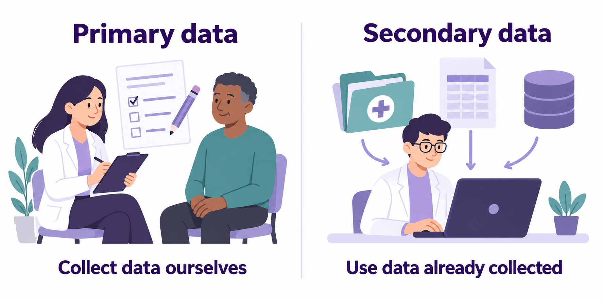
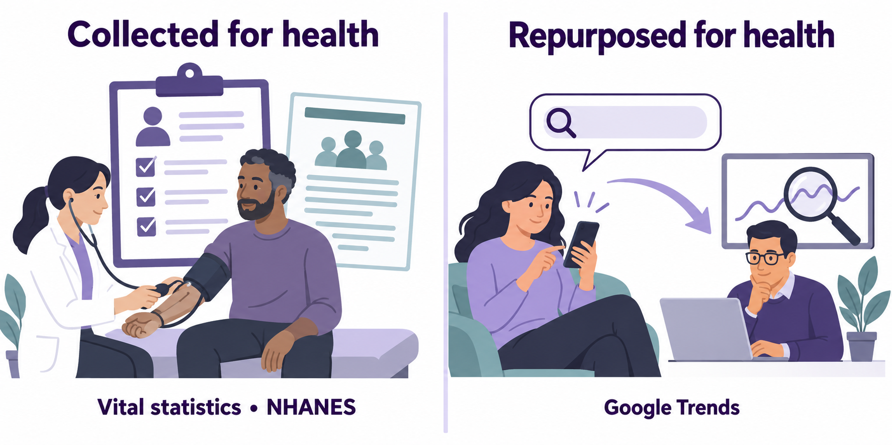

## Learning Objectives {.compact}

By the end of this week, you should be able to:

1. Identify key factors that influence **epidemiologic data quality**.
2. Distinguish between **vital statistics** and **reportable/notifiable disease data**.
3. Identify major **surveillance programs in the United States**.
4. Describe major **sources of epidemiologic data** used in public health.

::: {.notes}
- In our last module we learned about calculating some foundational epidemiologic measures.
- Ask the class to recall some examples of measures of event/disease/outcome occurrence that are commonly used in epidemiology.
- But where do we get the data to calculate those measures? That's today's topic.
- Before diving in, let's complete a reading comprehension exercise to refresh your memory and solidify what you read for this week.
:::

# Reading Comprehension Quiz {.section}

::: {.notes}
Before diving in, let's complete a reading comprehension exercise to refresh your memory and solidify what you read for this week.
:::

<!--  
The reading comprehension quiz uses Poll Everywhere.
Change to AhaSlides or slide-quiz when time allows.
-->

## Reading Comprehension Quiz 01 {#disease-data-linkage .quiz}



::: {.notes}
A: Good effort. Removing identifying information serves a different purpose. Data linkage connects information using a shared identifier.

B: Keep going. Summarizing records describes information already in a database. Linkage joins information across databases.

C: That's right. A common identifier lets us connect related information stored in different databases.

D: Good effort. An interview collects information. Data linkage connects information already stored in databases.
:::

## Reading Comprehension Quiz 02 {#disease-data-mining .quiz}



::: {.notes}
A: That's right. Data mining explores large amounts of data to help us discover patterns and associations.

B: Good effort. A pattern can show an association, but data mining alone does not establish that one factor causes another.

C: Keep going. Changing how records are stored is different from exploring their contents for patterns.

D: Good effort. Data mining looks for patterns; it does not guarantee that the data are free of errors.
:::

## Reading Comprehension Quiz 03 {#disease-data-census .quiz}



::: {.notes}
A: Good effort. Causes of death come from death records. Census data help us describe the population used in the denominator.

B: Keep going. Census data describe populations; they do not confirm individual disease diagnoses.

C: Good effort. Treatment information comes from healthcare records. Census data provide population counts and characteristics.

D: That's right. Census population counts help us define the denominator when calculating a population-based rate.
:::

## Reading Comprehension Quiz 04 {#disease-data-death-certificates .quiz}



::: {.notes}
A: Good effort. The chapter describes death registration as nearly complete. The cause assigned to a recorded death can still be inaccurate.

B: That's right. A death can be recorded even when its cause is unclear or classified inaccurately.

C: Keep going. Death certificates include demographic information such as age and sex. The chapter highlights possible errors in the cause of death.

D: Good effort. Death certificates are widely used to study mortality. We still need to consider their limitations.
:::

## Reading Comprehension Quiz 05 {#disease-data-surveillance .quiz}



::: {.notes}
A: That's right. Surveillance helps us monitor health problems over time and share findings that support public health action.

B: Good effort. Individual treatment is part of clinical care. Surveillance gathers and uses information about health in populations.

C: Keep going. Surveillance is ongoing and includes analyzing, interpreting, and sharing information, not just storing it.

D: Good effort. Assigning treatments is part of an experimental study. Surveillance monitors the occurrence of health problems and risk factors.
:::

## Reading Comprehension Quiz 06 {#disease-data-reportable-diseases .quiz}



::: {.notes}
A: Good effort. Publication in a research article does not make a disease reportable. The term refers to a required report to health authorities.

B: Keep going. A census counts and describes a population. Disease reporting is a separate process required for specified diseases.

C: Good effort. News coverage is different from the required reporting of disease cases to health authorities.

D: That's right. Reportable diseases are diseases whose cases healthcare providers must report to health authorities under legal requirements.
:::

## Reading Comprehension Quiz 07 {#disease-data-case-registry .quiz}



::: {.notes}
A: Good effort. A list of research citations helps us find literature. A case registry collects information about a disease and its cases.

B: That's right. A case registry brings disease information together so we can track cases and study disease patterns.

C: Keep going. A population count describes how many people live in an area. A case registry focuses on a disease and its cases.

D: Good effort. An appointment schedule organizes clinic visits. A registry collects disease information for purposes such as tracking cases and supporting research.
:::

## Reading Comprehension Quiz 08 {#disease-data-health-surveys .quiz}



::: {.notes}
A: Good effort. NHANES collects information through interviews and examinations. Death certificates are a separate source of health data.

B: Keep going. The distinction is reversed: NHANES includes physical examinations, while NHIS collects information through interviews only.

C: That's right. Both surveys use interviews, and NHANES also uses physical examinations, which can reveal previously undiagnosed conditions.

D: Good effort. NHANES collects information from participants through interviews and examinations; it is not a literature search.
:::

# Data Sources {.section}

## Primary vs. Secondary Data

{width=90% fig-alt="Primary data: a researcher interviews a participant to collect data. Secondary data: a researcher uses existing health records and databases."}

::: {.notes}
- One way to categorize the data we often use in epidemiology is primary vs. secondary data.
- **Primary data**: Data we collect ourselves for a specific purpose. 
 - For example, a survey, interview, direct observation, or laboratory measurement we design and conduct.
- **Secondary data**: Data that already exists because it was collected by someone else. Often, though not always, for a different purpose than ours.
  - For example, electronic health records, surveillance data, census data, hospital discharge records, or a previously conducted survey.

- The **practical tradeoff**: 
  - Primary data give us more control over what and how we measure, but take more time and resources. 
  - Secondary data are faster and often less expensive to use, but their variables, measurement quality, population, and timing may not fully fit our question.

- This is a topic we will explore today.
:::

## Exercise: Primary vs. Secondary Data

Our county wants to understand barriers to staying safe during extreme heat. We can fund one initial approach:

::: {.spaced-options .fragment}
**Option 1.** Interview residents about cooling access and transportation. We can ask exactly what we need to ask, but recruitment takes time and some residents may not respond.

**Option 2.** Analyze existing emergency-department records. They contain detailed records of serious health events, but miss people who never reach an emergency department.

**Option 3.** Combine existing housing, tree-cover, and population data. They describe neighborhood conditions, but do not tell us who became ill.
:::

### Which would we start with and why? {.fragment}



::: {.notes}
**Instructions**

- Take 2 minuts to answer these questions with your group.

**Discussion**

- Option 1 allows us to answer questions about residents’ experiences; 
- Option 2 allows us to answer questions about serious illness and healthcare use; 
- Option 3 allows us to answer questions about environmental conditions and geographic targeting. 
- The value of each data sources changes as the question changes.

**Follow-up**

- Ask: “What would your chosen source leave unanswered?”
- Neither primary nor secondary data guarantees **quality**. 
- Neighborhood data can be relevant to health without containing diagnoses. 
- **Takeaway**: Choose the source after clarifying the question.
:::

## Health Data vs. Health Insights from Repurposed Data

{width=90% fig-alt="Data collected for health, illustrated by a health examination and records, compared with online search activity repurposed for health research."}

::: {.notes}
- In epidemiology, we frequently use data that was collected explicitly to understand health (e.g., Vital Statistics, NHANES).
- However, it's becoming increasingly common to use data that was created for a different purpose (e.g., Google Trends).
- We will see examples of both.
:::

# Vital Statistics Data {.section}

::: {.notes}
- We'll start by discussing data that was collected for tracking human health.
- Perhaps the most basic health data is births and deaths.
:::

## Vital Events: Check Understanding

Which group consists entirely of **vital events**?

::: {.spaced-options}
**A.** Births, deaths, and hospital admissions.  
**B.** Births, marriages, and vaccinations.  
**C.** Births, deaths, marriages, divorces, and fetal deaths.  
**D.** Deaths, divorces, and new cancer diagnoses.  
:::

::: {.fragment}
**Correct answer: C.** Vital events include births, deaths, marriages, divorces, and fetal deaths.
:::

::: {.notes}
- A: Hospital admissions describe healthcare use and are not vital events.
- B: Vaccinations are preventive healthcare services and are not vital events.
- C: All five are vital events.
- D: New cancer diagnoses can be tracked in a cancer registry, but they are not vital events.
:::

## Vital Events: Births

- Legally mandated
- Births: Local -> State

::: {.notes}
- In the United States, birth certificates are managed, stored, and issued by individual state and local governments.
:::

## Vital Events: Deaths

- Legally mandated
- Births: Local -> State
- Deaths: Local -> State -> Federal (NCHS)

https://www.cdc.gov/nchs/nvss/index.htm 

::: {.notes}
- Death certificates are also managed and stored by individual state, county, or local vital statistics offices.
- However, the NCHS, a division of the CDC, tracks every single death occurring within the US.
:::

## Exercise: Vital-Statistics Retrieval

Open [CDC’s *Mortality in the United States, 2024*](https://www.cdc.gov/nchs/products/databriefs/db548.htm). Each pair takes one task:

::: {.spaced-options}
- **A. Life expectancy:** Find life expectancy at birth. Explain why it is not a promise about how long a particular newborn will live.

- **B. Death rates:** Find the age-adjusted death rates for 2023 and 2024. Explain what age adjustment contributes to the comparison.

- **C. Leading causes:** Find which cause entered the top ten in 2024. Did its age-adjusted death rate increase?
:::

Produce two sentences: one accurate finding with year and units, and one interpretation or limitation.



::: {.notes}
**Instructions**

- 1 minute to assign tasks
- 3 for retrieval
- 1 to write
- 3 for up to three voluntary reports and synthesis.
- Answers are on the next slide.
:::

## Mortality Data for the Exercise {.compact}

[CDC: Mortality in the United States, 2024](https://www.cdc.gov/nchs/products/databriefs/db548.htm)

| Measure | 2023 | 2024 |
|---|---:|---:|
| Life expectancy at birth | 78.4 years | 79.0 years |
| All-cause age-adjusted death rate | 750.5 | 722.1 |
| Suicide age-adjusted death rate | 14.1 | 13.7 |

::: {.aside}
- Rates are deaths per 100,000 U.S. standard population.
- Suicide entered the ten leading causes in 2024; COVID-19 dropped out.
:::

::: {.notes}
- The **interpretation**: 79.0 years is the average lifespan that hypothetical cohort would have if it experienced 2024’s age-specific mortality rates throughout life. It is neither the observed average age of people who died in 2024 nor a forecast of the actual lifespan of babies born that year. Future mortality conditions can change.
- **Life expectancy** summarizes mortality conditions; age adjustment facilitates comparisons accounting for age composition. 
- **Ranking** is relative to other causes, so a rank can rise while a rate falls. 
:::

## Leading Cause ≠ Highest Risk {.compact}

<!--  
This is an important concept.
Let's make this more interactive somehow.
-->

::: {.incremental}
- **Leading causes of death** are ranked by **proportion of total deaths (PMR)**.
- Ranking answers “**how many deaths?**” → **Burden**.
- **Risk** answers “**how likely is death?**” → measured by rates (e.g., **CSMR**).
- A cause with a lower rank can still pose **high risk** to specific populations.
- Public health concern depends on **context**, not rank alone.
- **Burden ≠ Risk**
:::

::: {.notes}
- **PMR** = Proportionate Mortality Ratio (proportion of total deaths attributable to a specific cause) — this is the burden measure being ranked.
- **CSMR** = Cause-Specific Mortality Rate (deaths from a specific cause per population at risk, over a time period) — this is the risk measure being contrasted with rank.
:::

## Example: Suicide {.compact}

<!--  
I think it's also a leading cause of death in older white men.
-->

- Suicide is **not a top-ranked cause of death overall**.
- But it is a **leading cause of death among young adults**.
- This reflects **high cause-specific mortality rates** in certain groups.
- Key contrast:
  - PMR (overall): low
  - CSMR (subgroups): high

::: {.notes}
:::

## Exercise: One Death, Several Conditions — Death-Certificate Interpretation {.compact}

The certifying clinician documents this sequence:

> COVID-19 → pneumonia → acute respiratory distress syndrome → death.

The clinician also documents diabetes as contributing to the death.

A reader says: 

> “The person died of respiratory distress, so this should not count as a COVID-19 death.”

In two sentences, explain what the reader has misunderstood. Then identify one uncertainty that could still affect the accuracy of the death certificate.



::: {.notes}
**Instructions**

- 1 minute to explain the documented sequence, 
- 2 for individual writing, 
- 2 for pairs, and 
- 3 for debrief. 
- Introduce “underlying” as the condition initiating the sequence; students need not diagnose the case.

**Discussion**

- In this supplied sequence, COVID-19 is the **underlying cause**, respiratory distress syndrome the immediate cause, and diabetes an additional contributing condition. 
- Multiple listed conditions do not negate the underlying cause. CDC’s certification guidance explicitly illustrates reporting COVID-19 together with pneumonia and respiratory distress. [CDC guidance](https://stacks.cdc.gov/view/cdc/86558)
- Legitimate uncertainties include: 
  - incomplete clinical information and 
  - errors in documenting the sequence.

**Follow-up**

- Ask: “How would ‘deaths with COVID-19 listed anywhere’ differ from ‘deaths with COVID-19 as the underlying cause’?”
- “Deaths with COVID-19 listed anywhere” includes deaths where COVID-19 initiated the sequence leading to death or contributed to the death without initiating that sequence. “Deaths with COVID-19 as the underlying cause” includes only those where COVID-19 initiated the sequence, so it is a subset of the broader count. [CDC definitions](https://www.cdc.gov/nchs/covid19/faq.htm)
- The death in this exercise would count in both groups, because COVID-19 initiated the documented sequence.
- COVID-19 played a causal role in both categories, but its role differed.
- **As the underlying cause:** COVID-19 started the sequence that led to death. Saying the person “died from COVID-19” is appropriate, even though pneumonia and respiratory distress occurred along the way.
- **As a contributing cause only:** COVID-19 helped bring about the death, but another condition initiated the fatal sequence. “COVID-19 contributed to the person’s death” is more precise. [CDC definitions](https://www.cdc.gov/nchs/covid19/faq.htm)
- For students: **The broader count tells us how often COVID-19 was involved in causing death; the underlying-cause count tells us how often it initiated the fatal sequence**. Neither category simply means the person happened to have COVID-19 when they died.

**Takeaway**: 
- Complete death registration and accurate cause classification are different qualities.
:::

## Exercise: The Population Denominator

**Simulated numerator:** During 2025, 2,248 Tarrant County residents died from a fictional condition.

::: {.spaced-options}
**1.** Find the population estimate most appropriate for this numerator. Record its value and date.

**2.** Calculate deaths per 100,000 residents.
:::

::: {.fragment}
Open [Census QuickFacts: Tarrant County](https://www.census.gov/quickfacts/tarrantcountytexas).
:::



::: {.notes}
**Instructions** 

- 1 minute of instructions, 
  - Ask where we can look for the population size denominator.
- 3 for retrieval, 
- 2 for calculation, and 
- 3 for comparison and the extension. 
- Pairs need a browser and calculator.

**Discussion**

- See next slide.
:::

## Exercise: The Population Denominator Discussion

QuickFacts currently reports **2,248,466 residents on July 1, 2025**, and a **2020 Census count of 2,110,640**. [Census source](https://www.census.gov/quickfacts/tarrantcountytexas)

 

$$
\frac{2,248}{2,248,466} \times 100,000 \approx 100.0
$$

::: {.notes}
**Follow-up**

- Ask: "Explain why the 2020 Census count is less suitable."
  - Using the 2020 count gives **106.5 per 100,000**. 
  - That denominator is out of date.

- Ask: “Would the same denominator work for deaths occurring in Tarrant County hospitals?”
  - No. Because non-residents use the hospitals in Tarrant County and because people who live in Tarrant County use hospitals in other places.

- Ask: "If the deaths were only among residents aged 65 or older, what would need to change?""
  - For deaths among older residents, use the corresponding older population, with compatible geography and year.

**Takeaway:** 

- A plausible population number is not necessarily the correct denominator.
:::

# Data From Public Health Surveillance Programs {.section}

## Vital Statistics vs. Disease Surveillance {.compact}

::: {.grid-2}
::: {.panel}
**VITAL STATISTICS**

- Track *life events* (births, deaths)
- Population-wide and complete
- Designed for **long-term patterns**
:::

::: {.panel}
**REPORTABLE/NOTIFIABLE DISEASE DATA**

- Track *specific diseases*
- Focus on timeliness and rapid detection
- Designed for **public health action**
:::
:::

::: {.notes}
- Same population → different questions → different systems
:::

## Reportable vs. Notifiable — What’s the Difference? {.compact}

::: {.grid-2}
::: {.panel}
**Reportable Diseases**

- Reported to **local or state** health departments
- Used for **local public health action**
- Lists vary by jurisdiction
- Examples: Sexually transmitted diseases, rubella, tetanus, measles, plague, and foodborne disease
:::

::: {.panel}
**Notifiable Diseases**

- Reported to **national authorities** (e.g., CDC)
- Aggregated for **national monitoring**
- Examples: Anthrax, COVID-19, Botulism, HIV, Tuberculosis, Zika virus
- Every notifiable disease is first reported locally.
:::
:::

::: {.aside}
Source: Centers for Disease Control and Prevention. National Notifiable Diseases Surveillance System (NNDSS). 2026 National Notifiable Conditions (Historical). Available at: <https://ndc.services.cdc.gov/search-results-year/?os=vb&ref=app>. Accessed September 14, 2026.
:::

::: {.notes}
- States voluntarily send qualifying case information to CDC for national monitoring.
:::

## Two Approaches to Public Health Surveillance {.compact}

::: {.grid-2}
::: {.panel}
**Public Health Surveillance**

- Routine, ongoing monitoring
- Uses confirmed diagnoses
- Tracks incidence and trends
- **Usually takes place in:** Public health departments, registries, national systems
- Example: flu incidence over years
:::

::: {.panel}
**Syndromic Surveillance**

- Real-time, early warning
- Uses symptoms and signals
- Detects unusual patterns
- **Usually takes place in:** Emergency departments, urgent care, pharmacies
- Example: spikes in fever-related ER visits
:::
:::

::: {.notes}
:::

## Exercise: An Early Warning

Emergency departments record an unusual increase in fever-and-cough visits this week. Laboratory results are still arriving.

::: {.spaced-options}
**1.** What can we reasonably conclude now?
**2.** What information would help us interpret the signal?
**3.** What could explain the increase besides more infections?
:::

Would waiting for death certificates answer the same question soon enough?



::: {.notes}
**Instructions**

- Allow 2 minutes to discuss and 3 to debrief using the next slide.

**Discussion**

- We know recorded symptom-related visits increased, not that confirmed influenza incidence rose. 
- Examine total visits, participating facilities, coding changes, laboratory results, and timing. 
- Healthcare-seeking behavior or another respiratory infection could explain the signal. 
- Timely investigation can begin before certainty. 
- Death records describe a different outcome and are not a substitute for this early signal.
:::

## Sources for Our Project Questions {.compact}

| Source | What it can offer |
|---|---|
| **NHIS** — National Health Interview Survey | Reported health conditions, functioning, and healthcare access |
| **NHANES** — National Health and Nutrition Examination Survey | Interviews, examinations, and laboratory measurements |
| **BRFSS** — Behavioral Risk Factor Surveillance System | State-level adult data on behaviors, chronic conditions, and preventive services |

 

### For any source, inspect eligible ages, sampling, years, exact items, geography, and survey weights before estimating prevalence.

::: {.aside}
Sources: [NHIS](https://www.cdc.gov/nchs/nhis/about/index.html), [NHANES](https://www.cdc.gov/nchs/nhanes/about/index.html), [BRFSS](https://www.cdc.gov/brfss/index.html).
:::

::: {.notes}
- NHIS and NHANES are NCHS surveys. BRFSS is a CDC/state collaboration, not an NCHS survey. 
:::

## Exercise: Which Source Fits?

For your group's disease topic:

> “To learn **[what]** about **[whom]**, we would first examine **[source]** because **[reason]**. We would still need to check **[limitation]**.”



::: {.notes}
**Instructions**

- After 2 minutes with the source table, 
- allow 3 minutes to formulate a question, 
- 2 to examine the linked source description, and 
- 3 to compare recommendations. 

**Discussion**

- Diabetes examples: 
  - NHIS for reported diagnosis and access; 
  - NHANES for measured markers that can identify previously undiagnosed disease; 
  - BRFSS for state comparisons of reported diagnosis or behaviors. 
- Do not assume all sources support county estimates. 
- The course project requirement is unchanged; this is a source-selection exercise.
:::

## Factors Affecting Epidemiologic Data Quality {.compact}

Data quality reflects whether the assumptions behind our measures hold.   

- Key dimensions:   
  - **Coverage:** Who is included?   
  - **Accuracy:** Are events classified correctly?   
  - **Consistency:** Are the same definitions used over time and place?   
  - **Timeliness:** How current are the data?   
  - **Processing and quality control:** Errors and checks   

::: {.notes}
- Ask the class to connect each dimension to an earlier example.
- A large database does not automatically solve these problems.
:::

## Key Takeaways: Epidemiologic Data {.compact}

- Epidemiology depends on **population-based data** to describe health patterns.
- **Different public health questions require different data systems.**
- **Vital statistics** describe long-term population patterns (births, deaths).
- **Reportable disease data** support rapid detection and public health response.
- **Surveillance** turns reported data into ongoing monitoring and action.
- **Data quality** determines what conclusions can (and cannot) be drawn.
- Selecting an appropriate data source is a **critical epidemiologic decision**.

::: {.notes}
:::

## References {.references-slide .scrollable}

::: {#refs}
:::
