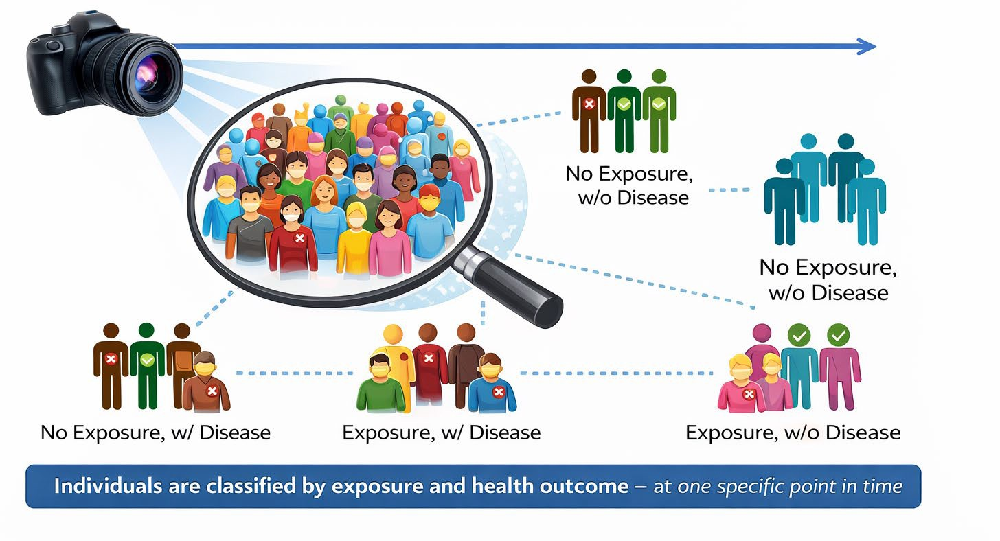
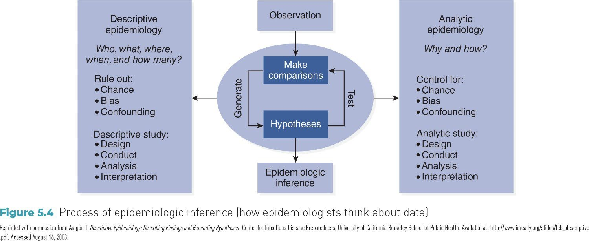

## APHS 20203 Epidemiology \& Biostatistics {#source-001}

Week 4: Descriptive Epidemiology: Patterns of Disease—Person, Place, Time

::: {.notes}

:::

## Learning Objectives {#source-002}

- Describe the **scope and uses of descriptive epidemiology**\.

- Distinguish among **case reports, case series, and cross\-sectional 	studies**\.

- Describe disease patterns using **person, place, and time**\.

- Use descriptive epidemiologic data to **make preliminary 	epidemiologic inferences**\.

- Identify **health disparities** using descriptive epidemiologic methods\.

::: {.notes}

:::

## What Is Descriptive Epidemiology? {#source-003}

- **Purpose:** Describe how health and disease are distributed across 	populations

- **Core Questions**

- **Who** is affected? *(Person)*

- **Where** does it occur? *(Place)*

- **When** does it occur? *(Time)*

- **Why It Matters**

- Monitor health and disease trends

- Guide health services planning

- Identify priorities for further study

::: {.notes}

:::

## Example: Descriptive Epidemiology in Practice {#source-004}

- **Scenario:** Breastfeeding trends among U\.S\. infants born in 2012:

- **43%** exclusively breastfed for the first **3 months**

- **22%** exclusively breastfed for **6 months**

- **What This Describes**

- **Person:** U\.S\. infants; **Place:** United States; **Time:** First 3 vs\. 6 months after 	birth

- **Discussion Questions**

- What **patterns** do you observe across time?

- What **additional descriptive data** would help clarify this pattern (e\.g\., age, 	SES, region)?

- Which **groups might be most affected** by this decline?

::: {.notes}

:::

## Descriptive Epidemiologic Study Designs {#source-005}

- **This section focuses on three common descriptive designs:**

- **Case reports**

- **Case series**

- **Cross\-sectional studies**

- Other descriptive designs exist (e\.g\., **ecologic studies**, **surveillance\-based 	descriptions**)

- **What these designs have in common**

- Describe **who**, **where**, and **when**

- Do **not** test causal relationships

- Often provide the **first signal** of a health issue or disparity

::: {.notes}

:::

## Case Reports {#source-006}

- **Definition:** A detailed description of a **single patient** or a **small number of unusual cases**, typically reported **individually**, not as a group analysis\.

- **Purpose**

- Document **novel, rare, or unexpected** health events

- Alert clinicians and public health officials to **new or emerging issues**

- **Why They Matter**

- Often provide the **first signal** of a new disease, complication, or side effect

- Contribute to early **public health awareness**

- Serve as educational examples in clinical and public health settings

- **Key Limitation**

- No comparison group → **cannot estimate risk or prevalence**

::: {.notes}

:::

## Case Reports: Example {#source-007}

<!-- REVIEW: source-007 | Grouped object 2: verify transformed position and order. -->

<!-- REVIEW: source-007 | Side-by-side layout with 2 columns (object 7 | object 3, object 4); consider a columns div. Source order kept column by column. -->

<!-- REVIEW: source-007 | Text fields/soft breaks in shape 9: verify formatting and links. -->

<!-- source-007-shape-3.png -->
{fig-alt=""}
<!-- REVIEW: source-007-b001 | Inspect image and author contextual alt text or record decorative status. -->

<!-- source-007-shape-4.jpg -->
{fig-alt=""}
<!-- REVIEW: source-007-b002 | Inspect image and author contextual alt text or record decorative status. -->

<!-- source-007-shape-5.png -->
{fig-alt=""}
<!-- REVIEW: source-007-b003 | Inspect image and author contextual alt text or record decorative status. -->

7

[Source: https://www\.nejm\.org/doi/full/10\.1056/nejmoa2001191](<https://www.nejm.org/doi/full/10.1056/nejmoa2001191>)

- **Scan the text and answer:**

- **How many cases are described in detail?**

- Where do you see evidence to support this is a *single case*?

- **Person**

- What basic characteristics of the patient are provided?

- **Place**

- Where did this case occur?

- Where did the outbreak begin?

- **Time**

- When was this case identified relative to the outbreak timeline?

- **What is being described vs\. inferred?**

- Which parts describe *this patient*?

- Which parts reference *broader context*?

First case of COVID\-19 in USA

::: {.notes}

:::

## Case Series {#source-008}

- **Definition:** A descriptive study that reports on **multiple patients** with 	the **same diagnosis or condition**, described **collectively**\.

- **Case report:** Each case is described **on its own**

- **Case series:** Multiple cases are described **together to identify patterns**

- **What Case Series Can Describe**

- Common **clinical features**

- Typical **disease progression**

- Distribution by **person, place, or time**

- **Key Limitation:** Cannot estimate **risk**, **rates**, or **causal effects**

::: {.notes}

:::

## Case Series: Example {#source-009}

<!-- REVIEW: source-009 | Grouped object 4: verify transformed position and order. -->

<!-- REVIEW: source-009 | Reading order: shapes reordered top-to-bottom, left-to-right because drawing order differed; verify against the source slide. -->

<!-- source-009-shape-5.png -->
{fig-alt=""}
<!-- REVIEW: source-009-b001 | Inspect image and author contextual alt text or record decorative status. -->

<!-- source-009-shape-6.png -->
{fig-alt=""}
<!-- REVIEW: source-009-b002 | Inspect image and author contextual alt text or record decorative status. -->

- **Scan the text and answer:**

- **How many patients are included?**

- Where in the text do you see evidence that **more than one case** is described?

- **Why is this a case series and not multiple case reports?**

- **How are the patients discussed?**

- Are patients described **one at a time**, or

- Are findings described **across patients as a group**?

- What language signals grouping?

- **What patterns are described across cases?**

*(e\.g\., symptoms, clinical course, outcomes, timing)*

- **What important information is still missing that prevents causal conclusions?**

Source: [www\.nature\.com/articles/s41591\-020\-0877\-5](<http://www.nature.com/articles/s41591-020-0877-5>)

9

::: {.notes}

:::

## Why Individual Cases Belong in Epidemiology {#source-010}

<!-- REVIEW: source-010 | Text fields/soft breaks in shape 5: verify formatting and links. -->

<!-- REVIEW: source-010 | Animations/transitions are not reproduced. -->

**“Isn’t epidemiology about populations?”**

- **Yes — but populations are built from individual cases\.**

- **Case reports and case series** focus on individuals

→ to **identify and describe new or unusual health events**

- These early descriptions:

- Reveal **what counts as a case**

- Signal **emerging health problems**

- Motivate **population\-level investigation**

<!-- source-010-shape-4.jpg -->
{fig-alt=""}
<!-- REVIEW: source-010-b002 | Inspect image and author contextual alt text or record decorative status. -->

10

::: {.notes}

:::

## Cross\-Sectional Studies {#source-011}

- **Definition:** A descriptive study that examines **health outcomes and 	related characteristics** across a defined **population at a single point 	in time**\.

- **Key Features**

- Data collected from **individuals**

- Results describe **population\-level patterns**

- Measures **prevalence**, not incidence

- Exposure(s) and outcome(s) assessed **simultaneously**

- **Core Focus: A snapshot** describing how health outcomes are 	distributed **across a population**

::: {.notes}

:::

## Cross\-Sectional: One\-Time Snapshot {#source-012}

<!-- REVIEW: source-012 | Grouped object 3: verify transformed position and order. -->

<!-- REVIEW: source-012 | Text fields/soft breaks in shape 6: verify formatting and links. -->

<!-- source-012-shape-4.jpg -->
{fig-alt=""}
<!-- REVIEW: source-012-b001 | Inspect image and author contextual alt text or record decorative status. -->

<!-- REVIEW: source-012-b002 | Drawing without text (FREEFORM (5), object 5): reconstruct or crop the source slide. Source: /ppt/slides/slide12.xml, shape 5 (object 5) -->

12

::: {.notes}

:::

## Cross\-Sectional Study: Example {#source-013}

<!-- REVIEW: source-013 | Grouped object 5: verify transformed position and order. -->

<!-- REVIEW: source-013 | Side-by-side layout with 2 columns (object 2, object 3 | object 6, object 7, object 8); consider a columns div. Source order kept column by column. -->

<!-- REVIEW: source-013 | Text fields/soft breaks in shape 9: verify formatting and links. -->

**Scan and Answer:**

- **Health problem:**

- What outcome is being described?

→ Incidence or **prevalence**?

- **Who:** Who is included in the study population?

- **Where:** What geographic or service area is studied?

- **When:** Does this describe a **snapshot** or follow\-up over time?

- **Measures:** What outcomes and exposures are assessed **at the same time**?

- **Design check:** What tells you this is **cross\-sectional**, not a case series or cohort?

<!-- source-013-shape-6.png -->
{fig-alt=""}
<!-- REVIEW: source-013-b003 | Inspect image and author contextual alt text or record decorative status. -->

<!-- source-013-shape-7.jpg -->
{fig-alt=""}
<!-- REVIEW: source-013-b004 | Inspect image and author contextual alt text or record decorative status. -->

[Source: publichealth\.jmir\.org/2021/1/e24320](<https://publichealth.jmir.org/2021/1/e24320>)

13

::: {.notes}

:::

## Untitled source 14 {#source-014}

<!-- REVIEW: source-014 | Title inferred from text size but ambiguous (candidates: 'Epi Project Prep 2 Get Started!' 60pt; '14' 0pt); verify or author a heading. -->

<!-- REVIEW: source-014 | Reading order: shapes reordered top-to-bottom, left-to-right because drawing order differed; verify against the source slide. -->

<!-- REVIEW: source-014 | Text fields/soft breaks in shape 3: verify formatting and links. -->

Epi Project Prep 2

Get Started\!

14

::: {.notes}

:::

## Person Variables: the “Who” Factor {#source-015}

- **Definition:** Person variables are demographic characteristics that can 	influence health outcomes\.

- **Purpose:** Understanding who is at risk helps tailor public health 	interventions\.

- **Key Person Variables:**

- Age, Sex, Race/ethnicity, Socioeconomic status

- Other examples: Gender, Marital status, Nativity (place of origin), Religion

::: {.notes}

:::

## Age {#source-016}

- **Definition:** Age describes how disease occurrence and health outcomes vary across the life course\.

- **Why Age Matters**

- Disease patterns often differ by **life stage**

- Helps identify **age\-specific health priorities**

- **Examples**

- **Childhood:** Higher occurrence of some infectious diseases

- **Young adults:** Higher rates of injury\-related outcomes

- **Older adults:** Higher prevalence of chronic disease and mortality

- **Discussion Question:** What health concerns are most common among

**college\-aged adults**?

::: {.notes}

:::

## Sex/Gender {#source-017}

- **Definition:** Sex and gender describe differences in health outcomes related to **biological characteristics** and **social roles, behaviors, and norms**\.

- **Why Sex/Gender Matters**

- Many diseases show different **patterns of occurrence and outcomes** by sex or gender

- Differences may reflect **biology, behavior, social context, or access to care**

- **Examples**

- **Heart disease:** Higher rates and earlier onset among males

- **Autoimmune diseases \& depression:** Higher prevalence among females

- **Mortality:** All\-cause age\-specific mortality rates are typically higher among males

- **Discussion Question:** What health concerns or health\-related behaviors differ by **sex or gender** among college students?

::: {.notes}

:::

## Race/Ethnicity {#source-018}

- **Definition:** Race and ethnicity describe population groups based on **social, cultural, historical, and geographic characteristics**\.

- **Why Race/Ethnicity Matters**

- Disease occurrence and health outcomes often vary across groups

- Patterns reflect **inequities in exposure, resources, and access to care**, not biology alone

- **Examples of Observed Patterns**

- **Asthma:** Lower reported prevalence among some Hispanic populations

- **Cognitive decline:** Higher prevalence among American Indian or Alaska Native populations

- **COVID\-19:** Higher mortality rates among non\-Hispanic Black populations, especially early in the pandemic

- **Discussion Question:** What factors—other than biology—might help explain differences in health outcomes across racial or ethnic groups?

::: {.notes}

:::

## Socioeconomic Status (SES) {#source-019}

- **Definition:** Socioeconomic status reflects an individual’s or group’s **economic and social position**, commonly measured by **income, education, and occupation**\.

- **Why SES Matters**

- Strongly associated with differences in **health outcomes and access to care**

- Patterns often show a **social gradient**, with worse health at lower SES levels

- **Examples of SES\-Related Patterns**

- Higher rates of chronic disease and mortality in lower\-SES groups

- Reduced access to preventive services and timely care

- Greater exposure to environmental and occupational risks

- **Discussion Question:** Which aspects of SES might most strongly influence health among **college students**?

::: {.notes}

:::

## Social Determinants of Health (SDOH) {#source-020}

- **Definition:** Social determinants of health are the **conditions in which people are 	born, grow, live, work, and age** that influence health outcomes\.

- **Why SDOH Matter**

- Shape **opportunities for health** beyond individual behaviors

- Help explain **persistent health disparities** across populations

- **Common SDOH Domains**

- Economic stability: e\.g\. Ability to afford food, housing, or health care

- Education access and quality: e\.g\. Access to quality schools or educational resources

- Health care access and quality: e\.g\. Availability of primary care or mental health services

- Neighborhood and built environment: e\.g\. Safe housing, and access to healthy foods

- Social and community context: e\.g\. Social support, or community connectedness

- **Discussion Question:** Which SDOH are most relevant to health outcomes among

**college students**?

::: {.notes}

:::

## SES vs\. SDOH {#source-021}

<!-- REVIEW: source-021 | Reading order: shapes reordered top-to-bottom, left-to-right because drawing order differed; verify against the source slide. -->

<!-- REVIEW: source-021 | Text fields/soft breaks in shape 5: verify formatting and links. -->

|  | Socioeconomic Status (SES) | Social Determinants of Health (SDOH) |
| --- | --- | --- |
| Concept | Social position | Living and working conditions |
| What it describes | Social and economic standing | Conditions shaping daily life and health |
| Common measures / examples | Income, education, occupation | Housing, working conditions, access to care, education, social support |

**Key distinction:** SES reflects social position; SDOH reflect lived conditions\.

**Relationship: SES → influences → SDOH → shapes health outcomes**

21

::: {.notes}

:::

## Exercise: SES or SDOH? {#source-022}

For each example, decide whether it best represents **SES** or **SDOH**\. Reminder: SES reflects **position**; SDOH reflect **conditions that come with that position**\.

- A person’s highest level of education

- Living in a neighborhood with limited access to grocery stores

- Type of job and employment status

- Exposure to hazardous conditions at work

- Ability to take paid sick leave

- Household income level

::: {.notes}

:::

## Health Disparities {#source-023}

- **Definition:** Health disparities are **differences in health outcomes, disease 	burden, or access to care** across population groups\.

- **Why Health Disparities Matter**

- Indicate **inequities** in health and health care

- Reflect differences in **SES, SDOH, and social context**

- **Examples of Health Disparities**

- Higher rates of chronic disease in lower\-SES populations

- Differences in access to preventive care by income or insurance status

- Higher mortality rates for certain conditions across racial or ethnic groups

- **Key Point:** Health disparities are **descriptive patterns**, not explanations\.

- **Discussion Question:**

- Which person\-related factors (age, race/ethnicity, SES, SDOH) are most likely contributing to health disparities among **college students**?

::: {.notes}

:::

## Place Variables\-the “Where” Factor {#source-024}

- **Definition:** Place describes how disease occurrence and health outcomes vary by **geographic location**\.

- **Why Place Matters**

- Health patterns often differ across locations due to **environmental, social, and structural factors**

- Helps identify **geographic disparities** in health and access to care

- **Common Place Levels**

- International

- National (within\-country)

- Regional or state

- Urban vs\. rural

- Local or neighborhood

::: {.notes}

:::

## International Variation {#source-025}

- **Definition:** Differences in disease patterns and health outcomes **across countries**\.

- **Why Place Matters Internationally**

- Health outcomes vary widely due to **contextual differences**

- Reflect differences in **health systems, environments, and resources**

- **Examples**

- **Infectious diseases:** Polio remains endemic in a few countries while eliminated elsewhere

- **Life expectancy:** Substantial differences across countries and regions

- **Maternal and child health:** Higher mortality in lower\-resource settings

- **Key Point:** International variation reflects **where people live**, not individual risk 	alone\.

- **Discussion Question**

- What factors might contribute to health differences between countries?

::: {.notes}

:::

## National (Within\-Country) Variations {#source-026}

- **Definition:** Differences in disease patterns and health outcomes **across regions or locations within the same country**\.

- **Why Place Matters Within Countries**

- Health outcomes vary by **region, state, and community**

- Reflect differences in **environment, resources, policies, and access to care**

- **Examples**

- **Heart disease:** Rates vary substantially by U\.S\. state and region

- **Respiratory illness:** Higher prevalence in areas with greater air pollution

- **Injury and violence:** Higher rates in some regions compared with others

- **Key Point:** Health patterns can differ greatly **even within the same country**\.

- **Discussion Question**

- What factors might explain health differences between regions within the U\.S\.?

::: {.notes}

:::

## National Variation (Example) {#source-027}

<!-- source-027-shape-2.jpg -->
{fig-alt="The map highlights the age prevalence of heart attacks. The data inferred from the map is as follows: 2.4 to 3.0, Washington, California, Utah, Alaska, Hawaii, Colorado, Nebraska, Wisconsin, New York, New Jersey, Maryland, New Hampshire, Washington D C; 3.1 to 3.4, Oregon, Nevada, Montana, Wyoming; New Mexico, Texas, Minnesota, Iowa, Illinois, Virginia, Vermont, Massachusetts, Rhode Island, Puerto Rico; 3.5 to 4.0, Idaho, Arizona, North Dakota, South Dakota, Kansas, Louisiana, Michigan, Indiana, Pennsylvania, North Carolina, South Carolina, Delaware, Guam; 4.1 to 5.6, Oklahoma, Missouri, Arkansas, Mississippi, Tennessee, Alabama, Georgia, Kentucky, Ohio, West Virginia, Maine, Guam; Data not available, Florida, Virgin Island."}

Question: What do you notice about the geographic pattern?

::: {.notes}

:::

## From Urban–Rural to Local {#source-028}

- **Definition:** Geographic health patterns can exist at **multiple spatial scales**, from broad categories to very specific locations\.

- **Examples**

- **Urban vs\. rural:**	Higher **motor vehicle fatality rates** in rural areas compared with urban areas in the U\.S\.

- **Local areas:** Elevated **childhood lead exposure** in neighborhoods with older housing stock; higher **asthma prevalence** near major highways or industrial sites\.

- **Key Point:** As place becomes more specific, patterns may point to **localized risks or exposures**\.

- **Discussion Questions**

- Do you know any examples of diseases that show localized geographic patterns?

::: {.notes}

:::

## Localized Patterns of Disease {#source-029}

- Associated with specific environmental conditions that may exist in a 	particular geographic area

- Examples:

- Lung cancer:	regions with high level radon gas

- Skin lesions and increased risks of lung, bladder, and skin cancers: regions 	with naturally occurring arsenic in water supply

- Dengue Fever: along the Texas–Mexico border linked to the presence of 	Aedes mosquitoes

- Lyme disease: Northeast, mid\-Atlantic, and upper Midwest in US (\~90% 	reported cases)

::: {.notes}

:::

## Time: The “When” {#source-030}

- **Definition:**	Time describes how disease occurrence and health 	outcomes **change or vary over time**\.

- **Why Time Matters**

- Reveals **trends, cycles, and outbreaks**

- Helps distinguish **short\-term events** from **long\-term patterns**

- **Common Time Patterns**

- **Secular trends:** Long\-term changes over years or decades

- **Seasonal or cyclic trends:** Regular patterns within a year or over cycles

- **Point epidemics:** Sudden increases over a short period

- **Clustering:** Higher\-than\-expected cases in a specific time period or place

::: {.notes}

:::

## Secular Trends {#source-031}

- **Definition:** Long\-term changes in disease occurrence or health outcomes observed over

**many years or decades**\.

- **Why Secular Trends Matter**

- Show whether a health problem is **increasing, decreasing, or stable** over time

- Reflect broad changes in **population behavior, environment, or policy**

- **Examples**

- **Smoking prevalence:** Steady decline in the U\.S\. over several decades

- **Obesity prevalence:** Long\-term increase across many age groups

- **Life expectancy:** Gradual increases over time, with recent plateaus or declines in some populations

- **Key Point:** Secular trends describe **direction and magnitude of change**, not causes\.

- **Discussion Question**

- Can you think of a health outcome that has shown major changes **past several decades or across generations in the U\.S\.**?

::: {.notes}

:::

## Seasonal (Cyclic) Trends {#source-032}

- **Definition:** Regular increases and decreases in disease occurrence that repeat over **specific periods**, often within a year\.

- **Why Seasonal Trends Matter**

- Help anticipate **predictable changes** in disease burden

- Support **timing of prevention and response** efforts

- **Examples**

- **Influenza:** Higher incidence during winter months

- **Allergic conditions:** Increased symptoms during spring and fall

- **Foodborne illness:** Higher incidence in summer months

- **Key Point:** Seasonal trends repeat in a **predictable pattern** over time\.

- **Discussion Question**

- What health conditions tend to increase during specific seasons?

::: {.notes}

:::

## Point Epidemics {#source-033}

- **Definition:** A sudden increase in disease occurrence over a **short period of time**, 	often linked to a **common exposure**\.

- **Why Point Epidemics Matter**

- Signal a **recent or ongoing outbreak**

- Help identify **when** exposure likely occurred

- **Examples**

- **Food poisoning outbreak** linked to a single meal or event

- **Legionnaires’ disease** outbreak associated with a contaminated water source

- **Chemical exposure** causing acute illness in a community

- **Key Point:** Point epidemics reflect **short\-term changes**, not long\-term trends\.

- **Discussion Question**

- What **time\-related information** helps identify **when exposure likely occurred** during a point epidemic?

::: {.notes}

:::

## Clustering {#source-034}

- **Definition:** The occurrence of a **greater\-than\-expected number of cases**

within a **specific time period**, **geographic area, or population group**\.

- **Why Clustering Matters**

- May signal **unusual aggregation** of disease

- Helps identify patterns that warrant **closer monitoring or investigation**

- **Examples**

- **Temporal clustering:** Increased cases of influenza during a short winter period

- **Spatial clustering:** Higher\-than\-expected leukemia cases in a small community

- **Spatiotemporal clustering:** Dengue cases occurring in a specific neighborhood over several weeks

- **Key Point:** Clustering describes **where and when cases group together**, not why they occur\.

::: {.notes}

:::

## Comparing Time and Place Patterns {#source-035}

| Pattern | What it represents | Key distinguishing feature | Example |
| --- | --- | --- | --- |
| Seasonal trend | Expected, recurring variation over time | Predictable and repeats regularly | Influenza peaks every winter |
|  Temporal clustering | Descriptive observation of cases grouped in time | Higher\-than\-expected cases during a specific period; no designation implied | Unusual increase in meningitis cases over 2 weeks |
| Point epidemic | A sharp form of temporal clustering | Very short time window, often consistent with a single exposure | Food poisoning after one shared meal |
| Endemic pattern | Baseline, expected level of disease in a population | Ongoing and relatively stable over time | Malaria in parts of sub\-Saharan Africa |
| Spatial clustering | Descriptive observation of cases grouped in place | Higher\-than\-expected cases in a specific location | Lyme disease concentrated in the Northeast U\.S\. |
|  Spatiotemporal clustering | Descriptive observation of cases grouped by time and place | Unusual concentration in both dimensions | Dengue cases in one neighborhood over several weeks |
| Epidemic (Week 1 term) | Public health designation | Determination that observed clustering exceeds what is expected | COVID\-19 epidemic in early 2020 |

::: {.notes}

:::

## Descriptive Epidemiology: Advantages and Limitations {#source-036}

<!-- REVIEW: source-036 | Side-by-side layout with 2 columns (object 3 | object 4); consider a columns div. Source order kept column by column. -->

<!-- REVIEW: source-036 | Text fields/soft breaks in shape 5: verify formatting and links. -->

36

Advantages

- Describes who, where, and 	when disease occurs

- Identifies patterns and 	disparities in populations

- Supports public health 	surveillance and planning

- Helps generate questions for 	further study

Limitations

- Cannot establish causal 	relationships

- Often lacks temporal order

between exposure and outcome

- May be influenced by reporting 	or measurement differences

- Describes patterns but does not 	explain why they occur

::: {.notes}

:::

## Epidemiologic Inference {#source-037}

<!-- source-037-shape-3.jpg -->
{fig-alt="The steps involved in the process of epidemiologic inference are as follows: Observation leads to a cyclic process that involves the following four steps: make comparisons, generate, hypotheses, and test. The cyclic process further gives rise to descriptive epidemiology, analytic epidemiology, and epidemiologic inference. Descriptive epidemiology involves questions such as who, what, where, when, & how many? It rules out chance, bias, and confounding and involves design, conduct, analysis, and interpretation. Analytic epidemiology involves questions such as why & how? It controls for chance, bias, and confounding and involves design, conduct, analysis, and interpretation."}

::: {.notes}

:::

## Epi Project Prep 2 {#source-038}

<!-- REVIEW: source-038 | Text fields/soft breaks in shape 3: verify formatting and links. -->

38

::: {.notes}

:::
