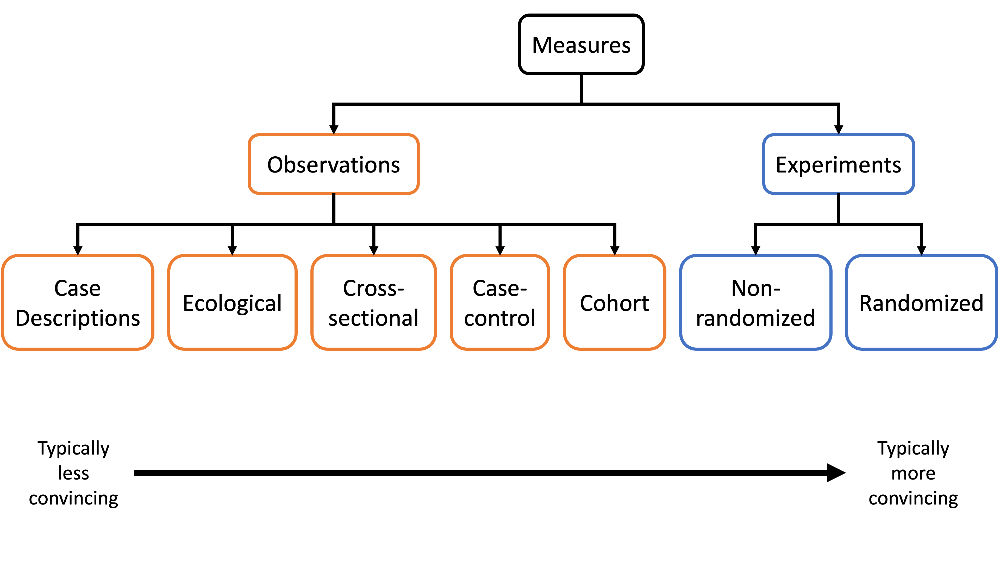
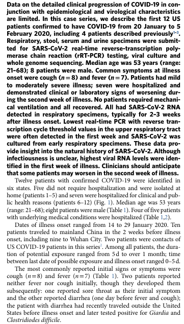
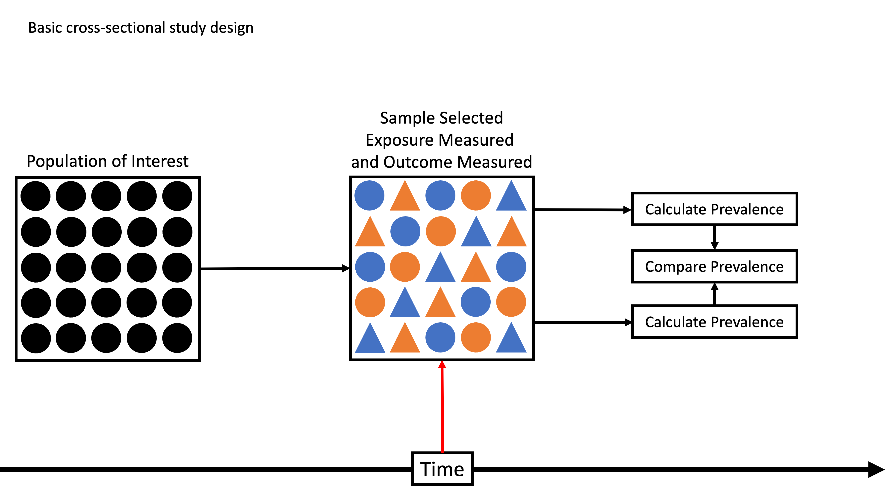
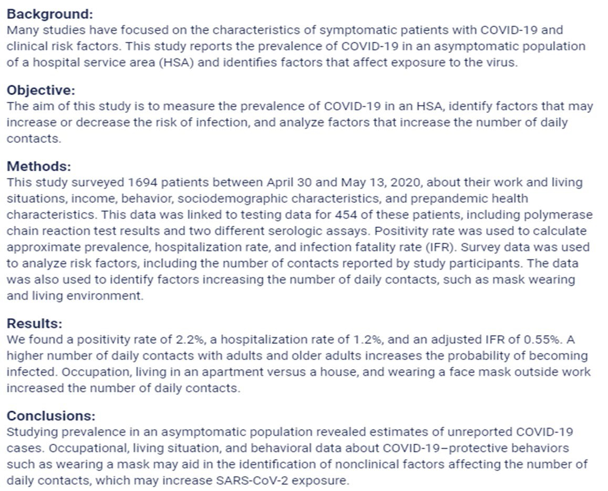
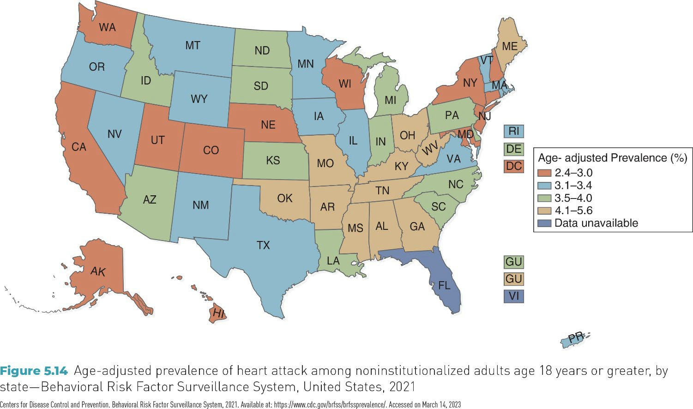

## Course Learning Objectives {visibility="hidden"}

<!-- I'm not sure there's a lot of value in showing these learning objectives to the students, but I'm adding and hiding them as a reminder to myself. What am I actually trying to accomplish? -->

1. Define epidemiology and key associated terminology, especially confounding.
2. Distinguish among association, prediction, and causation.
3. Explain the Rothman model of sufficient-component causes (RMSCC) and the concept of multifactorial causation.
4. Explain the limitations of anecdotal evidence in drawing epidemiologic conclusions.
5. Explain why disseminating risk information is sometimes necessary but rarely sufficient to improve population health.

## Learning Objectives {visibility="hidden"}

- Describe the **scope and uses of descriptive epidemiology**.

- Distinguish among **case reports, case series, and cross-sectional 	studies**.

- Describe disease patterns using **person, place, and time**.

- Use descriptive epidemiologic data to **make preliminary 	epidemiologic inferences**.

- Identify **health disparities** using descriptive epidemiologic methods.

## What Is Descriptive Epidemiology?

- **Purpose:** Describe how health and disease are distributed across 	populations

- **Core Questions**

    - **Who** is affected? *(Person)*

    - **Where** does it occur? *(Place)*

    - **When** does it occur? *(Time)*

- **Why It Matters**

    - Monitor health and disease trends

    - Guide health services planning

    - Identify priorities for further study

::: {.notes}
- Descriptive as opposed to analytic, although there is often some gray area.
:::

## Example: Descriptive Epidemiology in Practice {.compact}

- **Scenario:** Breastfeeding trends among U.S. infants born in 2012:

    - **43%** exclusively breastfed for the first **3 months**

    - **22%** exclusively breastfed for **6 months**
    
::: {.fragment}
- **What This Describes**

    - **Person:** U.S. infants 

    - **Place:** United States 

    - **Time:** First 3 vs. 6 months after 	birth
:::

::: {.fragment}
- **Discussion Questions**

    - What **patterns** do you observe across time?

    - What **additional descriptive data** would help clarify this pattern (e.g., age, 	SES, region)?

    - Which **groups might be most affected** by this decline?
:::

::: {.notes}
**Fragment 1**

Ask them to describe the person, place, and time.

**Fragment 2**

Discussion questions
:::

# Descriptive Epidemiologic Study Designs {.section}

## Descriptive Epidemiologic Study Designs {.compact}

<!-- Consider breaking this up into multiple slides. -->
<!-- I think it's important for them to understand these study designs, including their strengths and weaknesses. Perhaps it's the most important concept in the chapter. -->

- **This section focuses on three common descriptive designs:**

    - **Case reports**

    - **Case series**

    - **Cross-sectional studies**

    - Other descriptive designs exist (e.g., **ecologic studies**, **surveillance-based 	descriptions**)

- **What these designs have in common**

    - Describe **who**, **where**, and **when**

    - Do **not** test causal relationships

    - Often provide the **first signal** of a health issue or disparity

## Hierarchy of Study Designs

{fig-alt="Diagram grouping study designs into observational and experimental approaches. From left to right: case descriptions, ecological, cross-sectional, case-control, and cohort studies are observational; nonrandomized and randomized studies are experimental. An arrow indicates that evidence typically becomes more convincing from left to right."}

::: {.notes}
- As you can see in the diagram on the screen, case reports and cross-sectional studies are a type of observational study.   
- They are often considered to produce less convincing (or “weaker”) evidence than other study designs.   
- Having said that, they definitely serve an important purpose in epidemiology.  
:::

## Case Reports {.compact}

<!-- Consider breaking this up into multiple slides. -->
<!-- Consider creating a COL question. -->
<!-- What are some real-life examples of important case reports? -->

- **Definition:** A detailed description of a **single patient** or a **small number of unusual cases**, typically reported **individually**, not as a group analysis.

- **Purpose**

    - Document **novel, rare, or unexpected** health events

    - Alert clinicians and public health officials to **new or emerging issues**

- **Why They Matter**

    - Often provide the **first signal** of a new disease, complication, or side effect

    - Contribute to early **public health awareness**

    - Serve as educational examples in clinical and public health settings

- **Key Limitation**

    - No comparison group → **cannot estimate risk or prevalence**

## Case Reports: Example {.case-report-example} {visibility="hidden"}

<!-- Don't have students read from this slide on the screen. Provide them with the article or a link to the article. -->

:::: {.columns}

::: {.column width="54%"}

**Scan the text and answer:**

- **How many cases are described in detail?**
    - Where do you see evidence that this is a *single case*?
- **Person**
    - What basic characteristics of the patient are provided?
- **Place**
    - Where did this case occur?
    - Where did the outbreak begin?
- **Time**
    - When was this case identified relative to the outbreak timeline?
- **What is being described vs. inferred?**
    - Which parts describe *this patient*?
    - Which parts reference *broader context*?

:::

::: {.column width="44%"}

**First case of COVID-19 in the USA**

{height="480" fig-alt="Article excerpt from the first reported U.S. COVID-19 case, with Summary, outbreak background, and Case Report sections. The case report describes a 35-year-old man presenting to urgent care in Snohomish County, Washington, on January 19, 2020, after returning from Wuhan, China."}

[Source: NEJM case report](https://www.nejm.org/doi/full/10.1056/nejmoa2001191){.case-report-source}

:::

::::

## Case Series

<!-- Consider breaking this up into multiple slides. -->
<!-- Consider creating a COL question. -->
<!-- What are some real-life examples of important case series? -->

- **Definition:** A descriptive study that reports on **multiple patients** with 	the **same diagnosis or condition**, described **collectively**.

    - **Case report:** Each case is described **on its own**

    - **Case series:** Multiple cases are described **together to identify patterns**

- **What Case Series Can Describe**

    - Common **clinical features**

    - Typical **disease progression**

    - Distribution by **person, place, or time**

- **Key Limitation:** Cannot estimate **risk**, **rates**, or **causal effects**

## Case Series: Example {.case-report-example} {visibility="hidden"}

<!-- Don't have students read from this slide on the screen. Provide them with the article or a link to the article. -->

:::: {.columns}

::: {.column width="54%"}

**Scan the text and answer:**

- **How many patients are included?**
    - Where in the text do you see evidence that **more than one case** is described?
    - **Why is this a case series and not multiple case reports?**
- **How are the patients discussed?**
    - Are patients described **one at a time**, or
    - Are findings described **across patients as a group**?
    - What language signals grouping?
- **What patterns are described across cases?**
    - *(e.g., symptoms, clinical course, outcomes, timing)*
- **What important information is still missing that prevents causal conclusions?**

:::

::: {.column width="44%"}

{height="480" fig-alt="Article excerpt describing the first 12 U.S. patients confirmed to have COVID-19 from January 20 to February 5, 2020. Findings summarize symptoms, clinical course, laboratory results, and outcomes across the patients as a group."}

[Source: Nature Medicine case series](http://www.nature.com/articles/s41591-020-0877-5){.case-report-source}

:::

::::

## Why Individual Cases Belong in Epidemiology {.individual-cases}

<!-- Consider breaking this up into multiple slides. -->

**“Isn’t epidemiology about populations?”**

- **Yes — but populations are built from individual cases.**

- **Case reports and case series** focus on individuals → to **identify and describe new or unusual health events**

- These early descriptions:

    - Reveal **what counts as a case**

    - Signal **emerging health problems**

    - Motivate **population-level investigation**

{width="900" .nostretch fig-alt="Diagram showing how individual cases reveal patterns that lead to population studies: Individuals → Patterns → Population studies."}

::: {.notes}
- Initially, COVID-19 was reported as a case report.
:::

## Cross-Sectional Studies

- **Definition:** A descriptive study that examines **health outcomes and related characteristics** across a defined **population at a single point in time**.

- **Key Features**

    - Data collected from **individuals**

    - Results describe **population-level patterns**

    - Measures **prevalence**, not incidence

    - Exposure(s) and outcome(s) assessed **simultaneously**

- **Core Focus: A snapshot** describing how health outcomes are distributed **across a population**

## Cross-Sectional: One-Time Snapshot

{fig-alt="Diagram showing a sample selected from a population, with exposure and outcome measured simultaneously at one point in time. Colors represent exposure status, and shapes represent outcome status. Prevalence is calculated for each exposure group and compared between groups."}

::: {.notes}
When we use a cross-sectional study design, we simultaneously measure exposures and outcomes at a single point in time. So here, we have a population of interest where exposures and outcomes have occurred out in the world. We come along and take a sample of the population and measure the exposures and outcomes at the same time.

For example:

- Orange = Exposed to hepatitis B virus   
- Blue = Unexposed to hepatitis B virus   
- Circle = No aplastic anemia   
- Triangle = Aplastic anemia   

Let’s stop and notice a couple of things here:

1. Notice here that there is some ambiguity about which is the exposure and which is the outcome (or more precisely, which is the cause and which is the effect).

2. Notice that now we must use prevalence as our measure of disease occurrence.
:::

## Cross-Sectional Study: Example {.case-report-example} {visibility="hidden"}

:::: {.columns}

::: {.column width="54%"}

**Scan and Answer:**

- **Health problem:**
    - What outcome is being described? → Incidence or **prevalence**?
- **Who:** Who is included in the study population?
- **Where:** What geographic or service area is studied?
- **When:** Does this describe a **snapshot** or follow-up over time?
- **Measures:** What outcomes and exposures are assessed **at the same time**?
- **Design check:** What tells you this is **cross-sectional**, not a case series or cohort?

:::

::: {.column width="44%"}

{height="480" fig-alt="Article abstract with Background, Objective, Methods, Results, and Conclusions sections. The study surveyed 1,694 patients between April 30 and May 13, 2020, and linked survey responses to COVID-19 testing data for 454 patients to estimate prevalence and examine associated factors in a hospital service area."}

[Source: publichealth.jmir.org/2021/1/e24320](https://publichealth.jmir.org/2021/1/e24320){.case-report-source}

:::

::::

::: {.notes}
- What about the big federal surveys we discussed?
- Some of them have a longitudinal component, but most are cross-sectional.
:::

# Project Prep 2 {.section}

<!-- I'm not sure I'm going to have them do this. -->

::: {.notes}
Get Started!
:::

# Person, Place, and Time {.section}

## Person Variables: The “Who” Factor

<!-- Consider breaking this up into multiple slides. -->
<!-- Consider creating a COL question. -->

- **Definition:** Person variables are demographic characteristics that can influence health outcomes.

- **Purpose:** Understanding who is at risk helps tailor public health interventions.

::: {.fragment}
- **Key Person Variables:**

    - Age, Sex, Race/ethnicity, Socioeconomic status

    - Other examples: Gender, Marital status, Nativity (place of origin), Religion
:::

::: {.notes}
- What are some key person-level characteristics?
:::

## Age {.compact}

<!-- Consider breaking this up into multiple slides. -->
<!-- Consider creating a COL question. -->

- **Definition:** Age describes how disease occurrence and health outcomes vary across the life course.

- **Why Age Matters**

    - Disease patterns often differ by **life stage**

    - Helps identify **age-specific health priorities**

- **Examples**

    - **Childhood:** Higher occurrence of some infectious diseases

    - **Young adults:** Higher rates of injury-related outcomes

    - **Older adults:** Higher prevalence of chronic disease and mortality

- **Discussion Question:** What health concerns are most common among **college-aged adults**?

## Sex/Gender {.compact}

<!-- Consider breaking this up into multiple slides. -->
<!-- Consider creating a COL question. -->

- **Definition:** Sex and gender describe differences in health outcomes related to **biological characteristics** and **social roles, behaviors, and norms**.

- **Why Sex/Gender Matters**

    - Many diseases show different **patterns of occurrence and outcomes** by sex or gender

    - Differences may reflect **biology, behavior, social context, or access to care**

- **Examples**

    - **Heart disease:** Higher rates and earlier onset among males

    - **Autoimmune diseases & depression:** Higher prevalence among females

    - **Mortality:** All-cause age-specific mortality rates are typically higher among males

- **Discussion Question:** What health concerns or health-related behaviors differ by **sex or gender** among college students?

::: {.notes}
- **Sex** is a biological trait. Chromosomes (like XX or XY), hormones, internal reproductive organs, and external genitals.
 - Females usually have two X chromosomes (XX).   
 - Males usually have one X and one Y chromosome.   

- **Gender** refers to the socially constructed roles, behaviors, expressions, and expectations that a culture considers appropriate for men, women, and gender-diverse people.
:::

## Race/Ethnicity {.compact}

<!-- Consider breaking this up into multiple slides. -->
<!-- Consider creating a COL question. -->

- **Definition:** Race and ethnicity describe population groups based on **social, cultural, historical, and geographic characteristics**.

- **Why Race/Ethnicity Matters**

    - Disease occurrence and health outcomes often vary across groups

    - Patterns reflect **inequities in exposure, resources, and access to care**, not biology alone

- **Examples of Observed Patterns**

    - **Asthma:** Lower reported prevalence among some Hispanic populations

    - **Cognitive decline:** Higher prevalence among American Indian or Alaska Native populations

    - **COVID-19:** Higher mortality rates among non-Hispanic Black populations, especially early in the pandemic

- **Discussion Question:** What factors—other than biology—might help explain differences in health outcomes across racial or ethnic groups?

::: {.notes}
- Typically not a biologically determined difference.
:::

## Socioeconomic Status (SES) {.compact}

<!-- Consider breaking this up into multiple slides. -->
<!-- Consider creating a COL question. -->

- **Definition:** Socioeconomic status reflects an individual’s or group’s **economic and social position**, commonly measured by **income, education, and occupation**.

- **Why SES Matters**

    - Strongly associated with differences in **health outcomes and access to care**

    - Patterns often show a **social gradient**, with worse health at lower SES levels

- **Examples of SES-Related Patterns**

    - Higher rates of chronic disease and mortality in lower-SES groups

    - Reduced access to preventive services and timely care

    - Greater exposure to environmental and occupational risks

- **Discussion Question:** Which aspects of SES might most strongly influence health among **college students**?

## Social Determinants of Health (SDOH) {.compact}

<!-- Consider breaking this up into multiple slides. -->
<!-- Consider creating a COL question. -->

- **Definition:** Social determinants of health are the **conditions in which people are born, grow, live, work, and age** that influence health outcomes.

- **Why SDOH Matter**

    - Shape **opportunities for health** beyond individual behaviors

    - Help explain **persistent health disparities** across populations

- **Common SDOH Domains**

    - Economic stability: e.g., ability to afford food, housing, or health care

    - Education access and quality: e.g., access to quality schools or educational resources

    - Health care access and quality: e.g., availability of primary care or mental health services

    - Neighborhood and built environment: e.g., safe housing and access to healthy foods

    - Social and community context: e.g., social support or community connectedness

- **Discussion Question:** Which SDOH are most relevant to health outcomes among **college students**?

## SES vs. SDOH {.compact}

<!-- Double-check the information on this slide. -->

|  | Socioeconomic Status (SES) | Social Determinants of Health (SDOH) |
| --- | --- | --- |
| Concept | Social position | Living and working conditions |
| What it describes | Social and economic standing | Conditions shaping daily life and health |
| Common measures / examples | Income, education, occupation | Housing, working conditions, access to care, education, social support |

::: {.notes}
**Key distinction:** SES reflects social position; SDOH reflect lived conditions.

**Relationship: SES → influences → SDOH → shape health outcomes**
:::

## Exercise: SES or SDOH? {.compact}

<!-- I'm not sure how important this distinction is. -->

For each example, decide whether it best represents **SES** or **SDOH**. Reminder: SES reflects **position**; SDOH reflect **conditions that come with that position**.

- A person’s highest level of education

- Living in a neighborhood with limited access to grocery stores

- Type of job and employment status

- Exposure to hazardous conditions at work

- Ability to take paid sick leave

- Household income level

::: {.notes}
- A person’s highest level of education: SES
- Living in a neighborhood with limited access to grocery stores: SDOH
- Type of job and employment status: SES
- Exposure to hazardous conditions at work: SDOH
- Ability to take paid sick leave: SDOH
- Household income level: SES
:::

## Health Disparities {.compact}

<!-- Consider breaking this up into multiple slides. -->
<!-- Consider creating a COL question. -->

- **Definition:** Health disparities are **differences in health outcomes, disease 	burden, or access to care** across population groups.

- **Why Health Disparities Matter**

    - Indicate **inequities** in health and health care

    - Reflect differences in **SES, SDOH, and social context**

- **Examples of Health Disparities**

    - Higher rates of chronic disease in lower-SES populations

    - Differences in access to preventive care by income or insurance status

    - Higher mortality rates for certain conditions across racial or ethnic groups

- **Key Point:** Health disparities are **descriptive patterns**, not explanations.

- **Discussion Question:**

    - Which person-related factors (age, race/ethnicity, SES, SDOH) are most likely contributing to health disparities among **college students**?

## Place Variables: The “Where” Factor {.compact}

<!-- Consider breaking this up into multiple slides. -->
<!-- Consider creating a COL question. -->

- **Definition:** Place describes how disease occurrence and health outcomes vary by **geographic location**.

- **Why Place Matters**

    - Health patterns often differ across locations due to **environmental, social, and structural factors**

    - Helps identify **geographic disparities** in health and access to care

- **Common Place Levels**

    - International

    - National (within-country)

    - Regional or state

    - Urban vs. rural

    - Local or neighborhood

## International Variation {.compact}

- **Definition:** Differences in disease patterns and health outcomes **across countries**.

- **Why Place Matters Internationally**

    - Health outcomes vary widely due to **contextual differences**

    - Reflect differences in **health systems, environments, and resources**

- **Examples**

    - **Infectious diseases:** Polio remains endemic in a few countries while eliminated elsewhere

    - **Life expectancy:** Substantial differences across countries and regions

    - **Maternal and child health:** Higher mortality in lower-resource settings

- **Key Point:** International variation reflects **where people live**, not individual risk 	alone.

- **Discussion Question**

    - What factors might contribute to health differences between countries?

## National (Within-Country) Variations {.compact}

- **Definition:** Differences in disease patterns and health outcomes **across regions or locations within the same country**.

- **Why Place Matters Within Countries**

    - Health outcomes vary by **region, state, and community**

    - Reflect differences in **environment, resources, policies, and access to care**

- **Examples**

    - **Heart disease:** Rates vary substantially by U.S. state and region

    - **Respiratory illness:** Higher prevalence in areas with greater air pollution

    - **Injury and violence:** Higher rates in some regions compared with others

- **Key Point:** Health patterns can differ greatly **even within the same country**.

- **Discussion Question**

    - What factors might explain health differences between regions within the U.S.?

## National Variation (Example)

<!-- source-027-shape-2.jpg -->
{fig-alt="The map highlights the age prevalence of heart attacks. The data inferred from the map is as follows: 2.4 to 3.0, Washington, California, Utah, Alaska, Hawaii, Colorado, Nebraska, Wisconsin, New York, New Jersey, Maryland, New Hampshire, Washington, D.C.; 3.1 to 3.4, Oregon, Nevada, Montana, Wyoming; New Mexico, Texas, Minnesota, Iowa, Illinois, Virginia, Vermont, Massachusetts, Rhode Island, Puerto Rico; 3.5 to 4.0, Idaho, Arizona, North Dakota, South Dakota, Kansas, Louisiana, Michigan, Indiana, Pennsylvania, North Carolina, South Carolina, Delaware, Guam; 4.1 to 5.6, Oklahoma, Missouri, Arkansas, Mississippi, Tennessee, Alabama, Georgia, Kentucky, Ohio, West Virginia, Maine, Guam; Data not available, Florida, Virgin Islands."}

Question: What do you notice about the geographic pattern?

## From Urban–Rural to Local {.compact}

- **Definition:** Geographic health patterns can exist at **multiple spatial scales**, from broad categories to very specific locations.

- **Examples**

    - **Urban vs. rural:**	Higher **motor vehicle fatality rates** in rural areas compared with urban areas in the U.S.

    - **Local areas:** Elevated **childhood lead exposure** in neighborhoods with older housing stock; higher **asthma prevalence** near major highways or industrial sites.

- **Key Point:** As place becomes more specific, patterns may point to **localized risks or exposures**.

- **Discussion Questions**

    - Do you know any examples of diseases that show localized geographic patterns?

## Localized Patterns of Disease

- Associated with specific environmental conditions that may exist in a 	particular geographic area

- Examples:

    - Lung cancer:	regions with high levels of radon gas

    - Skin lesions and increased risks of lung, bladder, and skin cancers: regions 	with naturally occurring arsenic in the water supply

    - Dengue fever: along the Texas–Mexico border linked to the presence of 	Aedes mosquitoes

    - Lyme disease: Northeast, mid-Atlantic, and upper Midwest in the U.S. (\~90% of 	reported cases)

## Time: The “When” Factor {.compact}

<!-- Consider breaking this up into multiple slides. -->
<!-- Consider creating a COL question. -->

- **Definition:** Time describes how disease occurrence and health outcomes **change or vary over time**.

- **Why Time Matters**

    - Reveals **trends, cycles, and outbreaks**

    - Helps distinguish **short-term events** from **long-term patterns**

- **Common Time Patterns**

    - **Secular trends:** Long-term changes over years or decades

    - **Seasonal or cyclic trends:** Regular patterns within a year or over cycles

    - **Point epidemics:** Sudden increases over a short period

    - **Clustering:** A higher-than-expected number of cases in a specific time period or place

## Secular Trends {.compact}

<!-- Consider breaking this up into multiple slides. -->

- **Definition:** Long-term changes in disease occurrence or health outcomes observed over **many years or decades**.

- **Why Secular Trends Matter**

    - Show whether a health problem is **increasing, decreasing, or stable** over time

    - Reflect broad changes in **population behavior, environment, or policy**

- **Examples**

    - **Smoking prevalence:** Steady decline in the U.S. over several decades

    - **Obesity prevalence:** Long-term increase across many age groups

    - **Life expectancy:** Gradual increases over time, with recent plateaus or declines in some populations

- **Key Point:** Secular trends describe **direction and magnitude of change**, not causes.

- **Discussion Question**

    - Can you think of a health outcome that has shown major changes **over the past several decades or across generations in the U.S.**?

## Seasonal (Cyclic) Trends {.compact}

<!-- Consider breaking this up into multiple slides. -->

- **Definition:** Regular increases and decreases in disease occurrence that repeat over **specific periods**, often within a year.

- **Why Seasonal Trends Matter**

    - Help anticipate **predictable changes** in disease burden

    - Support **timing of prevention and response** efforts

- **Examples**

    - **Influenza:** Higher incidence during winter months

    - **Allergic conditions:** Increased symptoms during spring and fall

    - **Foodborne illness:** Higher incidence in summer months

- **Key Point:** Seasonal trends repeat in a **predictable pattern** over time.

- **Discussion Question**

    - What health conditions tend to increase during specific seasons?

::: {.notes}

:::

## Point Epidemics {.compact}

<!-- Consider breaking this up into multiple slides. -->

- **Definition:** A sudden increase in disease occurrence over a **short period of time**, 	often linked to a **common exposure**.

- **Why Point Epidemics Matter**

    - Signal a **recent or ongoing outbreak**

    - Help identify **when** exposure likely occurred

- **Examples**

    - **Food poisoning outbreak** linked to a single meal or event

    - **Legionnaires’ disease** outbreak associated with a contaminated water source

    - **Chemical exposure** causing acute illness in a community

- **Key Point:** Point epidemics reflect **short-term changes**, not long-term trends.

- **Discussion Question**

    - What **time-related information** helps identify **when exposure likely occurred** during a point epidemic?

::: {.notes}
- Latency period: The time that passes between being exposed to a disease-causing agent, such as a virus or radiation, and the actual appearance of symptoms
:::

## Clustering {.compact}

<!-- Consider breaking this up into multiple slides. -->

- **Definition:** The occurrence of a **greater-than-expected number of cases** within a **specific time period**, **geographic area, or population group**.

- **Why Clustering Matters**

    - May signal **unusual aggregation** of disease

    - Helps identify patterns that warrant **closer monitoring or investigation**

- **Examples**

    - **Temporal clustering:** Increased cases of influenza during a short winter period

    - **Spatial clustering:** A higher-than-expected number of leukemia cases in a small community

    - **Spatiotemporal clustering:** Dengue cases occurring in a specific neighborhood over several weeks

- **Key Point:** Clustering describes **where and when cases group together**, not why they occur.

::: {.notes}
- Military bases and cancer/Parkinson's disease.
:::

## Comparing Time and Place Patterns {.scrollable}

::: {style="font-size: 0.65em; line-height: 1.2;"}

| Pattern | What it represents | Key distinguishing feature | Example |
| --- | --- | --- | --- |
| Seasonal trend | Expected, recurring variation over time | Predictable and repeats regularly | Influenza peaks every winter |
| Temporal clustering | Descriptive observation of cases grouped in time | A higher-than-expected number of cases during a specific period; no designation implied | Unusual increase in meningitis cases over 2 weeks |
| Point epidemic | A sharp form of temporal clustering | Very short time window, often consistent with a single exposure | Food poisoning after one shared meal |
| Endemic pattern | Baseline, expected level of disease in a population | Ongoing and relatively stable over time | Malaria in parts of sub-Saharan Africa |
| Spatial clustering | Descriptive observation of cases grouped in place | A higher-than-expected number of cases in a specific location | Lyme disease concentrated in the Northeast U.S. |
| Spatiotemporal clustering | Descriptive observation of cases grouped by time and place | Unusual concentration in both dimensions | Dengue cases in one neighborhood over several weeks |
| Epidemic (Week 1 term) | Public health designation | Determination that observed clustering exceeds what is expected | COVID-19 epidemic in early 2020 |

:::

::: {.notes}
- You can use this to study.
:::

## Descriptive Epidemiology: Advantages and Limitations

:::: {.columns}

::: {.column width="50%"}

### Advantages

- Describes who is affected and where and when disease occurs

- Identifies patterns and disparities in populations

- Supports public health surveillance and planning

- Helps generate questions for further study

:::

::: {.column width="50%"}

### Limitations

- Cannot establish causal relationships

- Often lacks temporal order between exposure and outcome

- May be influenced by reporting or measurement differences

- Describes patterns but does not explain why they occur

:::

::::

<!-- Add a references slide. -->

# Project Prep 2 {.section}
