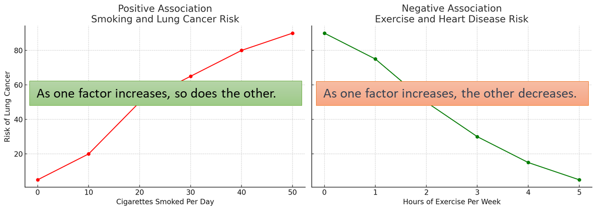
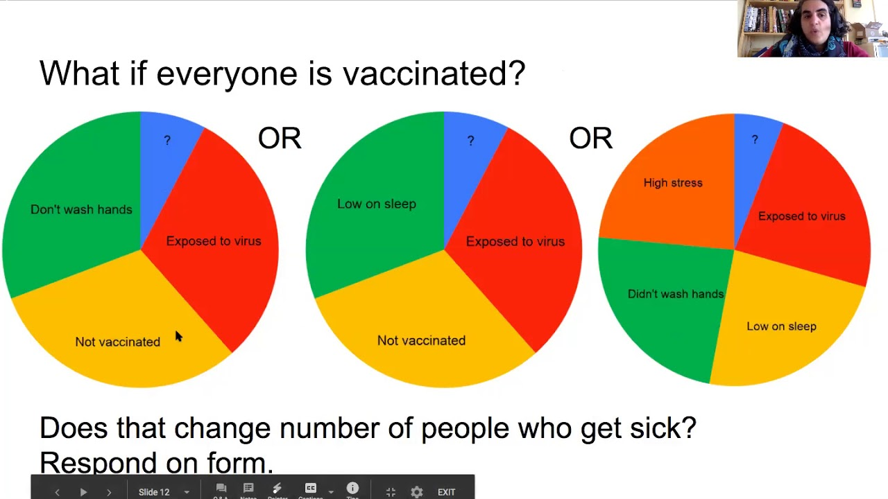
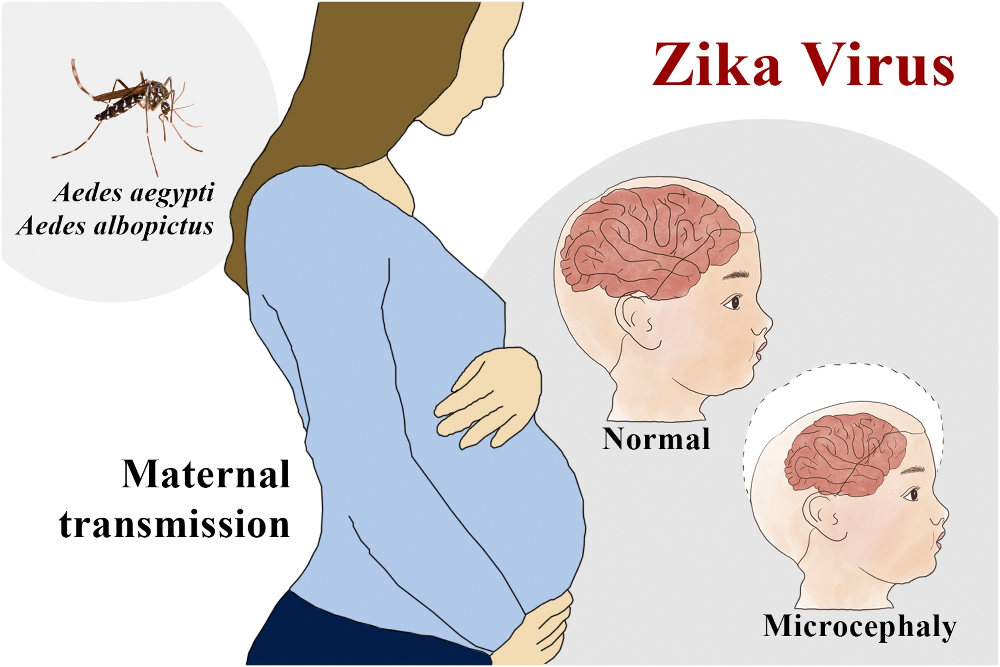
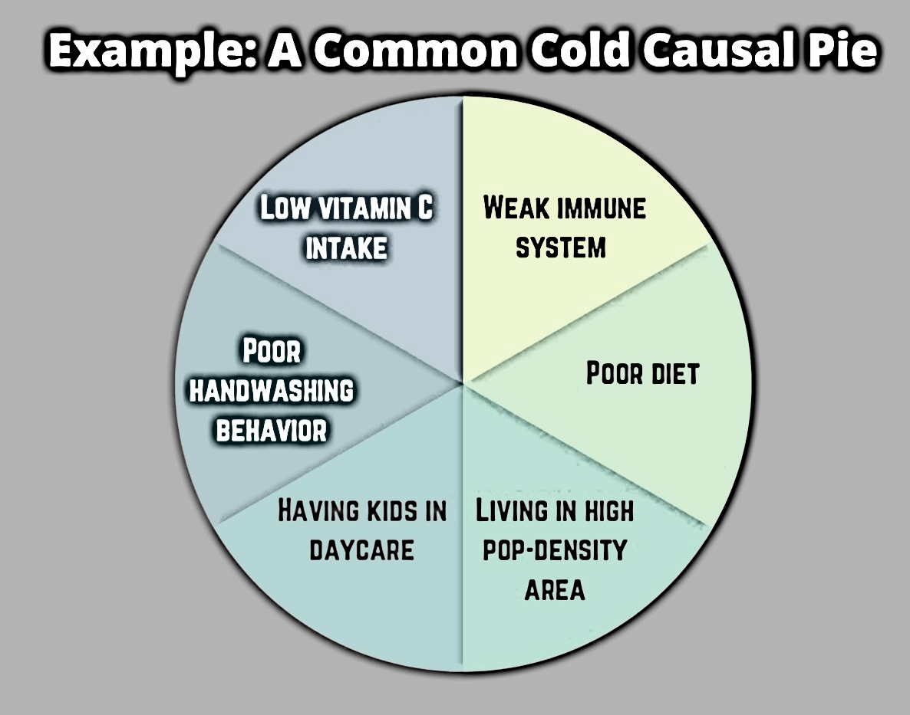
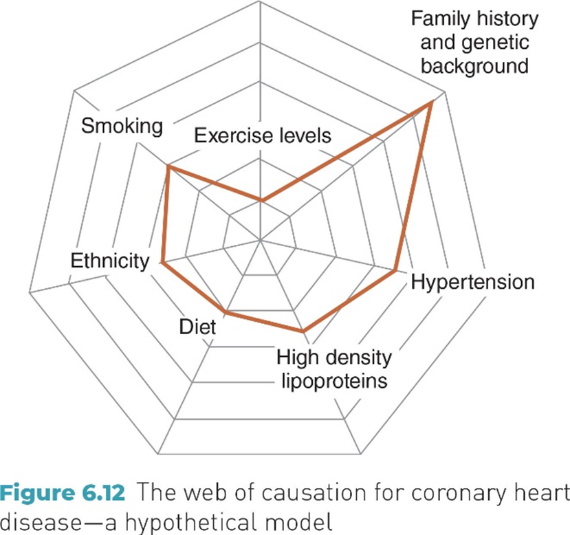
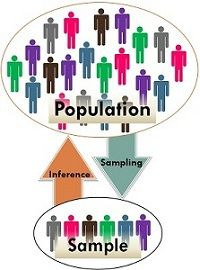

## Learning Objectives

<!-- REVIEW: Slide 2 | Text fields/unrecognized inline content in shape 2: verify formatting and links. -->

By the end of this week, you should be able to:

- **Describe** the history of changing concepts of disease causality

- **Compare** association and spurious association

- **Distinguish** deterministic vs probabilistic (stochastic) causality

- **Apply** key criteria of causality with examples

- **Explain** how chance affects observed associations and causal inference

- Key idea: Association does not imply causation.

2

::: {.notes}
Source cover: APHS 20203  Epidemiology & Biostatistics

Week 5: Association and Causality

1
:::

## Epidemiological Study: Fundamental Question

<!-- REVIEW: Slide 3 | Grouped object 28676: verify transformed position and order. -->

<!-- REVIEW: Slide 3 | Text fields/unrecognized inline content in shape 11: verify formatting and links. -->

<!-- REVIEW: Slide 3 | Animations/transitions are not reproduced. -->

<!-- REVIEW: Slide 3 | Automatic layout declined: Grouped content uses untransformed child coordinates. Extracted content retained in source drawing order; manually arrange and check for overflow. -->

After identifying patterns (Person–Place–Time), we ask: **Are exposure and outcome linked?**

E

O

**Exposure**

**Outcome**

<!-- source-003-shape-28678.png -->
{fig-alt="C:\\Documents and Settings\\yazhang\\Local Settings\\Temporary Internet Files\\Content.IE5\\ALCZ05LK\\MC900434859[1].png"}

<!-- REVIEW: source-003-b007 | Drawing without text (LINE (9), Straight Arrow Connector 2): reconstruct or crop the source slide. Source: /ppt/slides/slide3.xml, shape 3 (Straight Arrow Connector 2) -->

<!-- REVIEW: source-003-b008 | Drawing without text (LINE (9), Straight Arrow Connector 8): reconstruct or crop the source slide. Source: /ppt/slides/slide3.xml, shape 9 (Straight Arrow Connector 8) -->

- Is the observed association valid or misleading?

- Could chance, bias, or confounding explain the finding?

- Does the evidence support a causal interpretation?

3

::: {.notes}
Basic designs in epidemiology examine if exposures are correlated with disease.
:::

## How Would You Find the Cause of Disease-Across History?

**Imagine you are trying to explain why people get sick…**

**1\. Stone Age / Early Societies** *(No writing, no labs, no statistics)*

    - What visible signs or events would you blame for illness?

    - What explanations would feel convincing?

**2\. Pre-Germ Theory** *(People notice patterns but cannot see microbes)*

    - What patterns in **place, season, or environment** would stand out?

    - How might surroundings be linked to disease?

**3\. Early Modern Science** *(Counting, mapping, and observation become common)*

    - What new observations or comparisons could suggest cause?

    - How would you decide whether exposure comes before disease?

- 

::: {.notes}
4
:::

## Disease Causality: Concepts Over Time

Causal explanations evolve with **available evidence, tools, and methods**.

    - **Supernatural explanations:**  Disease attributed to fate, spirits, or moral forces

    - **Environmental (Miasma) theories:** Illness linked to air, water, climate, and surroundings

    - **Germ theory:** Specific biological agents identified as causes of many infectious diseases

    - **Risk-factor & multicausal models:** Most diseases arise from **multiple interacting factors**, not a single cause

    - **Modern epidemiology:** Causal inference integrates biology, behavior, environment, and social context over time

::: {.notes}
5
:::

## What Do Epidemiologists Observe First?

<!-- REVIEW: Slide 6 | Animations/transitions are not reproduced. -->

Poll: When studying health in populations, we usually see:

**A.** Clear cause-and-effect

**B.** Patterns and correlations

**C.** Biological mechanisms

**D.** Random events with no structure

- 

- Epidemiology starts with **association**.

- Causality requires **additional evaluation**.

::: {.notes}
6
:::

## Association

<!-- REVIEW: Slide 7 | Text fields/unrecognized inline content in shape 6: verify formatting and links. -->

- **Association:** A relationship between two **factors or events** that occur together **more often than expected by chance**.

    - Associations describe **patterns** in populations

    - They tell us **what tends to occur together**

- **Key idea:** Association is about **co-occurrence**, not explanation.

- **Types:** positive association and negative association 

7

## Types of Association

<!-- REVIEW: Slide 8 | Text fields/unrecognized inline content in shape 9: verify formatting and links. -->

<!-- REVIEW: Slide 8 | Automatic layout declined: No unique, clear two-column partition. Extracted content retained in source drawing order; manually arrange and check for overflow. -->

Positive Association 

Negative Association 

<!-- source-008-shape-4.png -->
{fig-alt=""}
<!-- REVIEW: source-008-b003 | Inspect image and author contextual alt text or record decorative status. -->

8

## Spurious (Misleading ) Association

- Spurious Association: Sometimes two factors appear related **even though neither causes the other**.

- **What’s happening?**

    - A **third factor** influences both

    - The association looks real but is **not causal**

- **Example:**

    - Ice cream sales ↑ and drownings ↑

    - Hot weather increases **both**

- **Key takeaway:** An association can be **real** but still **misleading**.

- 

::: {.notes}
9
:::

## Exercise: Sunscreen Use and Skin Cancer

<!-- REVIEW: Slide 10 | Text fields/unrecognized inline content in shape 5: verify formatting and links. -->

- **Observed association:** Higher rates of skin cancer are associated with increased sunscreen use.

- **Question:** Could this association be **misleading**?

- **Think about:**

    - Who is more likely to use sunscreen?

    - What other exposure might be related to both sunscreen use and skin cancer?

- 

10

::: {.notes}
Answer: While there appears to be a positive association between sunscreen use and skin cancer rates, this may be a spurious association due to the confounding factor of increased sun exposure. People who use sunscreen might spend more time in the sun, which independently increases skin cancer risk.

:::

## Exercise: Which Is a Spurious Association?

Which scenario shows a **misleading association**?

- A. As outside temperature drops, more people wear hats.

- B. As vaccination rates increase, the targeted disease decreases.

- C. Ice cream sales and shark attacks both increase during summer.

- D. People who exercise regularly have lower rates of heart disease.

- 

::: {.notes}
A. As outside temperature drops, more people wear hats
This is not spurious.
Cold temperature plausibly causes both discomfort and hat use.
This is a reasonable causal relationship, not a misleading one.
B. As vaccination rates increase, the targeted disease decreases
This is a plausible causal association supported by strong evidence.
Students may say “this is still just an association,” which is technically true, but:
It is not spurious because no third factor explains both in opposite directions.
Extensive experimental and observational evidence supports causality.
C. Ice cream sales and shark attacks increase during summer ✅
Classic spurious association.
Neither causes the other.
Season (summer) is a third factor influencing both.
This is the clearest example of a misleading association.
D. People who exercise regularly have lower rates of heart disease
This is an association that may be causal but is not obviously spurious.
Students may argue confounding (diet, SES), which is valid.
Key distinction:
Confounding does not automatically make an association spurious.
The association may still reflect a real causal effect.

11
:::

## Example: Sugar and Type 2 Diabetes

- **Observed finding:** People who consume more sugar have higher rates of type 2 diabetes.

- **How should we interpret this?**

    - **Spurious association?** Could a third factor (e.g., overall diet, physical activity) explain both?

    - **Non-spurious association (not yet causal)?** Is this a real pattern that still needs stronger evidence?

    - **Causal relationship?** What additional evidence would be needed to support causality?

- 

::: {.notes}
12
:::

## Causality

<!-- REVIEW: Slide 13 | Text fields/unrecognized inline content in shape 3: verify formatting and links. -->

- **Causality:** A relationship where a change in one factor **directly produces** a change in an outcome.

- **Key distinctions**

    - **Causality implies association**

    - **Association does not imply causality**

- **Why causality is harder to establish**

    - Multiple contributing factors

    - Role of chance, bias, and confounding

    - Ethical and practical limits on experimentation

13

## Types of Causality

- **Deterministic causality**

    - A cause leads to an outcome **with certainty**

    - If the cause occurs, the outcome follows

    - *Everyday example:* Pressing a light switch → the light turns on

- **Probabilistic causality**

    - A cause **changes the chance** of an outcome

    - The outcome does not always occur

    - *Everyday example:* Studying more → higher chance of doing well on an exam

    - Epidemiology focuses mostly on **probabilistic causality**.

- 

::: {.notes}
14
:::

## Deterministic Causality in Epidemiology (Rare)

- **Defining feature:** Exposure leads to disease **with near certainty**

- **Why it’s unusual**

    - Most diseases involve **multiple interacting causes**

    - Individual susceptibility and context matter

- **Epidemiologic example**

    - Untreated rabies virus exposure → rabies disease

- **Key takeaway:** Deterministic causality exists in epidemiology, but it is **rare and exceptional**.

- 

::: {.notes}
15
:::

## Probabilistic Causality in Epidemiology (Typical)

- **Defining feature:** Exposure **increases the likelihood** of disease

- **Why this is typical**

    - Diseases arise from **multiple interacting causes**

    - Susceptibility varies across individuals

- **Epidemiologic example**

    - Smoking → higher risk of lung cancer

- **Key takeaway:** Most epidemiologic causal relationships involve **risk, not certainty**.

- 

::: {.notes}
16
:::

## Sufficient Component Cause Model (Causal Pie)

<!-- REVIEW: Slide 17 | Image in shape 5 has crop/rotation; extracted original needs visual review. -->

<!-- REVIEW: Slide 17 | Animations/transitions are not reproduced. -->

<!-- REVIEW: Slide 17 | Automatic layout declined: Overlapping content may be a layered composition. Extracted content retained in source drawing order; manually arrange and check for overflow. -->

<!-- source-017-shape-5.png -->
{fig-alt=""}
<!-- REVIEW: source-017-b001 | Inspect image and author contextual alt text or record decorative status. -->

**Causal Pie: Understanding Causal Complexity**

- Each slice represents a **component cause**

- No single slice can cause disease by itself

- Different combinations of slices can produce the **same disease**

?: unknown or additional factors

Effect: Getting Sick (flu)

::: {.notes}
Each “slice” = a component cause
A complete “pie” = a sufficient cause for disease
Different combinations can lead to the same outcome
Key takeaway: Disease occurs when enough causes act together, not from one cause alone.

17
:::

## Exercise: Which Best Describes Deterministic Causality?

Which example best fits **deterministic causality**?

    - A. A medication leads to different levels of improvement across patients

    - B. A specific bacterium always causes disease in people without immunity

    - C. Increased exercise in a population is linked to lower heart disease rates

    - D. Rising global temperature is correlated with rising sea levels

- 

::: {.notes}
Explanation:
Deterministic causality implies a fixed, predictable, and consistent cause-and-effect relationship. If a certain cause is present, the effect will always occur. In option B, the presence of a specific pathogen leading to disease in susceptible individuals is an example of a deterministic cause-and-effect scenario, assuming no other factors, such as immunity, intervene.

18
:::

## Exercises: Sugar and Diabetes

<!-- REVIEW: Slide 19 | Text fields/unrecognized inline content in shape 6: verify formatting and links. -->

<!-- REVIEW: Slide 19 | Animations/transitions are not reproduced. -->

**Task:** Identify if this is an association or causality and specify the type.

- **Statement:** High sugar intake directly increases the risk of type 2 diabetes by causing insulin resistance.

**Causality (probabilistic):** Proposes a cause-and-effect relationship in which high sugar intake increases diabetes risk through insulin resistance, but not with certainty.

- **Statement:** Studies have found a correlation between sugar-sweetened beverage consumption and the incidence of diabetes.

**Association - Positive:** describes a correlation between two variables (sugar-sweetened beverage consumption and diabetes incidence) without establishing a direct causal link.

- 

19

## Exercises: Sugar and Diabetes

<!-- REVIEW: Slide 20 | Text fields/unrecognized inline content in shape 6: verify formatting and links. -->

<!-- REVIEW: Slide 20 | Animations/transitions are not reproduced. -->

**Task:** Identify if this is an association or causality and specify the type.

- **Statement:** Consuming sugar does not guarantee that an individual will develop diabetes, but it significantly increases the probability.

**Causality - Probabilistic:** while sugar consumption increases the risk of diabetes, it does not do so with certainty for every individual, acknowledging the role of other factors.

- **Statement:** In regions where sugar consumption has decreased, the rates of diabetes have also shown a decline.

**Association – Positive:** This statement could be seen as suggesting a positive association (if interpreted as "less sugar, less diabetes") but is more about observing a trend over time. The causality (if implied) would be probabilistic due to the lack of direct cause-and-effect evidence provided.

20

## Slide 21

<!-- REVIEW: Slide 21 | Media, embedded objects, or SmartArt need manual reconstruction; inspect source. -->

<!-- REVIEW: Slide 21 | Automatic layout declined: Unsupported drawing/chart requires manual layout. Extracted content retained in source drawing order; manually arrange and check for overflow. -->

<!-- REVIEW: source-021-b001 | Drawing without text (MEDIA (16), Online Media 5): reconstruct or crop the source slide. Source: /ppt/slides/slide21.xml, shape 6 (Online Media 5) -->

::: {.notes}
21
:::

## The Search for Causality

<!-- REVIEW: Slide 22 | Text fields/unrecognized inline content in shape 3: verify formatting and links. -->

- When an association is observed, epidemiologists ask:

    - **Is the association real?**\
      Could chance, bias, or confounding explain it?

    - **Is the association consistent with what we know?**\
      Across time, place, populations, and biology?

    - **Does the evidence support a causal interpretation?**\
      Or are alternative explanations more plausible?

- **Key idea:** Causality is not proven by a single study, but **evaluated through accumulated evidence**.

    - 

22

## Epi Prep 2

::: {.notes}
23
:::

## Quick Review: Association vs Causality

What distinguishes a **causal relationship** from an **association**?

    - A causal relationship means the two factors increase at the same time.

    - A causal relationship means changes in one factor lead to changes in another, with evidence that the exposure occurs before the outcome.

    - An association requires a statistically significant p-value, while a causal relationship does not.

    - Associations can only be observed in laboratory settings, while causal relationships are observed in real-world settings.

- 

::: {.notes}
Causality implies that there is a direct cause-and-effect link between two variables, and it is established through various criteria such as temporality (cause precedes effect), strength (strong association), consistency (repeated observations across studies), plausibility (biological rationale), and others. An association may suggest that two variables are related in some way, but it does not confirm that one causes the other.
 

24
:::

## The Search for Causality: EVALI Outbreak

**EVALI:** E-cigarette or Vaping–Associated Lung Injury

**Question:** How did epidemiologists move from **observation** to **causal judgment**?

- **Observation (Early 2019):** Surge in lung injuries among people who reported vaping

- **Initial hypotheses:** Vaping products may be linked to lung injury: Which products? Which components?

- **Data collection (Mid 2019):** Patient histories, product testing, pattern comparison

- **Evidence accumulation (Late 2019):** Vitamin E acetate identified in many THC-containing products

- **Causal inference (2020):** Evidence supports a causal role for vitamin E acetate in EVALI

- 

::: {.notes}

Vitamin E acetate is a thick, sticky substance added to some vaping products and can be harmful when inhaled, unlike regular vitamin E, which is a nutrient found in foods that's good for your skin and overall health.

25
:::

## Hill’s Criteria of Causality: Overview

- **Context:** Proposed by Sir Austin Bradford Hill (1965) to guide causal reasoning in epidemiology

- **Purpose:** A set of principles to help evaluate whether an observed **association** is likely to be **causal**

- **Important clarifications**

    - Not a checklist

    - Not all criteria must be met

    - **Temporality** (exposure precedes outcome) is essential

- **Key idea:** Hill’s Criteria **organize evidence**; they do not prove causation.

- 

::: {.notes}
26
:::

## Temporality & Strength of Association

- **Temporality (Essential)**

    - Exposure must occur before the outcome

    - A cause cannot come after its effect

    - Without temporality, causality cannot be established

    - *Example:* Smoking occurs before lung cancer diagnosis

- **Strength of Association**

    - Stronger associations are more likely to be causal

    - Large effect sizes are less likely to be explained by chance or confounding

    - *Example:* Heavy smokers have much higher lung cancer risk than non-smokers

- **Key idea:** Temporality is required. Strength provides supporting evidence.

- 

::: {.notes}
27
:::

## Consistency and Coherence

- **Consistency**

    - The association is observed repeatedly

    - Similar findings across different studies, populations, and settings

    - *Example:* High salt intake is linked to high blood pressure in many countries

- **Coherence**

    - The association fits with existing biological and epidemiologic knowledge

    - Findings do not contradict what is already known

    - *Example:* Smoking-related lung cancer aligns with known carcinogenic effects of tobacco

- **Comparison:**

    - Consistency compares **evidence across studies**.

    - Coherence compares findings with **existing knowledge**.

- 

::: {.notes}
28
:::

## Dose-Response Relationship & Biological Plausibility

- **Dose Response Relationship (Biological Gradient)** 

    - Higher levels of exposure are associated with higher risk of the outcome

    - A clear pattern strengthens confidence in a causal interpretation

    - *Example:* Smoking more cigarettes per day is associated with higher lung cancer risk

- **Biological Plausibility**

    - A reasonable biological mechanism links exposure to outcome

    - The explanation should align with existing biological knowledge

    - *Example:* Carcinogens in tobacco smoke damage lung cells and increase cancer risk

- 

::: {.notes}
29
:::

## Experiment and Specificity

- **Experiment**

    - Evidence comes from interventions or natural experiments

    - Changes in exposure are followed by changes in outcomes

    - *Example:* Smoking bans are followed by fewer asthma-related hospitalizations

- **Specificity**

    - A specific exposure is linked to a specific outcome

    - This criterion is less emphasized today because many exposures have multiple effects

    - *Example:* Mycobacterium tuberculosis bacteria causes tuberculosis

- 

::: {.notes}
30
:::

## Analogy (Weakest Criterion)

- **Analogy**

    - Similar exposures are known to cause similar outcomes

    - Raises a hypothesis by comparison, not by direct evidence

    - *Example:* Other viruses are known to cause birth defects, raising concern about Zika virus

- **Why this criterion is weak**

    - Relies on **similarity**, not direct observation

    - Does not test exposure, timing, or mechanism

    - Easily misleading if used alone

- **Key point:** Analogy can **suggest** a causal relationship, but it provides the **weakest support** and **cannot establish causality**.

- 

::: {.notes}
31
:::

## Best Practices for Using Hill’s Criteria

- **Start with temporality:** If exposure does not precede outcome, causality cannot be established

- **Evaluate criteria collectively:** No single criterion, beyond temporality, is sufficient on its own

- **Consider alternative explanations:** Always assess confounding, bias, and chance

- **Interpret findings in context:** Align evidence with biology and existing research

- **Avoid checklist thinking:** Hill’s Criteria guide reasoning but do not prove causation

::: {.notes}
32
:::

## Example: Zika Virus & Microcephaly

<!-- REVIEW: Slide 33 | Text fields/unrecognized inline content in shape 6: verify formatting and links. -->

<!-- REVIEW: Slide 33 | Automatic layout declined: Overlapping content may be a layered composition. Extracted content retained in source drawing order; manually arrange and check for overflow. -->

- **Zika virus** is a member of the virus family Flaviviridae. It is spread by daytime-active Aedes mosquitoes

- **Microcephaly** is a medical condition involving a smaller-than-normal head. 

- 

<!-- source-033-shape-4.png -->
{fig-alt=""}
<!-- REVIEW: source-033-b002 | Inspect image and author contextual alt text or record decorative status. -->

Atichat Kuadkitkan, Nitwara Wikan, Wannapa Sornjai, Duncan R. Smith, Zika virus and microcephaly in Southeast Asia: A cause for concern?, Journal of Infection and Public Health,Volume 13, Issue 1,2020,Pages 11-15,

33

::: {.notes}

The Zika virus is a disease that you can get from mosquito bites in certain parts of the world. If a pregnant woman gets bitten by a mosquito carrying Zika, there's a chance it can harm her unborn baby. One serious problem it can cause is microcephaly, where the baby's head and brain don't develop properly and are smaller than they should be. This can lead to serious health and development issues for the baby as it grows.
:::

## Group Activity: Zika Virus and Causal Reasoning

<!-- REVIEW: Slide 34 | Automatic layout declined: Overlapping content may be a layered composition. Extracted content retained in source drawing order; manually arrange and check for overflow. -->

- You will watch a short video about the Zika virus and microcephaly.

- Each group has been assigned a **different lens** for evaluating causality at this google link: [https://tinyurl.com/W5GroupActivity](<https://tinyurl.com/W5GroupActivity>) or QR code

- **While watching the video:**

    - Focus only on your assigned lens and the last slide about dose-response 

    - Capture brief bullet points, not full sentences

- **After the video, your group should report:**

    - One piece of evidence that supports causality

    - One limitation or uncertainty related to your lens

- **As a whole class, we will then discuss:**

    - Whether there is evidence of a dose–response relationship, and

    - Why some causal criteria may be harder to demonstrate than others\
      

<!-- source-034-shape-6.png -->
{fig-alt=""}
<!-- REVIEW: source-034-b002 | Inspect image and author contextual alt text or record decorative status. -->

::: {.notes}
34
:::

## Video: Zika Virus & Microcephaly

<!-- REVIEW: Slide 35 | Media, embedded objects, or SmartArt need manual reconstruction; inspect source. -->

<!-- REVIEW: Slide 35 | Automatic layout declined: Unsupported drawing/chart requires manual layout. Extracted content retained in source drawing order; manually arrange and check for overflow. -->

<!-- REVIEW: source-035-b001 | Drawing without text (PLACEHOLDER (14), Online Media 4): reconstruct or crop the source slide. Source: /ppt/slides/slide35.xml, shape 5 (Online Media 4) -->

::: {.notes}
“As you watch, listen for which pieces of evidence strengthened the causal argument and which questions remained.”

35
:::

## Causality Criteria: Zika Virus & Microcephaly

- **Temporality:** Pregnant mothers got Zika before having babies with microcephaly.

- **Strength:** Big spike in microcephaly where Zika outbreaks occurred.

- **Consistency:** Similar rises reported in multiple regions (e.g., Brazil, French Polynesia).

- **Specificity:** Most increases appeared where Zika was active (though microcephaly has other causes).

- **Dose-Response (Biological Gradient):** More severe or earlier Zika infections may lead to higher risk of microcephaly.

- **Biological Plausibility:** Zika infects developing brain cells, a direct biological link to smaller head size.

- **Coherence:** Fits with existing knowledge that viruses can damage fetal brain development.

- **Experiment:** No direct clinical trials (ethical limits), but strong observational and lab evidence.

- **Analogy:** Similar viruses (e.g., rubella) cause birth defects, supporting the Zika-microcephaly link.

- 

::: {.notes}
36
:::

## Multivariate Causality

<!-- REVIEW: Slide 37 | Text fields/unrecognized inline content in shape 2: verify formatting and links. -->

<!-- REVIEW: Slide 37 | Automatic layout declined: No unique, clear two-column partition. Extracted content retained in source drawing order; manually arrange and check for overflow. -->

- Most health outcomes do not have a single cause.

    - Diseases usually result from **multiple contributing factors**

    - Causes may act **together**, not independently

    - The same outcome can arise through **different causal pathways**

    - *Example (Zika and microcephaly):Risk reflects the interaction of viral exposure, timing during pregnancy, biological susceptibility, and environmental context*

- **Key idea:** Causal reasoning in epidemiology focuses on **how factors combine**, not on identifying one “true” cause.

37

<!-- source-037-shape-5122.png -->
{fig-alt="Why Some People Get COVID and Others Don't | by Viggy Hampton, MPH | Medium"}

::: {.notes}
“Notice that no single piece of evidence was sufficient. That’s because most diseases have multiple contributing causes.”
:::

## Disease Triangle and Web of Causes

<!-- REVIEW: Slide 38 | Text fields/unrecognized inline content in shape 3: verify formatting and links. -->

<!-- REVIEW: Slide 38 | Automatic layout declined: Unsupported drawing/chart requires manual layout. Extracted content retained in source drawing order; manually arrange and check for overflow. -->

<!-- REVIEW: source-038-b002 | Drawing without text (PLACEHOLDER (14), Content Placeholder 9): reconstruct or crop the source slide. Source: /ppt/slides/slide38.xml, shape 10 (Content Placeholder 9) -->

38

<!-- source-038-shape-4.png -->
{fig-alt=""}
<!-- REVIEW: source-038-b001 | Inspect image and author contextual alt text or record decorative status. -->

::: {.notes}
Even with good causal reasoning, we are still studying populations, not certainties.
:::

## Population, Sample & Uncertainty

<!-- REVIEW: Slide 39 | Reading order: shapes reordered top-to-bottom, left-to-right because drawing order differed; verify against the source slide. -->

<!-- REVIEW: Slide 39 | Text fields/unrecognized inline content in shape 6: verify formatting and links. -->

- In epidemiology, we study **populations** using **samples**.

    - A **population** is the group we want to understand

    - A **sample** is the subset we actually observe

    - Conclusions about populations are based on **incomplete information**

- **Why this matters for causality**

    - We rarely observe all cases or all exposures

    - Some uncertainty is unavoidable when drawing conclusions

- **Key idea:** Causal reasoning always involves **uncertainty** because it relies on samples.

<!-- source-039-shape-2.png -->
{fig-alt=""}
<!-- REVIEW: source-039-b002 | Inspect image and author contextual alt text or record decorative status. -->

39

## Role of Chance in Association/Causality

- **Chance** refers to **random variation** that occurs because we study **samples**, not entire populations.

- **How chance creates uncertainty**

    - Results can vary simply due to randomness

    - An observed association may differ from the true population relationship

- **Why chance matters**

    - Chance can make two events appear related when they are not

    - Chance can hide a real association

    - *Example:* In one flu season, both **flu cases** and **asthma hospitalizations** increase. With small numbers, this co-occurrence may reflect **random variation**, not a causal relationship.

- **Key idea:** Uncertainty in epidemiology arises because **chance affects what we observe in samples**.

::: {.notes}
“Chance is one of the main reasons associations can mislead us, even when we apply causal criteria carefully.” Activity: Encourage students to think of other examples where two unrelated factors might seem connected due to external influences, enhancing their understanding of confounding.

40
:::

## Controlling for Chance in Epidemiologic Studies

<!-- REVIEW: Slide 41 | Text fields/unrecognized inline content in shape 2: verify formatting and links. -->

- Even when chance affects what we observe, epidemiologists can **reduce its impact**.

    - Studying **larger populations** reduces random variation

    - Comparing **exposed and unexposed groups** improves clarity

    - Careful study design strengthens confidence in findings

- **Key idea:** We cannot eliminate chance, but we can **design studies to limit its influence**.

- 

    - 

41

## Putting It All Together

- Causal inference in epidemiology requires careful judgment.

    - Associations are the starting point

    - Causality is evaluated using multiple lines of evidence

    - Most diseases have **multiple contributing causes**

    - Uncertainty and chance are always present

- **Final takeaway:** Epidemiology is about making the **best possible causal judgments** with imperfect evidence.

- 

::: {.notes}
42
:::
