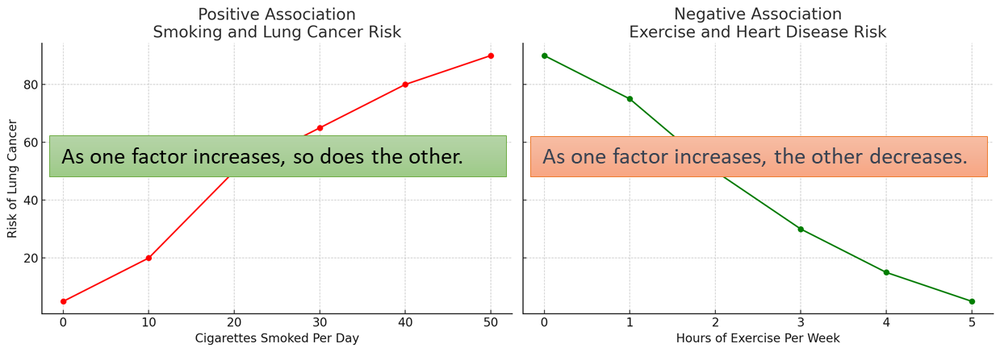
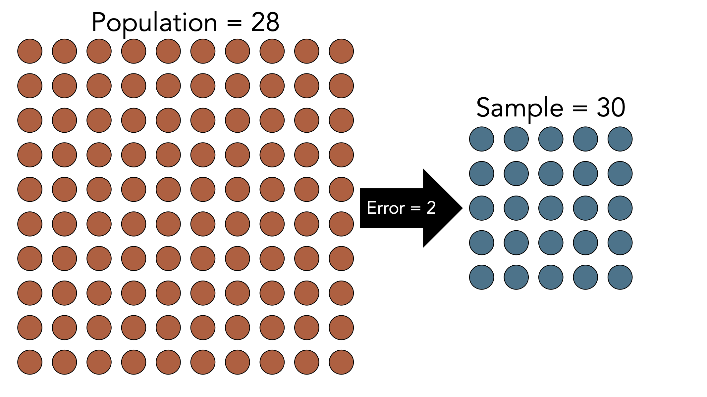
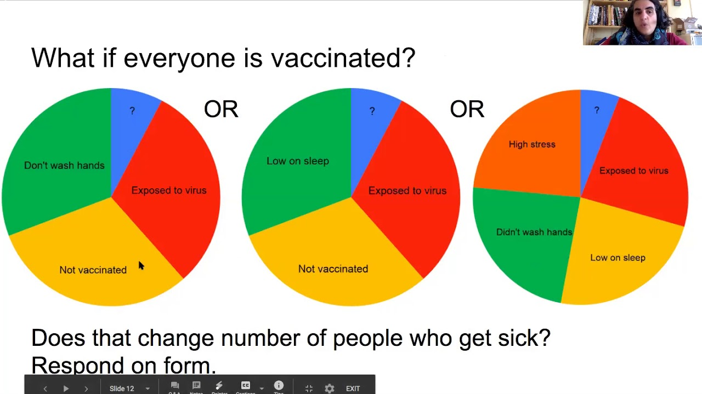
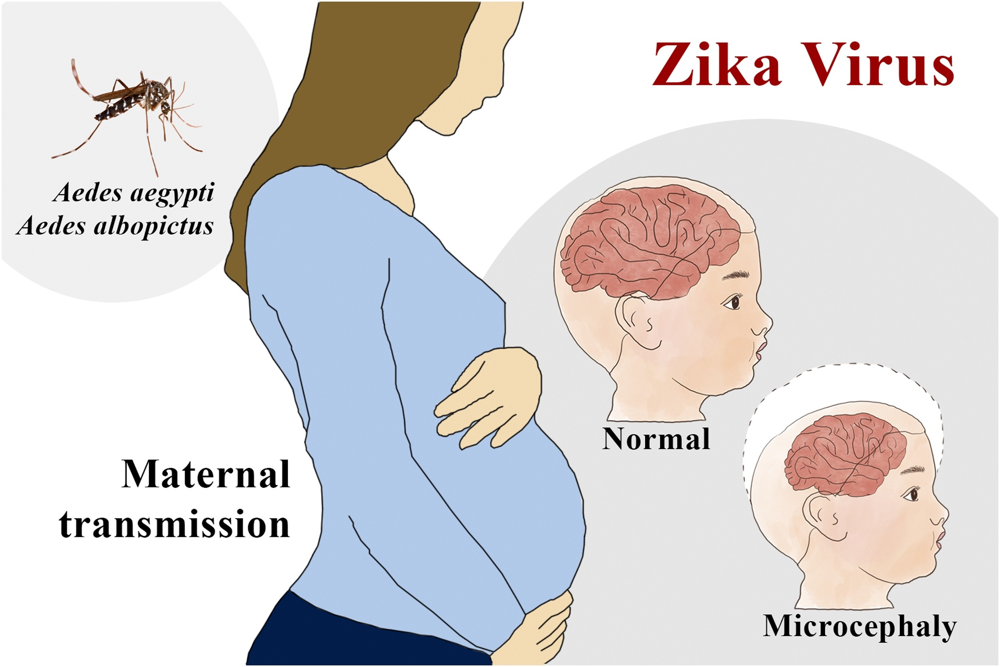

## Learning Objectives {visibility="hidden"}

By the end of this week, you should be able to:

- **Describe** the history of changing concepts of disease causality

- **Compare** association and spurious association

- **Distinguish** between deterministic and probabilistic (stochastic) causality

- **Apply** key criteria of causality with examples

- **Explain** how chance affects observed associations and causal inference

- Key idea: Association does not imply causation.

## Epidemiological Study: Fundamental Question

After identifying patterns (Person–Place–Time), we ask: 

- **Are exposure and outcome linked?**

- Is the observed association valid or misleading?

- Could chance, bias, or confounding explain the finding?

- Does the evidence support a causal interpretation?

::: {.notes}
- Last week, we discussed descriptive epidemiology - describing the occurrence of exposures and outcomes - but we are rarely content to stop there.
- We'll discuss each of these terms a little bit today.
:::

## How Would You Find the Cause of Disease Across History? {visibility="hidden"}

<!-- I see what she's trying to do here, but I don't find this slide very useful. -->

**Imagine you are trying to explain why people get sick…**

**1. Stone Age / Early Societies** *(No writing, no labs, no statistics)*

- What visible signs or events would you blame for illness?

- What explanations would feel convincing?

**2. Pre-Germ Theory** *(People notice patterns but cannot see microbes)*

- What patterns in **place, season, or environment** would stand out?

- How might surroundings be linked to disease?

**3. Early Modern Science** *(Counting, mapping, and observation become common)*

- What new observations or comparisons could suggest cause?

- How would you decide whether exposure comes before disease?

## Disease Causality: Concepts Over Time

Causal explanations evolve with **available evidence, tools, and methods**.

- **Supernatural explanations:**  Disease attributed to fate, spirits, or moral forces

- **Environmental (Miasma) theories:** Illness linked to air, water, climate, and surroundings

- **Germ theory:** Specific biological agents identified as causes of many infectious diseases

- **Risk-factor & multicausal models:** Most diseases arise from **multiple interacting factors**, not a single cause

- **Modern epidemiology:** Causal inference integrates biology, behavior, environment, and social context over time

## What Do Epidemiologists Report First?

<!-- Try using slide-quiz or AhaSlides.  -->

When studying health in populations, epidemiologists usually start by reporting:

**A.** Clear cause-and-effect relationships

**B.** Patterns and correlations

**C.** Biological mechanisms

**D.** Random events with no structure

::: {.notes}
- We usually report patterns and correlations first.
- Causality requires **additional evaluation and assumptions**.
:::

## Association

- **Association:** The distribution of an outcome differs across levels of an exposure.

    - For example, the outcome may be more common in one group than another.

- Knowing something about **X** helps us predict something about **Y**.

- **Types:** Positive association and negative association.

- An association alone does not tell us **why** the groups differ.

::: {.notes}
- The outcome's distribution can differ in its average, spread, or proportion in each category. 
- An association does not require a statistically significant p-value. Evaluating random error is a separate question.
:::

## Types of Association

::::: {.columns}

:::: {.column width="50%"}

Positive Association 

::::

:::: {.column width="50%"}

Negative Association 

::::

:::::

<!-- source-008-shape-4.png -->
{fig-alt="" .nostretch width="1111" style="max-width:100%;height:auto;"}
<!-- REVIEW: source-008-b003 | Inspect image and author contextual alt text or record decorative status. -->

## Causality

- **Causality:** A relationship where a change in one factor **directly produces** a change in an outcome.

- **Key distinctions**

    - **Causality implies association**

    - **Association does not imply causality**

- **Why causality is harder to establish**

    - Multiple contributing factors

    - Role of chance, bias, and confounding

    - Ethical and practical limits on experimentation

::: {.notes}
- Another way to think about the distinction: If I changed X and held everything else constant, would I expect Y to change?
:::

## The Search for Causality

- When an association is observed, epidemiologists may ask:

    - **Is the association causal?**\
      Could chance, bias, or confounding explain it?

    - **Is the association consistent with what we (think we) know about how the world works?**\
      Across time, place, populations, and biology?

    - **Does the evidence support a causal interpretation?**\
      Or are alternative explanations more plausible?

- **Key idea:** Causality is not proven by a single study, but **evaluated through accumulated evidence**.

::: {.notes}
- We are rarely content to stop at description or even prediction.
- We will talk about chance, bias, and confounding next.
:::

## Bias

- **Bias:** _Systematic_ error in an estimate. The gap between what we measured and what we intended to measure.

- Bias can arise from **who enters a study**, **how we measure variables**, or **how we estimate a causal effect**.

:::{.fragment}
- **Example:** We want to estimate average physical activity among all Texas adults, so we measure physical activity patterns at local gyms.
:::

:::{.fragment}
- **Key idea:** A larger sample does not generally eliminate bias.
:::

::: {.notes}
- Our sample will likely systematically overrepresent more active people.

- Because the error is systematic, a larger sample will not generally eliminate the bias.

- Transition to the next slide: Confounding is one source of bias when estimating causal effects. Some epidemiology texts distinguish confounding from other biases; for today, emphasize how each can lead our estimate away from the quantity we want to understand.
:::

## Confounding

- **Confounding:** The effects of other factors become mixed into our estimate of an exposure's causal effect. Or giving credit to the wrong variable.

- **Example:** Ice cream sales and drownings both increase during hot weather.

    - Hot weather influences both ice cream sales and drowning risk.

- **Question:** Would reducing ice cream sales reduce drownings?

- **Key idea:** The association can be real and useful for prediction without representing a causal effect of ice cream sales.

::: {.notes}
The association itself need not be incorrect. The problem arises when we attribute it to a causal effect of ice cream sales rather than the common cause, hot weather.

Introduce the term "spurious association" here for the reading, quiz, and later exercise. It describes an association that does not represent the causal relationship we might infer from it. Do not use it as a synonym for confounding: chance and other biases can also produce misleading findings.
:::

## Exercise: Sunscreen Use and Skin Cancer

- **Observed association:** Higher rates of skin cancer are associated with increased sunscreen use.

- **Question:** What might **confound** the relationship between sunscreen use and skin cancer?

- **Think about:**

    - Who is more likely to use sunscreen?

    - What other exposure might be related to both sunscreen use and skin cancer?

::: {.notes}
Answer: Sun exposure is a potential confounder. People who spend more time in the sun may be more likely to use sunscreen, and greater sun exposure also increases skin cancer risk. The observed association alone does not establish that sunscreen causes skin cancer.
:::

## Exercise: Which Is a Spurious Association?

Which scenario shows a **spurious association**?

**A.** As outside temperature drops, more people wear hats.

**B.** As vaccination rates increase, the targeted disease decreases.

**C.** Fires attended by more firefighters tend to cause more property damage.

**D.** People who exercise regularly have lower rates of heart disease.

::: {.notes}
**A.** As outside temperature drops, more people wear hats.
This is not spurious. Cold temperature plausibly causes both discomfort and hat use. This is a reasonable causal relationship, not a misleading one.

**B.** As MMR vaccination rates increase, measles incidence decreases.
This is a plausible causal association supported by strong evidence.
Students may say “this is still just an association,” which is technically true, but it is not spurious because no third factor explains both in opposite directions. Extensive experimental and observational evidence supports causality.

**C.** Fires attended by more firefighters tend to cause more property damage. ✅
Classic spurious association.

**D.** People who exercise regularly have lower rates of heart disease.
This is an association that may be causal but is not obviously spurious. Students may argue confounding (diet, SES), which is valid.

Notice that these are population averages. Not every person wears a hat when the temperature drops outside.
:::

## Population, Sample & Uncertainty

**Example:** We want to understand the health of adults living in Texas.

| Group | Who belongs to it? | In our example |
|---|---|---|
| **Target population** | People we want findings to apply to | All Texas adults |
| **Source population** | People from whom we select participants | Adult patients at several Texas clinics |
| **Study sample** | People whose data we analyze | 500 participating patients |

::: {.fragment}
- **Chance:** Would another random sample from the same source give a different estimate?
- **Applicability:** How well do these findings apply to all Texas adults?
:::

::: {.notes}
Sampling introduces uncertainty into our estimates. Who we recruit also affects which populations our findings may apply to. These are distinct questions: a larger clinic sample does not automatically make it representative of all Texas adults.

Distinguish statistical uncertainty from causal uncertainty, as in Measures of Occurrence, slides 14–16. Even a precisely estimated association can leave uncertainty about its causal interpretation.
:::

## Role of Chance in Association/Causality

**Sampling variability:** Estimates differ from sample to sample, even when we sample randomly from the same population.

:::: {.columns}
::: {.column width="57%"}
{fig-alt="A population with a mean BMI of 28 and a sample with a mean BMI of 30. The sample estimate is 2 units above the population mean." .nostretch width="630"}
:::
::: {.column width="43%"}
**Hypothetical BMI example**

- Population mean: **28**
- One random sample: **30**
- Another random sample might have a mean of **26**.

**Question:** Must a difference between an estimate and the truth mean someone made a mistake?
:::
::::

::: {.notes}
Answer: No. Samples can differ by chance. In practice, we usually do not know the true population mean. The same idea applies to estimates of associations: sampling variability can exaggerate, weaken, or reverse an observed association.

Sampling variability is one source of random error. The old deck also illustrates random measurement error. Random error need not average to exactly zero across a small number of samples.
:::

## Controlling for Chance in Epidemiologic Studies

- **Larger samples** generally reduce sampling variability.

- **Systematic bias is a different problem.** A larger sample does not typically correct biased recruitment, measurement, or confounding.

- **Precision and causality are different questions.** We can estimate an association precisely and still be uncertain whether it is causal.

- **Key idea:** More data can improve precision, but causal interpretation still requires careful judgment.

::: {.notes}
Increasing sample size generally reduces sampling variability when other features of the study are comparable. It does not guarantee that a particular estimate is closer to the truth. Comparing exposed and unexposed groups is essential to many association questions, but doing so alone does not control chance.

Now, we will transition from association to causation...
:::

## Types of Causality

- **Deterministic causality**

    - A cause leads to an outcome **with certainty**

    - If the cause occurs, the outcome follows

    - *Everyday example:* Pressing a light switch → the light turns on

- **Probabilistic causality**

    - A cause **changes the chance** of an outcome

    - The outcome does not always occur

    - *Everyday example:* Studying more → higher chance of doing well on an exam

    - Epidemiology focuses mostly on **probabilistic causality**.

::: {.notes}
- Can we really even call the light switch example completely deterministic? Does the light ALWAYS come on when we press the light switch?
- Ask what else must be present: electricity, a working bulb, and a complete circuit. Return to these conditions when introducing component causes.
:::

## Deterministic Causality in Epidemiology (Rare)

- **Defining feature:** Exposure leads to disease **with near certainty**

- **Why it’s unusual**

    - Most diseases involve **multiple interacting causes**

    - Individual susceptibility and context matter

- **Epidemiologic example**

    - Untreated rabies virus exposure → rabies disease

- **Key takeaway:** Deterministic causality exists in epidemiology, but it is **rare and exceptional**.

## Probabilistic Causality in Epidemiology (Typical)

- **Defining feature:** Exposure **increases the likelihood** of disease

- **Why this is typical**

    - Diseases arise from **multiple interacting causes**

    - Susceptibility varies across individuals

- **Epidemiologic example**

    - Smoking → higher risk of lung cancer

- **Key takeaway:** Most epidemiologic causal relationships involve **risk, not certainty**.

## Exercise: Which Best Describes Deterministic Causality?

Which example best fits **deterministic causality**?

**A.** A medication leads to different levels of improvement across patients

**B.** A specific bacterium always causes disease in people without immunity

**C.** Increased exercise in a population is linked to lower heart disease rates

**D.** Rising global temperature is correlated with rising sea levels

::: {.notes}
Explanation:
Deterministic causality implies a fixed, predictable, and consistent cause-and-effect relationship. If a certain cause is present, the effect will always occur. In option B, the presence of a specific pathogen leading to disease in susceptible individuals is an example of a deterministic cause-and-effect scenario, assuming no other factors, such as immunity, intervene.

Brad's notes
I left this in here in case it's on the quiz. However, I'd try to train myself to think about it this way:
- Virtually no outcome is truly deterministic.  
- If a particular exposure-outcome relationship happens to be pretty close to deterministic, how can we use that to our advantage?
:::

## Multivariate Causality

- Most health outcomes involve **multiple contributing causes**.

- Causes can act together, and different combinations can produce the same outcome.

**Return to the light switch:** What else must be present for flipping the switch to turn on the light?

::: {.fragment}

- Electricity, a working bulb, and a complete circuit.

- Flipping the switch may complete the combination of conditions needed for the light to turn on.

**Key idea:** The final event in a sequence is not necessarily the only cause.
:::

::: {.notes}
Pause for students to name the other conditions before revealing or discussing the examples. Use this as the transition to Rothman's model: a component contributes to a causal mechanism, while a complete set is sufficient to produce the outcome.
:::

## Rothman's Model of Sufficient and Component Causes (RMSCC) {.compact}

<!-- source-017-shape-5.png -->

**Outcome: Flu**

- Each pie is a **sufficient cause set** - "sufficient" to produce the outcome

- Each slice represents a **component cause**

- Different combinations of slices can produce the **same outcome**

- A **necessary cause** is a component cause that appears in every sufficient cause set

::: {.notes}
- ? = unknown causes. These pies illustrate hypothetical causal mechanisms.

- Connect this to the light-switch example: the switch, electricity, bulb, and circuit contribute to a complete causal mechanism. We often notice the last component, but the other components also matter.

- Work through examples. Make sure to discuss necessary and sufficient causes.

- Key takeaway: Disease occurs when enough causes act together, not from one cause alone.
:::

# Project Prep 2 {.section}

::: {.notes}
Give them time to work on project prep 2.
:::

## Quick Review: Association vs Causality

<!-- This slide would be better if the course were taught in a different order. We haven't even discussed p-values yet. -->

What distinguishes a **causal relationship** from an **association**?

**A.** A causal relationship means the two factors increase at the same time.

**B.** A causal relationship means changes in one factor lead to changes in another, with evidence that the exposure occurs before the outcome.

**C.** An association requires a statistically significant p-value, while a causal relationship does not.

**D.** Associations can only be observed in laboratory settings, while causal relationships are observed in real-world settings.

::: {.notes}
Causality implies that there is a direct cause-and-effect link between two variables, and it is established through various criteria such as temporality (cause precedes effect), strength (strong association), consistency (repeated observations across studies), plausibility (biological rationale), and others. An association may suggest that two variables are related in some way, but it does not confirm that one causes the other.
 
:::

## Hill’s Criteria of Causality: Overview

<!-- I probably have some slides that I can use to supplement this material. -->

<!-- Break these up into multiple slides. Also provide counterexamples. -->

- **Context:** Proposed by Sir Austin Bradford Hill (1965) to guide causal reasoning in epidemiology

- **Purpose:** A set of principles to help evaluate whether an observed **association** is likely to be **causal**

- **Important clarifications**

    - Not a checklist

    - Not all criteria must be met

    - **Temporality** (exposure precedes outcome) is essential

- **Key idea:** Hill’s Criteria **organize evidence**; they do not prove causation.

## Temporality & Strength of Association

:::: {.columns}
::: {.column width="50%"}
**Temporality**

- The exposure must occur before the outcome.
- *Example:* Smoking precedes lung cancer development.
- *Counterexample:* A rooster crows before sunrise. Does it cause sunrise?
:::
::: {.column width="50%"}
**Strength of association**

- A large association can support a causal interpretation, but alternative explanations still matter.
- *Counterexample:* Children's shoe sizes and reading aptitude are associated. What could explain both?
:::
::::

**Key idea:** Temporality is necessary, but neither timing nor strength alone establishes causality.

::: {.notes}
Counterexamples adapted from Brad Cannell, Epidemiology III, Introduction to Causal Inference, slide 10.

The rooster example shows why occurring first is not sufficient. Age helps explain the shoe-size and reading association: older children tend to have larger feet and greater reading aptitude. Increasing shoe size would not itself improve reading.

Retain smoking and lung cancer as an example of an association supported by multiple lines of evidence. A large association is not automatically free of confounding or bias.
:::

## Consistency and Coherence

:::: {.columns}
::: {.column width="50%"}
**Consistency**

- Similar findings across studies, populations, and settings.
- *Example:* High salt intake is linked to high blood pressure in many countries.
- **Limitation:** Studies that share the same bias can produce consistently misleading findings.
:::
::: {.column width="50%"}
**Coherence**

- Findings fit with existing biological and epidemiologic knowledge.
- *Example:* Smoking-related lung cancer aligns with known carcinogenic effects of tobacco.
:::
::::

**Comparison:** Consistency compares studies. Coherence compares findings with existing knowledge.

::: {.notes}
The consistency counterexample comes from Brad Cannell, Epidemiology III, Introduction to Causal Inference, slide 10: many biased studies are still biased studies.

Ask whether repeating the same recruitment or measurement problem would make us more confident merely because the results agree.
:::

## Dose-Response Relationship & Biological Plausibility

- **Dose-Response Relationship (Biological Gradient)** 

    - Higher levels of exposure are associated with higher risk of the outcome

    - A clear pattern strengthens confidence in a causal interpretation

    - *Example:* Smoking more cigarettes per day is associated with higher lung cancer risk

- **Biological Plausibility**

    - A reasonable biological mechanism links exposure to outcome

    - The explanation should align with existing biological knowledge

    - *Example:* Carcinogens in tobacco smoke damage lung cells and increase cancer risk

## Experiment and Specificity

- **Experiment**

    - Evidence comes from interventions or natural experiments

    - Changes in exposure are followed by changes in outcomes

    - *Example:* Smoking bans are followed by fewer asthma-related hospitalizations

- **Specificity**

    - A specific exposure is linked to a specific outcome

    - This criterion is less emphasized today because many exposures have multiple effects

    - *Example:* Mycobacterium tuberculosis bacteria cause tuberculosis

## Analogy (Weakest Criterion)

- **Analogy**

    - Similar exposures are known to cause similar outcomes

    - Raises a hypothesis by comparison, not by direct evidence

    - *Example:* Other viruses are known to cause birth defects, raising concern about Zika virus

- **Why this criterion is weak**

    - Relies on **similarity**, not direct observation

    - Does not test exposure, timing, or mechanism

    - Easily misleading if used alone

- **Key point:** Analogy can **suggest** a causal relationship, but it provides the **weakest support** and **cannot establish causality**.

## Best Practices for Using Hill’s Criteria

- **Start with temporality:** If exposure does not precede outcome, causality cannot be established

- **Evaluate criteria collectively:** No single criterion is sufficient. Temporality is necessary, but it is not sufficient.

- **Consider alternative explanations:** Always assess confounding, bias, and chance

- **Interpret findings in context:** Align evidence with biology and existing research

- **Avoid checklist thinking:** Hill’s Criteria guide reasoning but do not prove causation

## Example: Sugar and Type 2 Diabetes

<!-- Consider moving this to later in the presentation. After we've discussed evidence for causality. -->

- **Observed finding:** People who consume more sugar have higher rates of type 2 diabetes.

- **How should we interpret this?**

    - **Spurious association?** Could a third factor (e.g., overall diet, physical activity) explain both?

    - **Causal relationship?** Is this a real pattern that still needs stronger evidence? What additional evidence would be needed to support causality?

## Exercise: Sugar and Diabetes

<!-- At first glance, this is a good exercise, but what do we actually want them to do here? -->

**Task:** Identify whether this association is causal. If so, specify the type.

> **Statement 1:** High sugar intake directly increases the risk of type 2 diabetes by causing insulin resistance.

**Causality (probabilistic):** Proposes a cause-and-effect relationship in which high sugar intake increases diabetes risk through insulin resistance, but not with certainty.

> **Statement 2:** Studies have found a correlation between sugar-sweetened beverage consumption and the incidence of diabetes.

**Association - Positive:** Describes a correlation between two variables (sugar-sweetened beverage consumption and diabetes incidence) without establishing a direct causal link.

::: {.notes}
**Statement 1**
- It does say _directly_, but it also says _risk_.
:::

## Exercise: Sugar and Diabetes Continued

<!-- At first glance, this is a good exercise, but what do we actually want them to do here? -->

**Task:** Identify whether this association is causal. If so, specify the type.

> **Statement:** Consuming sugar does not guarantee that an individual will develop diabetes, but it significantly increases the probability.

**Causality - Probabilistic:** While sugar consumption increases the risk of diabetes, it does not do so with certainty for every individual, given the role of other factors.

> **Statement:** In regions where sugar consumption has decreased, the rates of diabetes have also shown a decline.

**Association – Positive:** This statement could be seen as suggesting a positive association (if interpreted as "less sugar, less diabetes") but is more about observing a trend over time. The causality (if implied) would be probabilistic due to the lack of direct cause-and-effect evidence provided.

## The Search for Causality: EVALI Outbreak

<!-- This example is fine I guess. Maybe we should move to the end after we discuss causal criteria. -->

**EVALI:** E-cigarette or Vaping–Associated Lung Injury

**Question:** How did epidemiologists move from **observation** to **causal judgment**?

- **Observation (Early 2019):** Surge in lung injuries among people who reported vaping

- **Initial hypotheses:** Vaping products may be linked to lung injury: Which products? Which components?

- **Data collection (Mid-2019):** Patient histories, product testing, pattern comparison

- **Evidence accumulation (Late 2019):** Vitamin E acetate identified in many THC-containing products

- **Causal inference (2020):** Evidence supports a causal role for vitamin E acetate in EVALI

::: {.notes}
Vitamin E acetate is a thick, sticky substance added to some vaping products and can be harmful when inhaled, unlike regular vitamin E, which is a nutrient found in foods that's good for your skin and overall health.
:::

## Example: Zika Virus & Microcephaly

<!-- Decide if you want to use this exercise or not. If you do, you will need to assign group numbers (1-8). -->

- **Zika virus** is a member of the virus family Flaviviridae. It is spread by daytime-active Aedes mosquitoes.

- **Microcephaly** is a medical condition involving a smaller-than-normal head. 

{fig-alt=""}

Atichat Kuadkitkan, Nitwara Wikan, Wannapa Sornjai, Duncan R. Smith, Zika virus and microcephaly in Southeast Asia: A cause for concern?, Journal of Infection and Public Health, Volume 13, Issue 1, 2020, Pages 11–15.

::: {.notes}
The Zika virus is a disease that you can get from mosquito bites in certain parts of the world. If a pregnant woman gets bitten by a mosquito carrying Zika, there's a chance it can harm her unborn baby. One serious problem it can cause is microcephaly, where the baby's head and brain don't develop properly and are smaller than they should be. This can lead to serious health and development issues for the baby as it grows.
:::

## Group Activity: Zika Virus and Causal Reasoning

<!-- Decide if you want to use this exercise or not. If you do, you will need to assign group numbers (1-8). -->

- You will watch a short video about the Zika virus and microcephaly.

- Each group has been assigned a **different lens** for evaluating causality at this Google link: [https://tinyurl.com/W5GroupActivity](<https://tinyurl.com/W5GroupActivity>) or via the QR code

- **While watching the video:**

    - Focus only on your assigned lens and the last slide about dose-response 

    - Capture brief bullet points, not full sentences

- **After the video, your group should report:**

    - One piece of evidence that supports causality

    - One limitation or uncertainty related to your lens

- **As a whole class, we will then discuss:**

    - Whether there is evidence of a dose–response relationship, and

    - Why some causal criteria may be harder to demonstrate than others\
      
{fig-alt=""}

## Video: Zika Virus & Microcephaly

<!-- Embed the video. -->
https://youtu.be/t-N9mryaVpY?si=RGQuPVqqhxsc4rxm

::: {.notes}
“As you watch, listen for which pieces of evidence strengthened the causal argument and which questions remained.”
:::

## Causality Criteria: Zika Virus & Microcephaly

- **Temporality:** Pregnant mothers got Zika before having babies with microcephaly.

- **Strength:** Big spike in microcephaly where Zika outbreaks occurred.

- **Consistency:** Similar rises reported in multiple regions (e.g., Brazil, French Polynesia).

- **Specificity:** Most increases appeared where Zika was active (though microcephaly has other causes).

- **Dose-Response (Biological Gradient):** More severe or earlier Zika infections may lead to higher risk of microcephaly.

- **Biological Plausibility:** Zika infects developing brain cells, a direct biological link to smaller head size.

- **Coherence:** Fits with existing knowledge that viruses can damage fetal brain development.

- **Experiment:** No direct clinical trials (ethical limits), but strong observational and lab evidence.

- **Analogy:** Similar viruses (e.g., rubella) cause birth defects, supporting the Zika-microcephaly link.

## Putting It All Together

<!-- I'm not sure associations are the starting point. We often start by searching for causes. I think it's more accurate to say that all causal relationships produce associations. -->

- Causal inference in epidemiology requires careful judgment.

    - Associations are the starting point

    - Causality is evaluated using multiple lines of evidence

    - Most diseases have **multiple contributing causes**

    - Uncertainty and chance are always present

- **Final takeaway:** Epidemiology is about making the **best possible causal judgments** with imperfect evidence.
