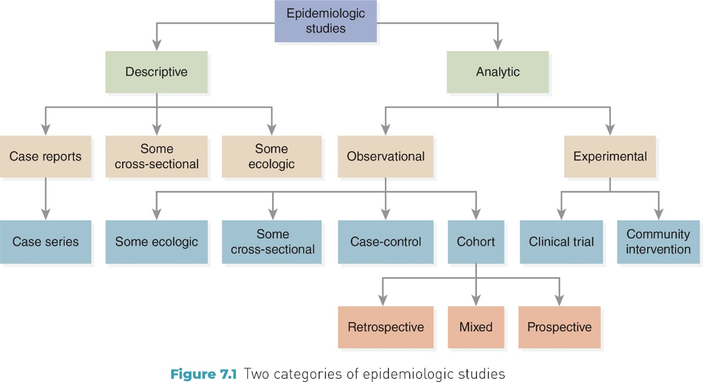
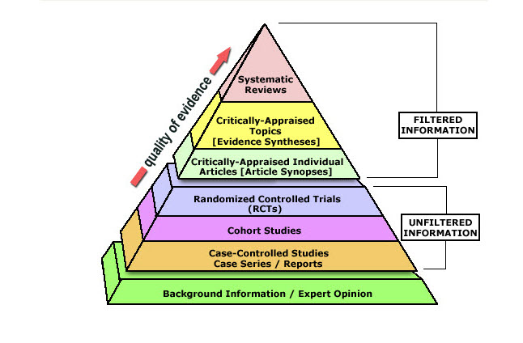
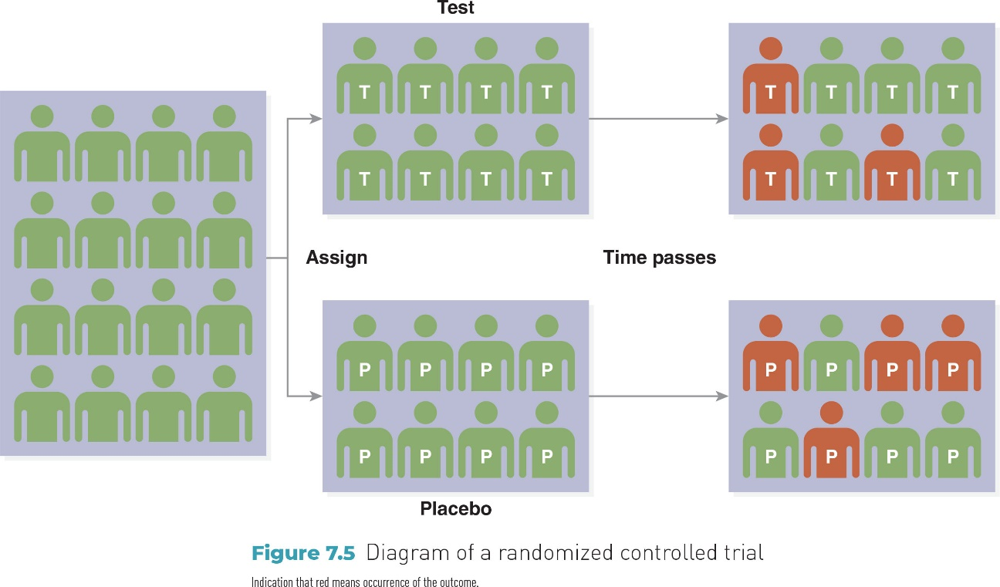
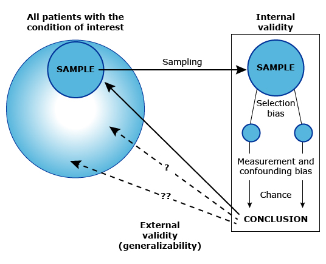
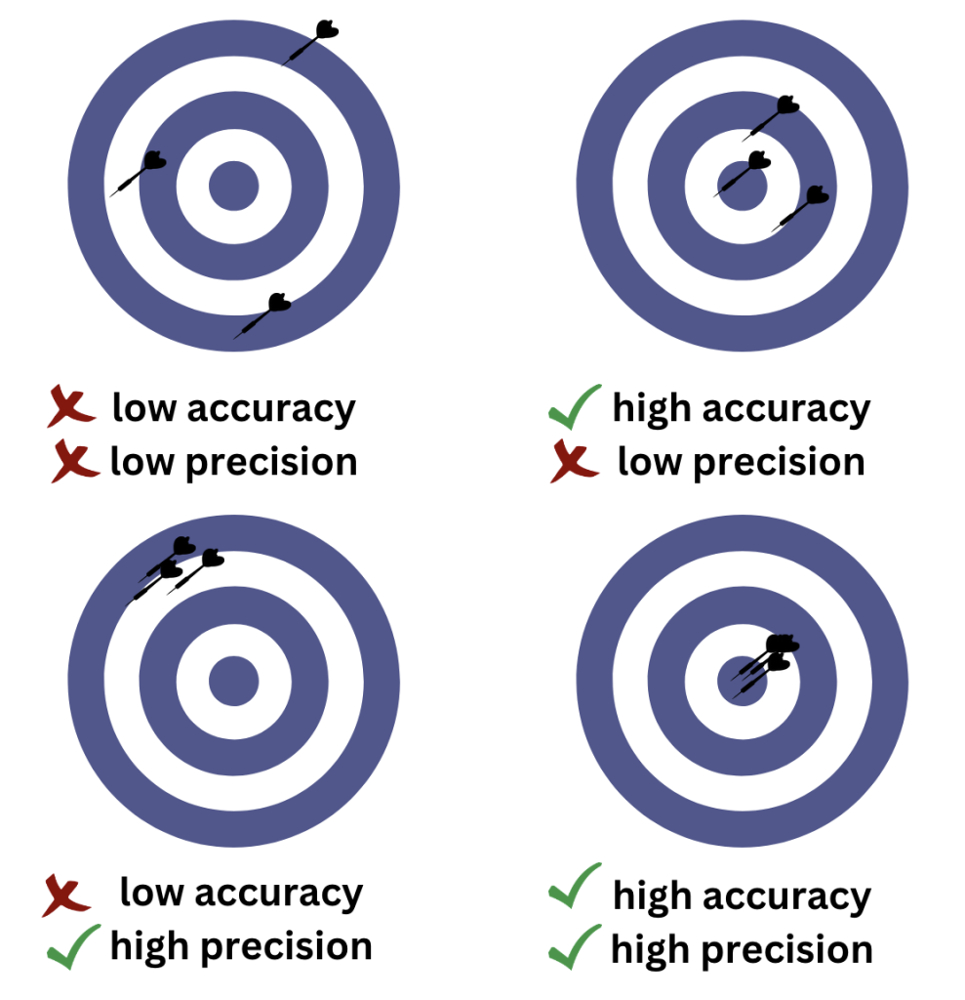
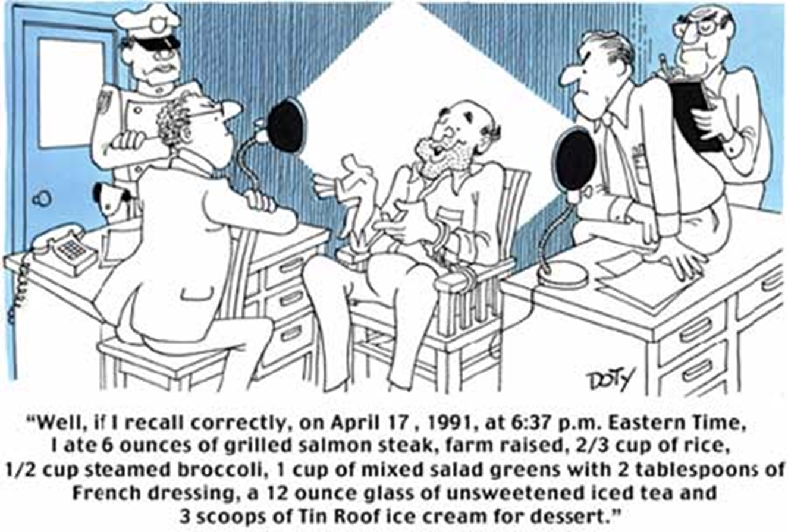
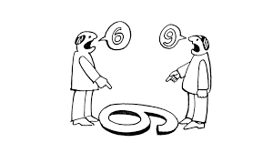
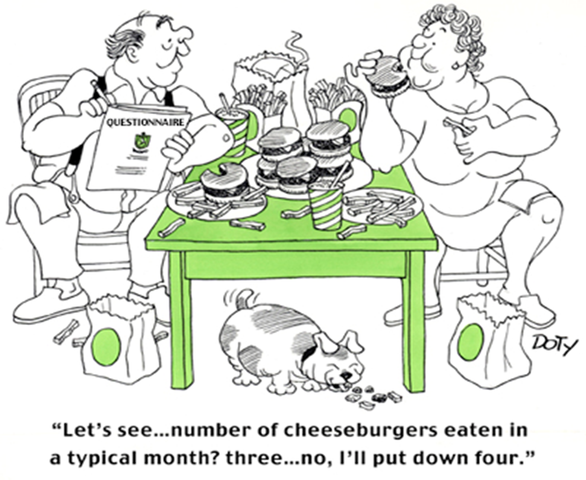
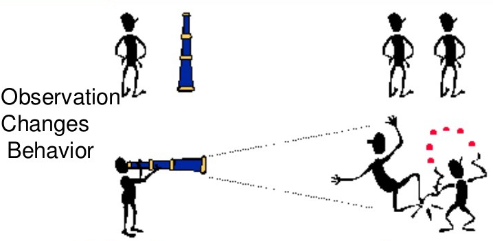
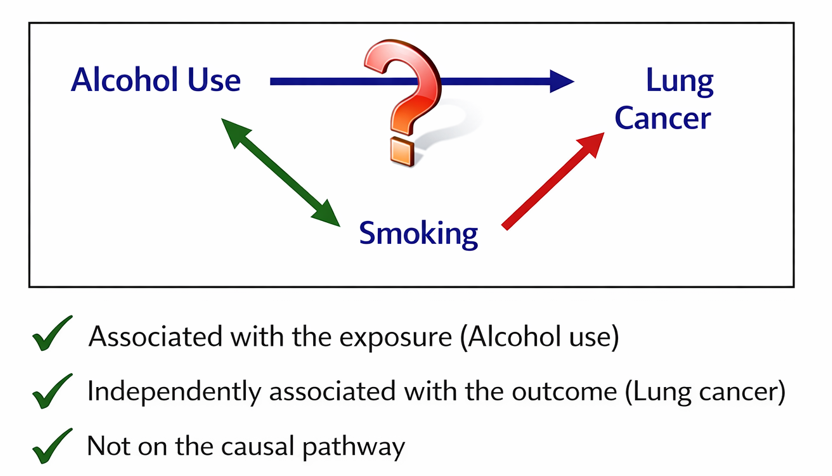

## Objectives {visibility="hidden"}

**By the end of this week, you should be able to:**

- Distinguish **observational** and **experimental** analytic study designs

- Explain the purpose and limitations of **ecologic studies**, including the **ecologic fallacy**

- Describe how **experimental studies** (especially **randomized controlled trials**) support causal inference

- Differentiate **internal validity** and **external validity** in epidemiologic studies

- Identify broad categories of **alternative explanations**—**chance, bias, and confounding**—that can affect study conclusions

## Epidemiological Study: Basic Question

Are exposure and outcome associated?

More specifically:

- Do people **with different exposures** experience **different health outcomes**?

- Is the observed association **likely to be causal**, or could it reflect other explanations?

::: {.notes}
Why this question matters:\
- Identifies factors that may cause or prevent disease\
- Evaluates the effectiveness and safety of interventions\
- Informs public health decisions and policies
:::

## Classification of Study Designs

<!-- Use Brad's study design slide: Lecture Slides/assets/study_design_hierarchy.png -->

<!-- source-004-shape-2.png -->
{fig-alt=""}
<!-- REVIEW: source-004-b001 | Inspect image and author contextual alt text or record decorative status. -->

::: {.notes}
This slide gives an overview of all the study designs we have mentioned today. 

At the top, if the investigator assigned the exposure, the study is an experimental study. If the investigator did not assign exposure, it is an observational study.

Among experimental studies, if the exposure was assigned in a random manner, the study is a randomized controlled trial. If the exposure was not randomly assigned, it is a non-randomized controlled trial. 

Among observational studies, if there is no comparison group, the study is a descriptive study. If there is a comparison group, the study is an analytic study. 

We have discussed three types of analytic studies today. A study where the population is characterized by exposure status, and then outcomes are determined, is a cohort study. A study where the population is characterized by outcome (or disease) status, and then the exposures are determined, is a case-control study.

Finally, a study where the exposure status and the outcome status are determined at the same time is a cross-sectional study.
:::

## Two Categories of Analytic Studies

<!-- REVIEW: Slide 5 | Animations/transitions are not reproduced. -->

::::: {.columns}

:::: {.column width="50%"}

Observational design

- Investigator **does not assign exposure**

- Observes existing differences in exposure and outcome

- Primary goal: **identify associations**

- Examples include ecologic, cohort, and case-control studies

::::

:::: {.column width="50%"}

Experimental design

- Investigator **assigns exposure or intervention**

- Often uses **randomization**

- Primary goal: **evaluate causal effects**

- Examples include randomized controlled trials (RCTs)

::::

:::::

## Levels of Evidence in Epidemiologic Research

<!-- Make the image larger. -->

<!-- source-006-shape-4.png -->
{fig-alt=""}
<!-- REVIEW: source-006-b001 | Inspect image and author contextual alt text or record decorative status. -->

Generate Hypotheses

Establish Causality 

- Study designs vary in how strongly they support **causal inference**

- Lower levels are often used to **generate hypotheses**

- Higher levels are better suited to **test causal effects**

- Moving **up the pyramid** generally means:

    - Greater control over alternative explanations

    - Stronger ability to evaluate causality

**Important note:**\
Higher evidence does **not** mean “always correct,” and lower evidence does **not** mean “wrong.”

::: {.notes}
- This is another way to visualize levels of evidence.
:::

## Epidemiologic Inference: From Association to Conclusion

<!-- Update step 1 to match our definition of assocaition from Module 05. -->

<!-- I'm not sure that I agree that external validity always comes before consider alternative explanations. I think all of these steps are important, but the slide implies that there is a linear sequence that I have not actually observed in the real world. -->

<!-- Further, we should evaluate chance (sampling variability) and bias even when studying associations. -->

Analytic epidemiology asks **whether an observed association reflects a causal relationship**.

- **Step 1: Identify an association:** Do exposure and outcome occur together more often than expected?

- **Step 2: Evaluate validity:** 

    - **Internal validity:** Is the association likely to be real within this study?

    - **External validity:** Can the findings be generalized to other populations?

- **Step 3: Consider alternative explanations**

    - Could the association reflect **chance**?

    - Could it reflect **systematic differences** in how groups are compared or observed?

    - Could it reflect other factors related to both exposure and outcome?

**Key takeaway:** Study design and validity assessment determine how confidently we can move from **association** to **inference**.

## Ecologic Studies: Limits of Causal Inference

<!-- Define and explain unit of analysis and unit of observation. See: https://pressbooks.pub/scientificinquiryinsocialwork/chapter/7-3-unit-of-analysis-and-unit-of-observation/ -->

- **Ecologic Studies:** *Group-level analysis*

- **Unit of analysis:** groups (not individuals)

- **Exposure & outcome:** measured at the **population level**

- **Common use:** explore population patterns; generate hypotheses

- **Key caution:** group-level associations ≠ individual-level conclusions

- **Take-home message:** Ecologic studies are useful for **population questions**, but **cannot establish individual-level causality**.

## Ecologic Fallacy

<!-- Make the image larger or delete it. -->

<!-- Should we also show a chart that demonostrates ecological falacy? -->

::::: {.columns}

:::: {.column width="65%"}

- **Definition:** Incorrectly applying **group-level** findings to **individuals**

    - Occurs when associations observed in populations are assumed to hold at the individual level

- **Example**

    - Observation: Cities with higher income have higher CHD rates

    - Incorrect inference: Wealthier individuals have higher CHD risk

    - Reality: Within cities, CHD risk may be higher among lower-income individuals

- **Take-home message:** Group-level data cannot be used to draw **individual-level conclusions**.

::::

:::: {.column width="35%"}

<!-- source-009-shape-6.png -->
{fig-alt="" .nostretch width="347" style="max-width:100%;height:auto;"}
<!-- REVIEW: source-009-b002 | Inspect image and author contextual alt text or record decorative status. -->

::::

:::::

## Ecologic Study: Strengths & Limitations

<!-- This gives the impression that ecological studies are never the best design choice. Instead, they are the only option at times. I don't think that's true. I think there are times when an ecological study is the best choice, even if resources allow other designs. -->

::::: {.columns}

:::: {.column width="50%"}

Strengths

- Uses existing population-level data

- Efficient: fast and low cost

- Useful when individual-level data are unavailable

::::

:::: {.column width="50%"}

Limitations

- **Ecologic fallacy**

- Crude exposure measurement

- Limited control of confounding

::::

:::::

## Discussion: Ecologic Study Example

- **Study**

    - Sasaki et al. (1993): dietary fat intake & breast cancer mortality

    - Unit of analysis: **countries (30 countries total)**

- **Key finding**

    - Higher animal fat intake was associated with higher breast cancer mortality

    - Fish fat intake was associated with lower breast cancer mortality

- **Discussion prompts**

    - What makes this study **feasible and efficient**?

    - Why can these results **not** be interpreted at the individual level?

    - What **other population-level factors** could explain the association?

<!-- Turn this into a real citation and add to the references slide. -->
Sasaki S, Horacsek M, Kesteloot H. An ecological study of the relationship between dietary fat intake and breast cancer mortality. Prev Med. 1993 Mar;22(2):187-202. doi: 10.1006/pmed.1993.1016. PMID: 8483858.

::: {.notes}
1️⃣ What are the strengths of this study design?
✅ Large-scale comparison – The study included 30 countries, providing a broad perspective on dietary patterns and breast cancer mortality. ✅ Identifies population-level trends – Ecologic studies help detect potential public health concerns that might warrant further investigation. ✅ Cost-effective & efficient – Uses existing data (e.g., food supply records, mortality data) rather than collecting new individual-level data. ✅ Hypothesis-generating – The findings can help guide future research, such as cohort or case-control studies, to test individual-level associations.
2️⃣ How might this study suffer from the ecologic fallacy?
❌ Group-level data ≠ individual risk – Just because a country has higher dietary fat intake and breast cancer mortality, it does not mean that individuals consuming more fat are at higher risk. ❌ Dietary variation within populations – Some individuals in low-fat-intake countries may have high fat diets, but their risk cannot be assessed in an ecologic study. ❌ Confounding factors – The study does not adjust for individual behaviors, such as genetics, exercise, smoking, or healthcare access, which might explain the association.
3️⃣ What confounding factors could explain the observed association?
🔹 Genetic predisposition – Some populations might have higher genetic susceptibility to breast cancer. 🔹 Healthcare access & screening differences – Countries with better screening may detect more cases, making breast cancer rates appear higher. 🔹 Other lifestyle factors – Obesity, physical inactivity, smoking, alcohol consumption could influence both diet and cancer risk. 🔹 Different reporting standards – Countries with more advanced healthcare systems may report more cancer deaths, inflating mortality statistics.
:::

## Experimental Studies

<!-- Why do we skip from ecological studies to experimental studies? I concerned that this order might be confusing for learners. -->

<!-- Double-check the statement that quasi-experimental studies are studies where the intervention is assigned without randomization. I think this statement might be an oversimplification. -->

- **Key feature:** investigator **assigns exposure or intervention**

    - Assigning exposure allows stronger conclusions about **cause and effect**.

- **Comparison:** intervention group vs control group

- **Goal:** evaluate the **effect of an intervention**

- **Two broad types**

    - **True experimental studies:** include **randomization**

    - **Quasi-experimental studies:** no randomization, but intervention is assigned

- **Why they matter**

    - Stronger control of alternative explanations

    - Better support for **causal inference** than observational designs

## Intervention Studies

<!-- Again, I think this is an oversimplification and perhaps even incorrect. Experimental studies can be conducted with real-world populations. -->

- **Key Features**

    - A type of **experimental study**

    - Introduce a **planned action** to assess its impact

    - Conducted in **real-world settings**

- **Common examples**

    - Medical interventions (e.g., vaccines, treatments)

    - Behavioral programs (e.g., smoking cessation)

    - Policy or community interventions (e.g., taxation, education)

- **Take-home message:** Intervention studies evaluate whether **deliberate actions** change health outcomes in practice.

## Experimental vs Intervention Studies

<!-- We might stop using the experimental vs intervention paradigm. -->

- **Experimental studies**

    - Broad category where the investigator **manipulates a condition**

    - Often conducted in **controlled settings**

    - Example: laboratory study testing how temperature affects a biological process

- **Intervention studies**

    - A type of experimental study focused on **planned actions to improve health**

    - Conducted in **real-world populations**

    - Example: introducing a vaccination program or a smoking cessation policy

- **Key point:** All intervention studies are experimental, but not all experimental studies are **health interventions**.

## Exercise: Experimental vs Intervention Studies

<!-- We might stop using the experimental vs intervention paradigm. -->

- **Exercise:**  For each example below, decide whether it is an **Experimental study** or an **Intervention study**.

- Researchers expose bacteria to different temperatures in a lab and measure growth rate.

- A city introduces a new bike-lane policy to encourage physical activity and reduce injuries.

- Participants are randomly assigned to receive a new medication or a placebo to evaluate treatment effectiveness.

- Psychologists test whether blue or red lighting affects concentration in a controlled setting.

- **Hint**

    - Which examples involve a **planned action to improve health**?

    - Which examples involve **manipulation without a health intervention**?

## Clinical Trials: Medical Intervention Studies

- **Clinical Trials**

    - A type of **intervention study** conducted in humans

    - Participants receive a **medical intervention** under controlled conditions

    - Designed to evaluate **safety** and **effectiveness**

- **Common purposes**

    - **Prevention** (prophylactic trials, e.g., vaccines)

    - **Treatment** (therapeutic trials, e.g., new drugs or procedures)

- **Key takeaway:** Clinical trials provide strong evidence for whether **medical interventions work and are safe**.

## Randomized Controlled Trials (RCTs)

- **Randomized Controlled Trials (RCTs)**

    - A type of **clinical trial**

    - Participants are **randomly assigned** to intervention or control groups

    - Groups are comparable **at baseline** by design

    - Outcomes are measured **consistently** across groups

- **Why randomization matters**

    - Reduces systematic differences between groups

    - Strengthens **causal inference**

- **Take-home message:** Randomization helps isolate the effect of the **intervention**, making RCTs the strongest design for evaluating causality.

## RCT: Randomization

<!-- We may want to use Epi III slides instead. -->

::::: {.columns}

:::: {.column width="48%"}

- **Randomization**

    - Assigns participants to groups **by chance**

    - Balances **known and unknown factors** across groups

    - Occurs **before** outcomes are measured

- **What randomization does**

    - Reduces systematic differences between groups

    - Minimizes alternative explanations for observed effects

::::

:::: {.column width="52%"}

<!-- source-018-shape-3.jpg -->
{fig-alt="A block contains 16 human-shaped green icons assigned and classified as test and placebo, where the test contains a block of 8 human-shaped green icons indicating T, and the placebo contains a block of 8 human-shaped green icons indicating P. Therefore, the test is further classified and contains a block of 5 green and 3 red-shaped human icons, while the placebo is further classified and contains a block of 4 green and 4 red-shaped human icons." .nostretch width="583" style="max-width:100%;height:auto;"}

**Take-home message**\
Randomization improves **internal validity** by making groups comparable at baseline.

::::

:::::

## Discussion: Randomized Controlled Trial (RCT) Example

<!-- REVIEW: Slide 19 | Automatic layout declined: Overlapping content may be a layered composition. Extracted content retained in source drawing order; manually arrange and check for overflow. -->

- **Study overview**

    - Large randomized controlled trial of a **low-fat dietary pattern**

    - Postmenopausal women assigned to **intervention** or **usual diet**

    - Long-term follow-up

- **Discussion prompts**

    - Why is an **RCT** an appropriate design for this question?

    - What features of this study strengthen **causal inference**?

    - What challenges might arise in **long-term behavioral interventions**?

- **Key takeaway:** RCTs strengthen causal conclusions, but feasibility, adherence, and follow-up matter.

Prentice RL, Caan B, Chlebowski RT, et al. Low-Fat Dietary Pattern and Risk of Invasive Breast Cancer: The Women's Health Initiative Randomized Controlled Dietary Modification Trial. JAMA. 2006;295(6):629–642. doi:10.1001/jama.295.6.629

## Discussion: Comparing Study Designs

<!-- Why are we comparing ecologic studies and RCTs? -->

- **Comparing Two Studies:** Think back to the two studies discussed today:

    - **Ecologic study:** dietary fat intake and breast cancer mortality

    - **Randomized controlled trial:** low-fat dietary intervention

- **Discussion questions**

    - What is the **unit of analysis** in each study?

    - Which study provides **stronger evidence for causality**, and why?

    - What kinds of conclusions are **appropriate** for each design?

::: {.notes}
Key takeaway Different study designs answer different questions and provide different levels of causal evidence.
:::

## RCTs: Strengths & Limitations

::::: {.columns}

:::: {.column width="50%"}

**Strengths**

- Randomization improves **group comparability**

- Strong **internal validity**

- Best design for evaluating **causal effects** of interventions

::::

:::: {.column width="50%"}

**Limitations**

- Often **expensive** and time-consuming

- May have **limited generalizability** to real-world populations

- Not always **ethical or feasible**

::::

:::::

# Project Prep 2 {.section}

::: {.notes}
Due date: 
:::

## Revisit: Study Design & Causal Inference

<!-- Why are we comparing ecologic studies and RCTs? -->

- Review:

    - **Ecologic study:** dietary fat & breast cancer mortality

    - **RCT:** low-fat dietary intervention

- **Quick question**

    - Which design offers stronger evidence for causality?

- **Follow-up**

    - What might still limit confidence in either study?

- **Key idea:** Even strong study designs have limitations. That leads us to **validity**.

## Challenges to the Validity of Study Designs

<!-- Flip the order of internal and external validity. -->

- Even well-designed studies can produce misleading results.

- Two central questions:

    - **External validity:** Can the findings be generalized to other populations or settings?

    - **Internal validity:** Is the observed association likely to reflect a true causal relationship?

- If validity is compromised, conclusions may reflect:

    - **Random error (chance)**

    - **Systematic error**

    - **Confounding**

- **Key idea:** Strong design does not eliminate threats to validity.

## External Validity

<!-- Flip the order of internal and external validity. -->

<!-- Make the image larger. -->

- **Definition:** The extent to which study results can be **generalized** to other populations or settings

- **Key influences**

    - **Sampling error:** random variation

    - **Sampling bias:** systematic lack of representativeness

- **Guiding question:** Do these results apply beyond this sample?

<!-- source-025-shape-9.png -->
{fig-alt=""}
<!-- REVIEW: source-025-b002 | Inspect image and author contextual alt text or record decorative status. -->

## Sampling Error

<!-- This is fine, but we may want to reuse my slides. -->

- **Definition:** Random variation that occurs because we study a **sample**, not the entire population.

- **Key points**

    - Occurs whenever a sample is drawn

    - Affects the **precision** of estimates

    - Not a design flaw — a natural result of sampling

- **How to reduce it:** Increase **sample size**

- **Example**

    - If the true population smoking rate is 20%,

    - A sample of 50 people might estimate 16% or 24% due to chance.

- **Key takeaway:** Sampling error reflects **random variation**, not systematic bias.

## Sampling Bias

<!-- Call this selection bias. -->

<!-- This is now a review from module 5. -->

- **Definition:** A systematic error that occurs when the sample is **not representative** of the target population.

- **Key points**

    - Results from **how participants are selected**

    - Affects both **generalizability** and potentially conclusions

    - Unlike sampling error, it does **not disappear** with larger sample size

- **Example**

    - Studying hypertension using patients from a single specialty clinic may overrepresent more severe cases.

- **Key takeaway:** Sampling bias threatens **external validity** because the sample does not reflect the population of interest.

## Internal Validity

<!-- This slide was a mess. Come up with some other way to explain internal validity. -->

## Random Error vs Systematic Error

<!-- Show an example of the law of large numbers. I think there is a Shiny application somewhere that does this. -->

::::: {.columns}

:::: {.column width="54%"}

- **Random Error (Chance)**

    - Natural variability in data

    - Directly affects **precision** (spread of estimates)

    - Reduced by increasing **sample size**

- **Systematic Error (Bias)**

    - Flaws in design, selection, or measurement

    - Affects **accuracy** (closeness to the truth)

    - Not corrected by larger sample size

::::

:::: {.column width="46%"}

<!-- source-029-shape-1026.png -->
{fig-alt="Accuracy vs. Precision | ChemTalk" .nostretch width="405" style="max-width:100%;height:auto;"}

::::

:::::

::: {.notes}
Two broad types of error affect internal validity.

:::

## Exercise: Random or Systematic?

For each scenario, decide: **Random error (chance)** or **Systematic error (bias)**

- A random sample of 40 students is used to estimate smoking prevalence on campus. The study finds 16% prevalence, while the true campus rate is 20%.

- In a survey about alcohol use, participants are asked face-to-face by a researcher. Many participants report lower drinking levels than expected.

- In a cohort study of pesticide exposure and Parkinson’s disease, more participants in the exposed group drop out during follow-up than in the unexposed group.

- Blood pressure is measured using two different devices. One device consistently gives readings 5 mmHg higher than the other.

::: {.notes}
Instructor Key (for you)
Random error (small sample variability)
Systematic error — Information bias (social desirability)
Systematic error — Selection bias (loss to follow-up)
Systematic error — Information bias (systematic measurement error)

:::

## Bias (Systematic Error)

- **Definition:** A systematic error in the design, conduct, or measurement of a study that distorts the true association.

- **Key features**

    - Shifts results in a consistent direction

    - Affects **accuracy**, not precision

    - Not corrected by increasing sample size

- **Two major categories**

    - **Selection bias**

    - **Information bias**

- **Key idea:** Bias creates a misleading estimate of the exposure–outcome relationship.

## Selection Bias

<!-- REVIEW: Slide 32 | Reading order: shapes reordered top-to-bottom, left-to-right because drawing order differed; verify against the source slide. -->

<!-- REVIEW: Slide 32 | Text fields/unrecognized inline content in shape 45058: verify formatting and links. -->

- **Definition:** A systematic error caused by differences in **who enters or remains in the study**.

- **How it occurs**

    - Differences in **participant selection**

    - Differences in **participation or refusal**

    - Differences in **loss to follow-up**

- **Key idea:** When the groups being compared differ because of the selection or retention process, the association may be distorted.

::: {.notes}
In essence, sampling bias is a type of selection bias specifically related to the process of sample selection, while selection bias can occur due to various factors throughout the study design and participant recruitment process. Both biases can lead to results that do not accurately represent the true population or the true effect of an exposure or intervention.
:::

## Common Types of Selection Bias

- **Self-selection bias:** Participation or refusal is related to exposure or outcome

- **Healthy worker effect:** Workers tend to be healthier than the general population

- **Control selection bias:** In case-control studies, controls do not represent the source population

- **Loss to follow-up (attrition bias):** In cohort studies, dropout differs between exposure groups

- **Key idea:** Selection bias occurs when group differences arise from **who enters or remains in the study**.

## Information Bias

- **Definition**\
  A systematic error caused by **inaccurate or inconsistent measurement** of exposure or outcome.

- **How it occurs**

    - Differences in how information is **reported**

    - Differences in how information is **collected**

    - Differences in how information is **recorded**

- **Key idea:** When exposure or outcome data differ between groups, the association may be distorted.

::: {.notes}
Information bias can lead to either overestimation or underestimation of the true association between exposure and outcome.
It affects the validity of the study’s findings and can mislead conclusions.
Prevention:
Ensure standardized and validated tools and procedures are used across all study groups.
Train personnel uniformly to minimize the variability in data collection.
Implementing blind or double-blind study designs can help reduce this bias.
 
:::

## Types of Information Bias: Recall Bias

::::: {.columns}

:::: {.column width="47%"}

- **Definition:** A type of information bias in which participants remember past exposures **differently**.

- **When it occurs**

    - Often in **case-control studies**

    - Cases may recall exposures more carefully than controls

- **Key idea:** Differences in memory between groups can distort the exposure–outcome association.

::::

:::: {.column width="53%"}

<!-- source-035-shape-2.png -->
{fig-alt="" .nostretch width="583" style="max-width:100%;height:auto;"}
<!-- REVIEW: source-035-b002 | Inspect image and author contextual alt text or record decorative status. -->

::::

:::::

## Types of Information Bias: Researcher Bias

<!-- Make the image larger. -->

::::: {.columns}

:::: {.column width="54%"}

- **Interviewer Bias**

    - Occurs during **data collection**

    - Interviewer knowledge influences how questions are asked

    - Can lead to different responses between groups

- **Observer Bias**

    - Occurs during **outcome assessment**

    - Observer expectations influence how outcomes are recorded

    - More likely when blinding is absent

- **Key idea:** When researchers influence data collection or measurement, results may be systematically distorted.

::::

:::: {.column width="46%"}

<!-- source-036-shape-3.png -->

<!-- REVIEW: source-036-b001 | Inspect image and author contextual alt text or record decorative status. -->

::::

:::::

## Types of Information Bias: Social Desirability

<!-- REVIEW: Slide 37 | Automatic layout declined: No unique, clear two-column partition. Extracted content retained in source drawing order; manually arrange and check for overflow. -->

- **Definition:** participants provide responses that are viewed as **socially acceptable** rather than accurate.

- **When it occurs**

    - Sensitive behaviors (e.g., smoking, alcohol use, drug use)

    - Self-reported health behaviors or lifestyle factors

- **Key idea:** When participants modify responses to appear favorable, exposure or outcome data may be systematically distorted.

<!-- source-037-shape-2.png -->
{fig-alt=""}
<!-- REVIEW: source-037-b002 | Inspect image and author contextual alt text or record decorative status. -->

## Types of Information Bias: Hawthorne effect

::::: {.columns}

:::: {.column width="47%"}

- **Definition:** participants change behavior because they know they are being observed.

- **When it occurs**

    - During clinical trials or behavioral studies

    - When participants are monitored or aware of measurement

- **Key idea:** when behavior changes due to observation, the measured exposure or outcome may not reflect usual behavior.

::::

:::: {.column width="53%"}

<!-- source-038-shape-2.png -->
{fig-alt="" .nostretch width="582" style="max-width:100%;height:auto;"}
<!-- REVIEW: source-038-b001 | Inspect image and author contextual alt text or record decorative status. -->

::::

:::::

## Exercise: Identify the Type of Information Bias

For each scenario, identify the most likely **type of information bias** and explain why.

::: {.incremental}
- In a case-control study, parents of sick children recall pesticide exposure during pregnancy more carefully than parents of healthy children.

- Participants report lower alcohol use in face-to-face interviews than expected from sales data.

- In a clinical trial, outcome assessors know which participants received the treatment and rate them more favorably.

- Interviewers ask more detailed exposure questions to lung cancer cases than to controls.

- Participants increase exercise levels during a study because they know their activity is being monitored.
:::

## Reducing Selection and Information Bias

- **Reducing Selection Bias**

    - Use appropriate **comparison groups**

    - Apply clear and consistent **inclusion criteria**

    - Minimize **loss to follow-up**

    - Ensure recruitment is not related to both exposure and outcome

- **Reducing Information Bias**

    - Use **standardized definitions** and procedures

    - Apply **blinding** when possible

    - Collect data **consistently across groups**

    - Use validated measurement tools

- **Key idea:** Careful design and consistent measurement strengthen internal validity.

## Confounding

<!-- Use my slide from module 5 -->

- **Definition:** a distortion of the exposure–outcome association caused by a third variable.

<!-- This isn't correct. Check to see if it's tested on quiz 3. -->

- **How to identify a confounder**

    - Associated with the exposure

    - Independently associated with the outcome

    - Not caused by the exposure

- **Example**

    - Smoking may confound the association between alcohol use and lung cancer.

- **Key idea:** If a third variable meets these criteria, the observed association may not reflect a true causal relationship.

## Example of Confounding

::::: {.columns}

:::: {.column width="43%"}

**Scenario**

- Studying the effect of **Alcohol Use (exposure)** on **Lung Cancer (outcome)**.

**Confounder: Smoking**

- Associated with **alcohol use**

- Independently associated with **lung cancer**

- Not caused by alcohol use

**Effect**

- The observed association between alcohol and lung cancer may be distorted because smoking is related to both.

::::

:::: {.column width="57%"}

<!-- source-042-shape-11.png -->
{fig-alt="" .nostretch width="645" style="max-width:100%;height:auto;"}
<!-- REVIEW: source-042-b002 | Inspect image and author contextual alt text or record decorative status. -->

::::

:::::

## Exercise: Could This Be Confounding?

For **each scenario**, decide whether the association could be explained by confounding.  Identify a possible confounder and explain why.

- **Scenario 1:** A study finds that people who carry lighters have a higher risk of lung cancer.

    - What third variable might explain this association?

    - Does it meet the criteria for a confounder?

- **Scenario 2:** A study finds that children who sleep with the light on are more likely to develop myopia (nearsightedness).

    - What third variable might explain this association?

    - Does it meet the criteria for a confounder?

::: {.notes}
**Scenario 1**
People who carry lighters have a higher risk of lung cancer.
Likely confounder: Smoking
Associated with carrying lighters ✔
Independently associated with lung cancer ✔
Not caused by carrying a lighter ✔
Conclusion: Yes — this is classic confounding. Carrying a lighter is a proxy for smoking.

**Scenario 2**
Children who sleep with the light on are more likely to develop myopia (nearsightedness).
Possible confounder: Parental myopia
Parents with myopia may leave lights on more often ✔
Myopia has a genetic component ✔
Sleeping with the light on does not cause parental myopia ✔
Alternative possible confounder: Socioeconomic factors (e.g., educational intensity, screen use)
Conclusion: Yes — the association may reflect underlying familial or environmental factors rather than a direct causal effect.
:::

## Addressing Confounding

<!-- Add a slide that lists the ways to control for confounding. -->

<!-- Create a very simple example where there is an apparent association until we "control" for confounding. -->

- Confounding cannot be ignored when interpreting results.

    - **Randomization** helps balance confounders between groups

    - In observational studies, researchers must **identify and measure potential confounders**

    - Results should be interpreted cautiously if important confounders are not accounted for

- **Key idea:** If confounding is not addressed, an observed association may not reflect a true causal relationship.

## Wrap-Up

<!-- I think we need to change several things about the slide deck, which will change several things about this slide. Or maybe I just don't worry about it this semester. -->

**Causal inference depends on:**

- **Study design**

    - Observational vs experimental

    - Ecologic vs RCT

- **Validity**

    - External validity

    - Internal validity

**Threats to internal validity**

- Chance

- Selection bias

- Information bias

- Confounding

**Key message:** Strong conclusions require both good design and strong validity.

## Final Epi Presentation

Get started!

