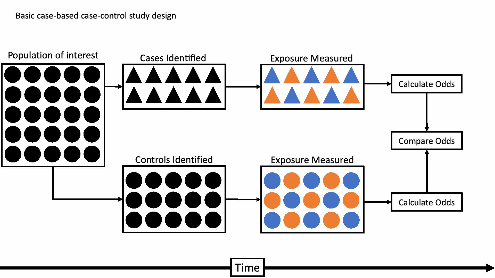

## Retrospective Cohort vs. Case-Control

<!-- REVIEW: Second of three sessions. Existing questions are retained for discussion/polling with show-of-hands fallback. Check Quiz 3 alignment; matched and nested analyses are deliberately not introduced. -->

<!-- Source: cohort_study_design.pptx, slide 19. -->
<!-- REVIEW: The source says cohort participants are sampled by exposure. Distinguish exposure-based recruitment from cohorts assembled by membership in a population; a new explanation has not been written. -->

- Case-control

    - Sample based on outcome and look backward for exposure.

- Retrospective Cohort

    - Sample based on exposure and look “forward” towards the outcome

    - A cohort study was done, you just weren’t there to initially observe it

::: {.notes}
Don’t confuse retrospective cohort and case-control.
:::

## When Cohort Is Not Ideal

<!-- Source: APHS 20203 W7-Analytic Epi-Cohort and Case-control studies.pptx, slide 33. -->

Cohort studies are powerful — but not always practical.

- What if:

    - The disease is **rare**?

    - The outcome has a **long latency period**?

    - Long-term follow-up is **too costly or infeasible**?

    - You need results **quickly**?

    - In these situations, a different design may be more efficient.

## Basic Case-Control Study Design

<!-- Source: UTHealth case_control_study_design.pdf, page 6; corresponding PowerPoint slide 7. -->

{fig-alt="Cases and controls are selected from a population. Prior exposure is measured in each group, and exposure odds are compared." .nostretch width="1000" height="500" style="object-fit:contain;"}

::: {.notes}
Here’s my little graphical representation of the basic case-based case-control study design. There are other case-control designs, but when someone simply says, “case-control” study, this is probably what they are talking about.

In this design, exposures and outcomes that we are interested in occur out in the world. Then, we come along and gather up a group of people who have already had the outcome we are interested in and then measure their history of exposures(s). Similarly, we gather up a group of people who we think are comparable to the people with the outcome in all relevant ways, but who haven’t had the outcome, and we also measure their history of exposure(s). Finally, we calculate the odds of being exposed in both groups and compare.

Where:
Orange = Exposed to smoking
Blue = Unexposed to smoking
Circle = No lung cancer
Triangle = Lung cancer

This is a very simplistic description, but it’s intended to just give you an intuitive feel for what we are talking about.

:::

## Case-Control Studies: Overview

<!-- Source: APHS 20203 W7-Analytic Epi-Cohort and Case-control studies.pptx, slide 34. -->
<!-- REVIEW: Traditional, nested, and matched were listed as separate types in the source, although the categories can overlap. That taxonomy is omitted; the slide illustrates a basic case-control study. -->

- **Definition:** Start with **outcome status**

    - **Cases** → Have the disease; **Controls** → Do not have the disease

    - Then look backward to assess **prior exposure**

- **Direction of Inquiry:** Outcome → Exposure

- **Primary Measure of Association: Odds Ratio (OR)**

## Poll: Identify the Study Design {.compact}

<!-- Source: APHS 20203 W7-Analytic Epi-Cohort and Case-control studies.pptx, slide 49. -->
<!-- REVIEW: Originally hidden. Source does not include an answer key; review the response with Brad rather than adding a newly authored explanation. -->

- Researchers identify 500 patients with lung cancer and 500 patients without lung cancer. They compare prior smoking history.

- What type of study is this?

**A.** Cohort study

**B.** Case-control study

**C.** Cross-sectional study

**D.** Randomized trial

## Discussion: How Would You Study Lung Cancer?

<!-- Source: APHS 20203 W7-Analytic Epi-Cohort and Case-control studies.pptx, slide 38. -->

If lung cancer is a **rare disease**, how would you design the study?

- Would you start with **exposure** or **outcome**?

- Would long-term follow-up be practical?

- How could you efficiently identify cases?

- What comparison group would you need?

## Doll and Hill (1950) {.compact}

<!-- Source: APHS 20203 W7-Analytic Epi-Cohort and Case-control studies.pptx, slide 40. -->
<!-- REVIEW: Retains the historical example from Yan's slides. Verify the original study citation and the framing of rarity before publication; no new historical detail has been added. -->

- **Research Question:** Is cigarette smoking associated with lung cancer?

- **Study Design:**

    - **Cases:** Patients diagnosed with lung cancer

    - **Controls:** Hospital patients without lung cancer

    - Collected prior **smoking history**

- **Direction of Inquiry:** Outcome → Exposure

- **Why Case-Control Was Appropriate:**

    - Lung cancer was a **rare disease**

    - Long-term follow-up would have been impractical

    - Efficient comparison of prior exposure

## Review: Population and Sample {.compact}

<!-- Source: Association and Causality.qmd, "Population, Sample & Uncertainty". -->

**Example:** We want to understand the health of adults living in Texas.

| Group | Who belongs to it? | In our example |
|---|---|---|
| **Target population** | People we want findings to apply to | All Texas adults |
| **Source population** | People from whom we select participants | Adult patients at several Texas clinics |
| **Study sample** | People whose data we analyze | 500 participating patients |

::: {.fragment}
- **Chance:** Would another random sample from the same source give a different estimate?
- **Applicability:** How well do these findings apply to all Texas adults?
:::

::: {.notes}
Sampling introduces uncertainty into our estimates. Who we recruit also affects which populations our findings may apply to. These are distinct questions: a larger clinic sample does not automatically make it representative of all Texas adults.

Distinguish statistical uncertainty from causal uncertainty, as in Measures of Occurrence, slides 14–16. Even a precisely estimated association can leave uncertainty about its causal interpretation.
:::

## Study Base Principle

<!-- Source: case_control_study_design.pptx, slide 10. -->
<!-- REVIEW: Use the common-source-population concept here. The absolute selection-bias statement is shorthand; assess whether selection actually distorts the exposure comparison. -->

- Cases and controls should be “representative of the same base experience.”

- If a potential control had gotten the disease, they would have been selected with the same probability as any other case

    - If this is not true, you have selection bias!

## Group Exercise: Shands Hospital {.compact}

<!-- Source: case_control_study_design.pptx, slide 11. -->
<!-- REVIEW: Retain the original Shands question. The old Poll Everywhere activity link is omitted because it has not been checked; use group discussion or a show of hands. No new answer explanation has been authored. -->

Shands Hospital at the University of Florida is a referral hospital for a variety of cancer diagnoses \-\- including bronchogenic carcinoma \-\- for the North Florida region where it is located. Researchers are interested in the association between bronchogenic carcinoma and a history of cigarette smoking, and they decide to conduct a case-control study. Cases are selected from the admissions records to the cancer center. Controls are randomly selected from the population of the surrounding county. Does the control group violate the study base principle?

## Selection Bias in Case-Control Studies {.compact}

<!-- Source: APHS 20203 W7-Analytic Epi-Cohort and Case-control studies.pptx, slide 42. -->
<!-- REVIEW: The matching paragraph was omitted: matching alone does not establish a valid source population or control confounding. A replacement explanation would require additional material. -->

- **Core Issue:** Controls must represent the **same source population** as the cases.

    - If not, the exposure comparison becomes biased.

- **Example (Smoking & Lung Cancer):**

    - If controls are selected from a group with unusually low smoking rates,\
      smoking may appear more strongly associated with lung cancer.

- **Key Principle:**

    - Controls should reflect the **exposure distribution** of the population that produced the cases.

## Recall Bias

<!-- Source: Analytic Epidemiology - Study Designs I.qmd, "Types of Information Bias: Recall Bias". -->

::::: {.columns}

:::: {.column width="47%"}

- **Definition:** A type of information bias in which participants remember past exposures **differently**.

- **When it occurs**

    - Often in **case-control studies**

    - Cases may recall exposures more carefully than controls

- **Key idea:** Differences in memory between groups can distort the exposure–outcome association.

::::

:::: {.column width="53%"}

{fig-alt="Cartoon of an interviewee claiming to remember exact foods, quantities, date, and time of a meal eaten years earlier." .nostretch width="583" style="max-width:100%;height:auto;"}
::::

:::::

## Interviewer and Observer Bias {.compact}

<!-- Source: Analytic Epidemiology - Study Designs I.qmd, "Types of Information Bias: Researcher Bias". -->

- **Interviewer Bias**

    - Occurs during **data collection**

    - Interviewer knowledge influences how questions are asked

    - Can lead to different responses between groups

- **Observer Bias**

    - Occurs during **outcome assessment**

    - Observer expectations influence how outcomes are recorded

    - More likely when blinding is absent

- **Key idea:** When researchers influence data collection or measurement, results may be systematically distorted.

## Why Use an Odds Ratio? {.compact}

<!-- Source: APHS 20203 W7-Analytic Epi-Cohort and Case-control studies.pptx, slide 43. -->
<!-- REVIEW: The no-incidence statement applies to the basic case-control sample presented here. Specialized designs and external denominator information need qualifications if introduced later. -->

- In case-control studies, we cannot calculate **risk** directly. Why?

    - We start with a fixed number of **cases and controls**

    - The total population at risk is unknown

    - Incidence cannot be measured

    - Instead, we quantify association using the **Odds Ratio (OR)**

- **What Does OR Measure?**

    - The **odds of prior exposure** among cases compared to the odds of exposure among controls

- **Key Contrast:**

    - Cohort → Uses **Relative Risk (RR)**

    - Case-Control → Uses **Odds Ratio (OR)**

## Calculating Odds Ratio

<!-- Source: APHS 20203 W7-Analytic Epi-Cohort and Case-control studies.pptx, slide 44. -->
<!-- REVIEW: The source table and odds-ratio equation are transcribed into editable Quarto text instead of retaining equation screenshots. -->

| | Cases | Controls |
| --- | --- | --- |
| Exposed | a | b |
| Not exposed | c | d |
| Odds of exposure | a/c | b/d |

**Odds ratio:** odds of exposure in cases versus odds of exposure in controls.

**OR = (a/c) ÷ (b/d) = (a × d)/(b × c)**

## Smoking and Lung Cancer {.compact}

<!-- Source: APHS 20203 W7-Analytic Epi-Cohort and Case-control studies.pptx, slide 46. -->

- **Research Question:** Is smoking associated with lung cancer?

- **Study Design:**

    - **Cases:** Patients with lung cancer

    - **Controls:** Patients without lung cancer

    - Collected prior **smoking history**

- **OR** = (A × D) / (B × C)= (647 × 27) / (622 × 2)≈ **14.0**

- **Interpretation:** The odds of prior smoking among lung cancer cases are about **14 times higher** than among controls.

- **Conclusion:** Smoking is strongly associated with lung cancer.

|  | Lung Cancer (+) | Lung Cancer (–) |
| --- | --- | --- |
| Smoker | 647 | 622 |
| Non-Smoker | 2 | 27 |

## Interpreting the Odds Ratio {.compact}

<!-- Source: APHS 20203 W7-Analytic Epi-Cohort and Case-control studies.pptx, slide 45. -->
<!-- REVIEW: The source's "protective effect" wording should not imply that the OR establishes causation. The rare-disease approximation needs appropriate source-population sampling assumptions; do not generalize it to every case-control design. -->

- **Interpreting the Odds Ratio (OR)**

    - **OR = 1:** No association between exposure and disease

    - **OR \> 1:** Exposure is associated with **higher odds** of disease

    - **OR \< 1:** Exposure is associated with **lower odds** of disease (protective effect)

- **Important:** OR reflects **odds**, not risk.

- When the disease is **rare**, the OR closely approximates the **Relative Risk (RR)**.

    - When cases are rare: **Total population ≈ Non-cases**

## Poll: Interpreting Odds Ratio {.compact}

<!-- Source: APHS 20203 W7-Analytic Epi-Cohort and Case-control studies.pptx, slide 51. -->

- In a case-control study examining asbestos exposure and lung cancer, researchers identified 400 lung cancer cases and 400 controls without lung cancer. The Odds Ratio (OR) for asbestos exposure was **3.0**.

- What does this mean?

**A.** Exposed individuals have 3 times the risk of lung cancer

**B.** Asbestos exposure causes lung cancer

**C.** There is no association between asbestos and lung cancer

**D.** Lung cancer cases had 3 times the odds of prior asbestos exposure compared to controls

::: {.notes}
Explanation: OR compares the odds of prior exposure between cases and controls. It does not directly measure risk or prove causation.
:::

## Poll: Identifying Bias {.compact}

<!-- Source: APHS 20203 W7-Analytic Epi-Cohort and Case-control studies.pptx, slide 52. -->

- In a case-control study investigating the relationship between alcohol use and liver cancer, cases were recruited from a major urban hospital. Controls were recruited from a local fitness club.

- Which bias is most likely?

**A.** Recall bias

**B.** Attrition bias

**C.** Selection bias

**D.** Interviewer bias

::: {.notes}
Explanation: Controls from a fitness club may not represent the same source population as hospital cases, leading to distorted exposure comparison.
:::

## Strengths and Limitations {.compact}

<!-- Source: APHS 20203 W7-Analytic Epi-Cohort and Case-control studies.pptx, slide 47. -->

:::: {.columns}
::: {.column width="50%"}
**Strengths**

- Efficient for studying **rare diseases**

- Faster and less costly than cohort studies

- Require **fewer participants**

- Useful for diseases with **long latency**
:::
::: {.column width="50%"}
**Limitations**

- Cannot directly measure **incidence or risk**

- Vulnerable to **selection bias**

- Prone to **recall bias**

- Control selection can be challenging
:::
::::

## Cohort vs. Case-Control Studies {.compact}

<!-- Source: APHS 20203 W7-Analytic Epi-Cohort and Case-control studies.pptx, slide 48. -->
<!-- REVIEW: This source table is a basic comparison. Time/cost and primary bias concerns depend on the study; cohort studies also support association measures other than RR. -->

| Feature | Cohort Study | Case-Control Study |
| --- | --- | --- |
| Start With | Exposure | Outcome |
| Direction | Exposure → Outcome | Outcome → Exposure |
| Measure | Relative Risk (RR) | Odds Ratio (OR) |
| Best For | Rare exposures | Rare diseases |
| Time & Cost | Longer, more expensive | Faster, less expensive |
| Main Bias Concern | Loss to follow-up | Selection & recall bias |
| Can Measure Incidence? | Yes | No |
