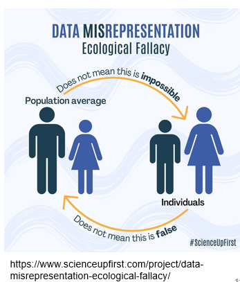
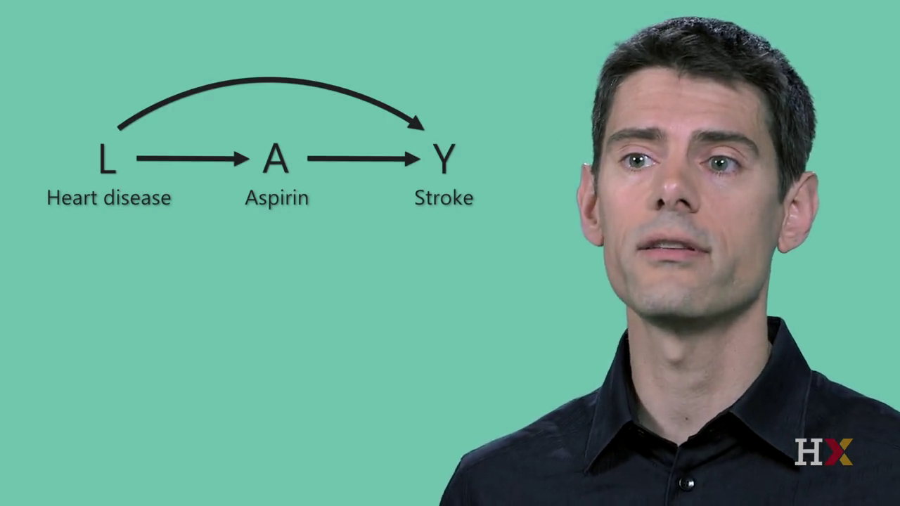
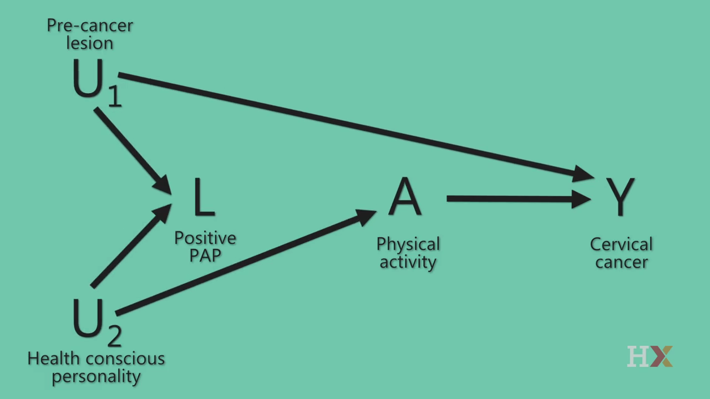

## Ecologic Studies {.compact}

<!-- REVIEW: Third of three sessions. Reserve time for AI Activity 2 if it is conducted in class. Check actual Quiz 3 items before declaring coverage complete. GAP: No complete, unambiguous exercise comparing all four designs was supplied; existing two-design discussion and the cohort/case-control comparison are reused instead. A new integrated exercise requires Brad's approval. -->

<!-- Source: Analytic Epidemiology - Study Designs I.qmd, "Ecologic Studies: Limits of Causal Inference". -->

<!-- Define and explain unit of analysis and unit of observation. See: https://pressbooks.pub/scientificinquiryinsocialwork/chapter/7-3-unit-of-analysis-and-unit-of-observation/ -->

- **Ecologic Studies:** *Group-level analysis*

- **Unit of analysis:** groups (not individuals)

- **Exposure & outcome:** measured at the **population level**

- **Common use:** explore population patterns; generate hypotheses

- **Key caution:** group-level associations ≠ individual-level conclusions

- **Take-home message:** Ecologic studies are useful for **population questions**, but **cannot establish individual-level causality**.

## Ecologic Fallacy {.compact}

<!-- Source: Analytic Epidemiology - Study Designs I.qmd, "Ecologic Fallacy". -->
<!-- REVIEW: The source city-income/CHD scenario is illustrative; verify or label it as hypothetical before presenting it as an empirical finding. -->

<!-- Make the image larger or delete it. -->

<!-- Should we also show a chart that demonostrates ecological falacy? -->

::::: {.columns}

:::: {.column width="65%"}

- **Definition:** Incorrectly applying **group-level** findings to **individuals**

    - Occurs when associations observed in populations are assumed to hold at the individual level

- **Example**

    - Observation: Cities with higher income have higher CHD rates

    - Incorrect inference: Wealthier individuals have higher CHD risk

    - Reality: Within cities, CHD risk may be higher among lower-income individuals

- **Take-home message:** Group-level data cannot be used to draw **individual-level conclusions**.

::::

:::: {.column width="35%"}

{fig-alt="An ecological-fallacy infographic contrasts a taller average male figure with a taller individual female figure, illustrating that population averages do not determine every individual comparison." .nostretch width="347" style="max-width:100%;height:auto;"}
::::

:::::

## Ecologic Study: Strengths & Limitations

<!-- Source: Analytic Epidemiology - Study Designs I.qmd, "Ecologic Study: Strengths & Limitations". -->
<!-- REVIEW: Brad's concern remains: this source does not explain when an ecological design is the preferred choice for a population-level question. No new example has been invented. -->

<!-- This gives the impression that ecological studies are never the best design choice. Instead, they are the only option at times. I don't think that's true. I think there are times when an ecological study is the best choice, even if resources allow other designs. -->

::::: {.columns}

:::: {.column width="50%"}

Strengths

- Uses existing population-level data

- Efficient: fast and low cost

- Useful when individual-level data are unavailable

::::

:::: {.column width="50%"}

Limitations

- **Ecologic fallacy**

- Crude exposure measurement

- Limited control of confounding

::::

:::::

## Dietary Fat and Breast Cancer Mortality {.compact}

<!-- Source: Analytic Epidemiology - Study Designs I.qmd, "Discussion: Ecologic Study Example". -->
<!-- REVIEW: Use the source discussion prompts as a group exercise. The inherited answer notes mix cancer incidence/detection with mortality and make unsupported study-specific claims; they were omitted pending review. Complete the source citation formatting before publication. -->

- **Study**

    - Sasaki et al. (1993): dietary fat intake & breast cancer mortality

    - Unit of analysis: **countries (30 countries total)**

- **Key finding**

    - Higher animal fat intake was associated with higher breast cancer mortality

    - Fish fat intake was associated with lower breast cancer mortality

- **Discussion prompts**

    - What makes this study **feasible and efficient**?

    - Why can these results **not** be interpreted at the individual level?

    - What **other population-level factors** could explain the association?

<!-- Turn this into a real citation and add to the references slide. -->
Sasaki S, Horacsek M, Kesteloot H. An ecological study of the relationship between dietary fat intake and breast cancer mortality. Prev Med. 1993 Mar;22(2):187-202. doi: 10.1006/pmed.1993.1016. PMID: 8483858.

## Low-Fat Dietary Pattern: Randomized Trial {.compact}

<!-- Source: Analytic Epidemiology - Study Designs I.qmd, "Discussion: Randomized Controlled Trial (RCT) Example". -->

- **Study overview**

    - Large randomized controlled trial of a **low-fat dietary pattern**

    - Postmenopausal women assigned to **intervention** or **usual diet**

    - Long-term follow-up

- **Discussion prompts**

    - Why is an **RCT** an appropriate design for this question?

    - What features of this study strengthen **causal inference**?

    - What challenges might arise in **long-term behavioral interventions**?

- **Key takeaway:** RCTs strengthen causal conclusions, but feasibility, adherence, and follow-up matter.

Prentice RL, Caan B, Chlebowski RT, et al. Low-Fat Dietary Pattern and Risk of Invasive Breast Cancer: The Women's Health Initiative Randomized Controlled Dietary Modification Trial. JAMA. 2006;295(6):629–642. doi:10.1001/jama.295.6.629

## Group Discussion: Comparing Study Designs {.compact}

<!-- Source: Analytic Epidemiology - Study Designs I.qmd, "Discussion: Comparing Study Designs". -->
<!-- REVIEW: The studies have different outcomes and exposure definitions. The comparison should not imply they estimate an identical causal effect. -->

<!-- Why are we comparing ecologic studies and RCTs? -->

- **Comparing Two Studies:** Think back to the two studies discussed today:

    - **Ecologic study:** dietary fat intake and breast cancer mortality

    - **Randomized controlled trial:** low-fat dietary intervention

- **Discussion questions**

    - What is the **unit of analysis** in each study?

    - Which study provides **stronger evidence for causality**, and why?

    - What kinds of conclusions are **appropriate** for each design?

::: {.notes}
Key takeaway Different study designs answer different questions and provide different levels of causal evidence.
:::

## Social Desirability Bias

<!-- Source: Original Module 6, "Types of Information Bias: Social Desirability"; nonjudgmental-questioning application adapted from supplied Quiz 3 Question 8. Original decorative image omitted. -->

- **Definition:** participants provide responses that are viewed as **socially acceptable** rather than accurate.
- **When it occurs:** sensitive behaviors, such as smoking, alcohol use, drug use, and other self-reported behaviors.
- **Key idea:** When participants modify responses to appear favorable, exposure or outcome data may be systematically distorted.
- **Reducing it:** Ask about behaviors in a **neutral, nonjudgmental** way.

## Hawthorne Effect

<!-- Source: Original Module 6, "Types of Information Bias: Hawthorne effect". The heading omits the source's information-bias classification because a change in behavior is not necessarily measurement error. -->

- **Definition:** participants change behavior because they know they are being observed.
- **When it occurs:** during clinical trials or behavioral studies, when participants are monitored or aware of measurement.
- **Key idea:** When behavior changes due to observation, the measured exposure or outcome may not reflect usual behavior.

::: {.notes}
Distinguish behavior changing from a participant reporting behavior inaccurately. The supplied exercise illustrates the distinction: exercise increases under observation, whereas socially desirable reporting can misrepresent alcohol use.
:::

## Exercise: Bias and Behavior Changes {.compact}

<!-- Source: Analytic Epidemiology - Study Designs I.qmd, "Exercise: Identify the Type of Information Bias". -->
<!-- Adaptation: Original scenarios retained; broadened the heading to distinguish information bias from the Hawthorne effect. -->

For each scenario, identify the **bias or behavior change** being illustrated and explain why.

::: {.incremental}
- In a case-control study, parents of sick children recall pesticide exposure during pregnancy more carefully than parents of healthy children.

- Participants report lower alcohol use in face-to-face interviews than expected from sales data.

- In a clinical trial, outcome assessors know which participants received the treatment and rate them more favorably.

- Interviewers ask more detailed exposure questions to lung cancer cases than to controls.

- Participants increase exercise levels during a study because they know their activity is being monitored.
:::

::: {.notes}
1. Recall bias: parents in the two groups recall exposure differently.
2. Social desirability bias is the intended answer. Underreporting alone does not establish the mechanism; discuss why participants might alter their reports.
3. Observer bias: knowledge of treatment influences outcome ratings.
4. Interviewer bias: exposure questioning differs between groups.
5. Hawthorne effect: behavior changes because participants know they are being observed. This is not automatically an error in measuring the changed behavior.
:::

## Reducing Bias {.compact}

<!-- Source: Analytic Epidemiology - Study Designs I.qmd, "Reducing Selection and Information Bias". -->

- **Reducing Selection Bias**

    - Use appropriate **comparison groups**

    - Apply clear and consistent **inclusion criteria**

    - Minimize **loss to follow-up**

    - Ensure recruitment is not related to both exposure and outcome

- **Reducing Information Bias**

    - Use **standardized definitions** and procedures

    - Apply **blinding** when possible

    - Collect data **consistently across groups**

    - Use validated measurement tools

- **Key idea:** Careful design and consistent measurement strengthen internal validity.

## Review: Sample Size and Bias

<!-- Source: Module 5 "Bias" slide and original Module 6 "Random Error vs Systematic Error". Reused concepts for Quiz 3 Question 9. -->

- **Random error:** Natural variability in data; affects **precision** and is generally reduced by increasing sample size.
- **Bias:** Systematic error arising from study design, selection, or measurement. A larger sample does **not generally eliminate bias**.
- **Existing example:** Measuring physical activity at local gyms may systematically overrepresent more active people, even with a large sample.

**For information bias:** standardized definitions, consistent measurement procedures, and blinding address the measurement process; a larger sample alone does not.

## Review: Confounding

<!-- Source: Association and Causality.qmd, "Confounding". -->

- **Confounding:** The effects of other factors become mixed into our estimate of an exposure's causal effect. Or giving credit to the wrong variable.

- **Example:** Ice cream sales and drownings both increase during hot weather.

    - Hot weather influences both ice cream sales and drowning risk.

- **Question:** Would reducing ice cream sales reduce drownings?

- **Key idea:** The association can be real and useful for prediction without representing a causal effect of ice cream sales.

::: {.notes}
The association itself need not be incorrect. The problem arises when we attribute it to a causal effect of ice cream sales rather than the common cause, hot weather.

Introduce the term "spurious association" here for the reading, quiz, and later exercise. It describes an association that does not represent the causal relationship we might infer from it. Do not use it as a synonym for confounding: chance and other biases can also produce misleading findings.
:::

## Conventional Confounder Definition

<!-- Source: Hernan, edX PH559x, Confounders Part 2, on-screen conventional definition. -->
<!-- REVIEW: Present this as the conventional definition being evaluated, not a recommended checklist. GAP: Students have seen sufficient-cause pies but not a systematic DAG introduction. Introduce arrow/path/collider notation before the source video; that introduction has not been authored. -->

L is a confounder of the effect of A on Y if L meets these three conditions:

- L is associated with A
- L is associated with Y conditional on A
- L is not on a causal pathway from A to Y

## Confounders: Part 1

<!-- Source: Hernan, Confounders Part 1.mp4, frame at 7:45. -->
<!-- REVIEW: The local Part 1 file ends at 9:13. This original diagram supplies the common-cause example. No narration has been transcribed. -->

{fig-alt="Hernan diagram: heart disease L causes aspirin use A and stroke Y; aspirin A also points to stroke Y." .nostretch width="1000" height="500" style="object-fit:contain;"}

## Confounders: Part 3

<!-- Source: Hernan, edX PH559x, supplied Confounders Part 3.mp4 (complete original video, approximately 7:13). -->
<!-- REVIEW: Review playback and narration before teaching. The supplied file has no embedded subtitle track; an accurate caption/transcript file is a remaining accessibility gap. No transcript or replacement narration has been invented. Keep the following still diagram available as a visual fallback. -->



## Confounders: Part 3 Diagram

<!-- Source: Hernan, Confounders Part 3.mp4, frame at 4:30. -->
<!-- REVIEW: Use the original video explanation for the collider counterexample. Verify that students can identify the path and understand conditioning; a new worked explanation has not been authored. -->

{fig-alt="Physical activity A points to cervical cancer Y. Precancer lesion U1 points to Y and positive Pap L. Health-conscious personality U2 points to A and L. The two arrows meet at L." .nostretch width="1000" height="500" style="object-fit:contain;"}

## Poll: Confounder Criteria {.compact}

<!-- Source: Hernan, 03 Confounders Part 1.pdf, question 1. -->
<!-- REVIEW: Original question reused verbatim, with letter labels added for classroom polling. Use a show of hands if no polling activity is configured. -->

Consider a variable associated with the treatment A, associated with the outcome Y within levels of A, and not on a causal pathway from A to Y. Adjustment for such a variable will always reduce bias.

**A.** True

**B.** False

::: {.notes}
False. The supplied completed edX question marks this response correct.
:::

## Poll: Causal Structure

<!-- Source: Hernan, 03 Confounders Part 1.pdf, question 2. -->

Generally, we need to use our expert knowledge of the causal structure of a problem to determine whether confounding is present.

**A.** True

**B.** False

::: {.notes}
True. The supplied completed edX question marks this response correct.
:::

## Addressing Confounding

<!-- Source: Analytic Epidemiology - Study Designs I.qmd, "Addressing Confounding". -->
<!-- REVIEW: GAP: Brad requested a simple numerical before/after-adjustment example and a list of control methods. These supplied slides do not provide that complete teaching sequence. No new numbers, example, or methods lesson has been authored. -->

<!-- Add a slide that lists the ways to control for confounding. -->

<!-- Create a very simple example where there is an apparent association until we "control" for confounding. -->

- Confounding cannot be ignored when interpreting results.

    - **Randomization** helps balance confounders between groups

    - In observational studies, researchers must **identify and measure potential confounders**

    - Results should be interpreted cautiously if important confounders are not accounted for

- **Key idea:** If confounding is not addressed, an observed association may not reflect a true causal relationship.

## Review: Cohort vs. Case-Control {.compact}

<!-- Source: APHS 20203 W7-Analytic Epi-Cohort and Case-control studies.pptx, slide 48. -->
<!-- REVIEW: Use as an existing comparison for review. It is not a complete four-design exercise; exceptions to the simplified rows still apply. -->

| Feature | Cohort Study | Case-Control Study |
| --- | --- | --- |
| Start With | Exposure | Outcome |
| Direction | Exposure → Outcome | Outcome → Exposure |
| Measure | Relative Risk (RR) | Odds Ratio (OR) |
| Best For | Rare exposures | Rare diseases |
| Time & Cost | Longer, more expensive | Faster, less expensive |
| Main Bias Concern | Loss to follow-up | Selection & recall bias |
| Can Measure Incidence? | Yes | No |

## Design-Selection Question for Review {.compact visibility="hidden"}

<!-- Source: APHS 20203 W7-Analytic Epi-Cohort and Case-control studies.pptx, slide 50. -->
<!-- REVIEW: HIDDEN PENDING REVIEW: This source question includes both a rare exposure and a rare disease. Recruitment and data availability are unspecified, so it does not support a unique best answer. Retained for Brad to revise rather than inventing a replacement. -->

- You want to study whether a rare genetic mutation is associated with pancreatic cancer. Which design is most efficient?

- Cohort study

- Case-control study

- Cross-sectional study

- Clinical trial

## Epidemiology Wrap-Up {.compact}

<!-- Source: APHS 20203 W7-Analytic Epi-Cohort and Case-control studies.pptx, slide 53. -->

- Define and explain the **foundations of epidemiology**

- Measure disease using **incidence, prevalence, and rates**

- Describe patterns by **person, place, and time**

- Evaluate **association and causality**

- Distinguish **cohort and case-control** study designs

- Interpret **RR, ARD, and OR**

- Identify major sources of **bias and confounding**

## From Concepts to Your Presentation {.compact}

<!-- Source: APHS 20203 W7-Analytic Epi-Cohort and Case-control studies.pptx, slide 54. -->
<!-- REVIEW: Verify these inherited presentation requirements against the current assignment rubric. No assignment expectations have been added. -->

::::: {.columns}

:::: {.column width="50%"}

- **The Conceptual Progression**

    - Descriptive Epidemiology\
      → Generates hypotheses

    - Analytic Epidemiology\
      → Tests exposure → outcome relationships

    - Critical Thinking\
      → Distinguish **association from causation**

::::

:::: {.column width="50%"}

- **For Your Epi Final Presentation**

- You are expected to:

    - Clearly describe a population health issue

    - Include and interpret an **analytic study**

    - Identify the **study design and measure**

    - Discuss **bias, confounding, and limitations**

    - Avoid overstating causality

::::

:::::
