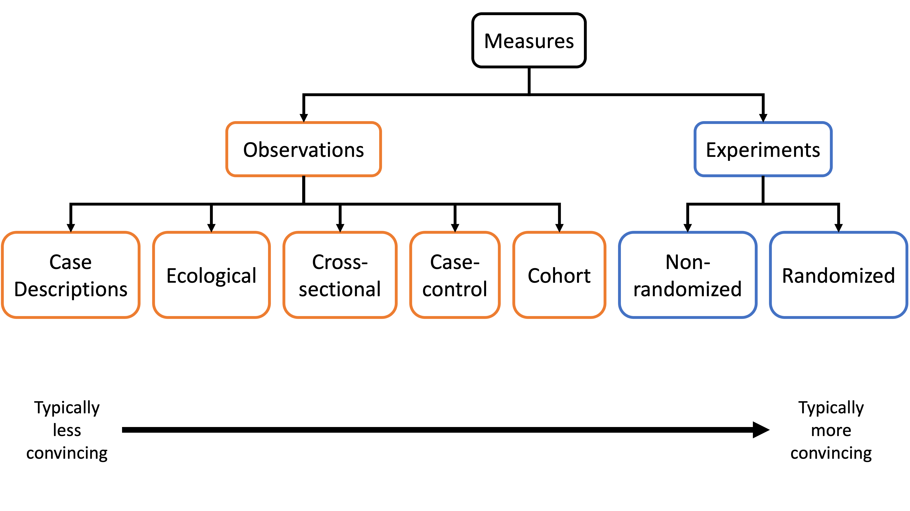
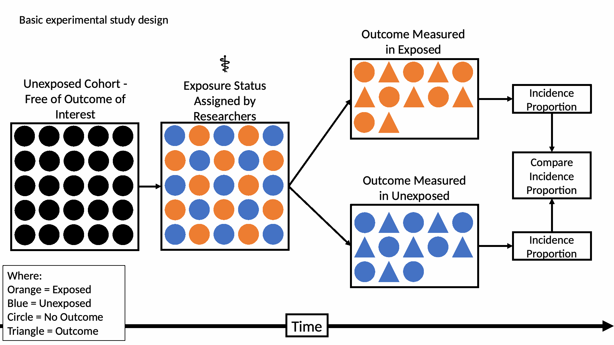
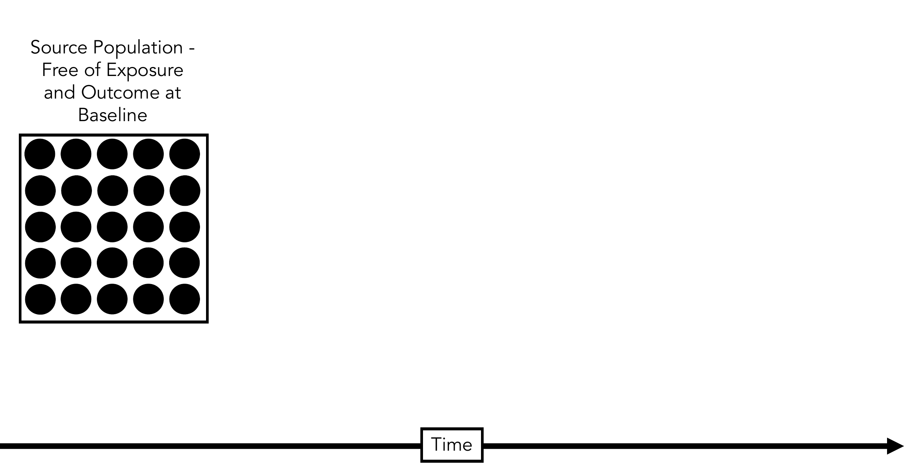
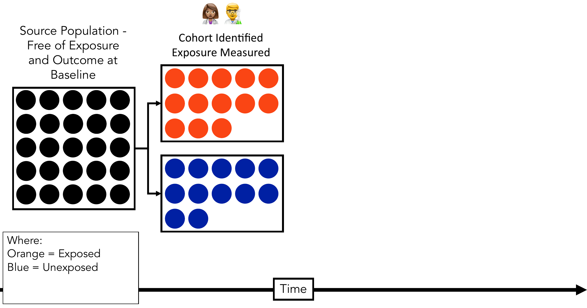
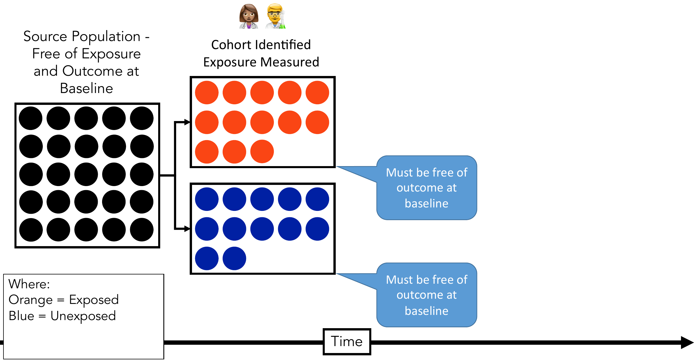
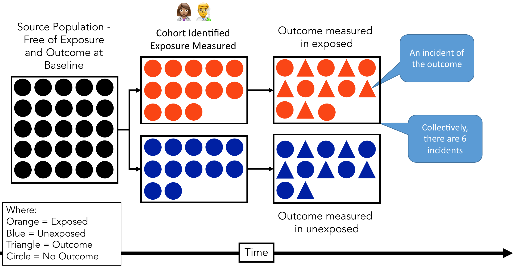
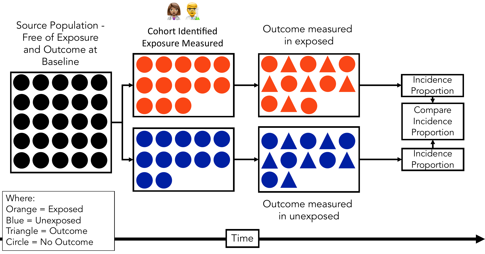
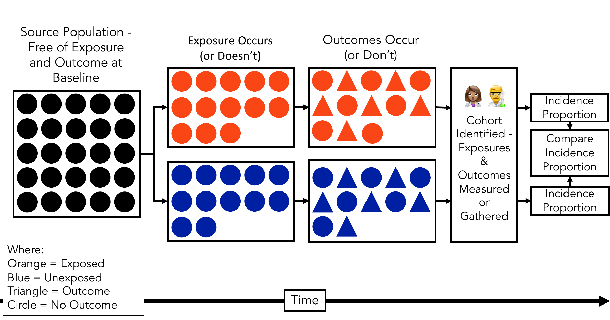

## Review: Association vs Causality

What is an **association**?

::: {.fragment}
- The distribution of an outcome differs across levels of an exposure.

    - For example, the outcome may be more common in one group than another.

- Knowing something about **X** helps us predict something about **Y**.
:::

::: {.notes}
Answer in a fragment.
:::

## Review: Association vs Causality

What distinguishes an **association** from a **causal relationship**?

::: {.fragment}
- **Counterfactual definition:** The outcome would differ for the same person if their exposure had been different.

- **Intervention definition:** Intervening to change the exposure would change the outcome or its probability. Said another way, X is a cause of Y if we can change Y by manipulating X.

- **Helpful question**: If I changed X and held everything else constant, would I expect Y to change?
:::

::: {.notes}
- Answer in a fragment.\
- Association compares people with different exposures; causation asks what would happen to the same people under different exposures.
:::

## Review: Deterministic vs Probabilistic Causality

What distinguishes **deterministic** causality from **probabilistic** causality?

::: {.fragment}
- **Deterministic:** Exposure **always** produces the outcome.

- **Probabilistic:** Exposure **increases the likelihood** of the outcome.
:::

## Two Categories of Analytic Studies

:::: {.columns}
::: {.column width="50%"}
**Observational design**

- Investigator **does not assign exposure**
- Observes existing differences in exposure and outcome
- Examples include cross-sectional, cohort, and case-control studies
:::
::: {.column width="50%"}
**Experimental design**

- Investigator **assigns exposure or intervention**
- Often uses **randomization**
- Examples include randomized controlled trials (RCTs)
:::
::::

## Hierarchy of Study Designs

{fig-alt="Diagram grouping study designs into observational and experimental approaches. From left to right: case descriptions, ecological, cross-sectional, case-control, and cohort studies are observational; nonrandomized and randomized studies are experimental. An arrow indicates that evidence typically becomes more convincing from left to right."}

::: {.notes}
- Here is a review of our study design hierarchy.
:::

## Basic Experimental Study Design

{fig-alt="Researchers assign exposure to an initially unexposed group of participants, observe outcomes in exposed and unexposed groups, and compare incidence proportions." .nostretch width="1000" height="500" style="object-fit:contain;"}

::: {.notes}
- We’ve already talked about experimental studies where we start with a group of people who have not yet been exposed to our primary exposure of interest and who have not yet experienced our outcome of interest.

- For example, if our outcome of interest was the flu and our exposure of interest was the flu vaccine, then our initial study group would include only people who had not yet received the flu vaccine (probably within some window of time) and who didn’t have the flu (probably within some window of time).

- The researchers would then choose who gets the flu vaccine and who doesn’t, ideally at **random**. The study participants do **NOT** choose their own exposure value. 

- We then follow these participants for some meaningful period of time, and then we compare the occurrence of the outcome – in this case the flu – between our exposure groups – in this case, those who did and did not get vaccinated.

Where:\
Orange = Exposed to vaccine\
Blue = Unexposed to vaccine\
Circle = No Flu\
Triangle = Flu
:::

## RCT: Randomization {.compact}

**Randomization** assigns participants to treatment groups using a chance process.

**Why randomization matters**

- Breaks the link between **baseline causes of the outcome** and **treatment assignment**.

- Protects against confounding by **measured and unmeasured factors**, without needing to identify them all.

- Produces **exchangeable groups on average**: groups expected to have the same outcome risk if given the same treatment.

**Take-home message**\
Randomization protects against **confounding on average**. Chance differences between groups can still occur in a particular trial.

::: {.notes}
- And what is randomization?

- Pearl describes randomization as replacing the usual causes of treatment with a chance mechanism, breaking the links responsible for confounding. The random device can affect the outcome through treatment; it should have no separate path to the outcome. Source: Judea Pearl, "The Art and Science of Cause and Effect," slide 46: https://bayes.cs.ucla.edu/LECTURE/TEXT/lec1_text.htm

- Hernán and Robins emphasize exchangeability in Chapter 2 and discuss chance imbalance in Chapter 10 of Causal Inference: What If: https://www.hsph.harvard.edu/miguel-hernan/wp-content/uploads/sites/1268/2024/04/hernanrobins_WhatIf_26apr24.pdf

- The slide describes simple random assignment with a common assignment probability. 

- Randomization probabilities that differ across baseline strata require accounting for those strata. 

- Randomization applies directly to assigned treatment; treatment actually received may also depend on adherence. 

- Randomization does not by itself prevent bias from loss to follow-up or outcome measurement.
:::

## Practice: Baseline Group Comparability {.compact}

Participants were randomly assigned to aspirin (**8,517**) or placebo (**8,514**).

| Baseline characteristic | Aspirin, n | Placebo, n | Ratio* |
|---|---:|---:|---:|
| Past cigarette smoking | 3,321 | 3,320 | 1.00 |
| Current cigarette smoking | 847 | 841 | 1.01 |
| Diabetes mellitus | 196 | 195 | 1.01 |

*Ratio of the proportion with the characteristic in the aspirin group to the proportion in the placebo group; labeled RR in the source table.*

1. What does a ratio close to **1** tell us about a baseline characteristic?
2. Do these rows describe treatment outcomes or participants **before treatment**?
3. Do similar proportions for these three characteristics establish that the groups are identical in every way?



::: {.notes}
- Group exercise. Answers are on the next slide.
:::

## Interpreting the Baseline Table {.compact}

1. Ratios close to **1** indicate similar proportions with these **measured baseline characteristics**.\
2. These rows contain baseline comparisons, so they describe participants **before treatment**.\
3. Similarity in these measured characteristics does **not** establish similarity in every measured or unmeasured characteristic.
    - Randomization supports comparability **on average**; chance differences can remain in a particular trial.

## Internal and External Validity

- **Internal validity:** Does the study provide an unbiased estimate of the association *among the people studied*?
    - Comparable groups at baseline, like the aspirin and placebo groups we just examined, support internal validity.

- **External validity:** Do the findings apply to people *outside the study*?
    - This depends on who enrolled. Would the aspirin results hold for people who differ from the trial participants in age, sex, or health?

::: {.notes}
- The baseline table answered a question about what happened *inside* the trial: were the aspirin and placebo groups comparable? That's a question about internal validity, meaning whether the trial gives an unbiased answer for the people in it.

- A separate question is whether that answer carries over to the people we actually want to treat. That's external validity. Randomization doesn't help with this one, because it depends on who enrolled in the trial, not on how they were assigned to groups.

- Keep these two questions in mind on the next slide. RCTs tend to be strong on the first and weaker on the second.
:::

## RCTs: Strengths & Limitations

::::: {.columns}

:::: {.column width="50%"}

**Strengths**

- Randomization improves **group comparability**

- Strong **internal validity**

- Typically provides strongest evidence for the **causal effects** of interventions

::::

:::: {.column width="50%"}

**Limitations**

- Often **expensive** and time-consuming

- May have **limited generalizability** to real-world populations

- Not always **ethical or feasible**

::::

:::::

::: {.notes}
Next, we'll discuss cohort studies.
:::

## What Is a Cohort?

A **cohort** is an identified group of people whose membership is defined by a shared characteristic or event.

- **Example:** Everyone who graduated from TCU in 2026.

- We can identify **who belongs to the group**.

- In epidemiology, we often follow a cohort over time to observe health outcomes.

- **Key difference between a population and a cohort**: Every member of the cohort is enumerated (i.e., known or listed). That is not necessarily true of a population.

::: {.notes}
- Think of a cohort as a group with a membership rule and a list of people who meet it. The shared event might be graduation, birth during a particular year, or enrollment in a study. Members do not need to know one another or live in the same place.

- The graduating class of 2026 is a useful example. Moving away does not change the fact that someone belongs to that graduating class. Similarly, someone who stops responding to a study remains a member of the original enrollment cohort, even though we are no longer observing their outcomes.

- A cohort is often the study sample drawn from a larger population. The word describes the group; it does not, by itself, specify the study design. We can follow a cohort in an observational study or a randomized trial. A cohort can also include both exposed and unexposed people.

Source: measures_of_occurrence.pptx, slide 27 and speaker notes; slide cites Lash TL, VanderWeele TJ, Haneuse S, Rothman KJ. Modern Epidemiology. 4th ed. Wolters Kluwer; 2021.
:::

## Closed and Open Cohorts {visibility="hidden"}

:::: {.columns}
::: {.column width="50%"}
**Closed cohort**

- No new members after enrollment ends.

- The number still being followed may decrease.

- Example: TCU's graduating class of 2026.
:::
::: {.column width="50%"}
**Open cohort**

- New members may enter over time.

- The number being followed may increase or decrease.

- Example: Patients at a clinic, with new patients joining as others leave.
:::
::::

::: {.notes}
- The key distinction is whether new people can enter the group over time. In a closed cohort, enrollment ends and no new members are added. People may die, withdraw, or be lost to follow-up, so fewer people remain under observation. That does not erase their membership in the original cohort.

- In an open cohort, people can enter as they meet the membership criteria and leave as they no longer meet them or are no longer followed. For example, we could study a clinic's patients over several years, adding people when they become patients and ending their follow-up when they leave the practice.

- Terminology varies across textbooks. Modern Epidemiology uses a strict definition in which cohort membership is permanent. Epidemiology by Design also discusses open and closed cohorts. Here, we use the broader terminology and specify whether new members can enter. Neither definition requires everyone to begin follow-up on the same calendar date.
:::

## Basic Experimental Study Design

<!-- Source: cohort_studies.pptx, slide 6. -->

{fig-alt="Experimental design: researchers assign exposure to an initially unexposed, outcome-free source population, follow exposed and unexposed groups, measure outcomes, and compare incidence proportions. Orange denotes exposed, blue unexposed, triangles outcomes, and circles no outcome." .nostretch width="1120" height="530" style="object-fit:contain;"}

::: {.notes}
- We’ve already talked about experimental studies where we start with a cohort of people who have not yet been exposed to our primary exposure of interest and who have not yet experienced our outcome of interest.

- For example, if our outcome of interest was the flu and our exposure of interest was the flu vaccine, then our initial source population would only include people who had not yet received the flu vaccine (probably within some window of time) and who didn’t have the flu (probably within some window of time).

- We would then choose who gets the flu vaccine and who doesn’t – ideally at random. The study participants do NOT choose their own exposure value.

- Next, we follow the cohort of people for some meaningful period of time. When enough time has elapsed, we compare the occurrence of the outcome – in this case the flu – between our exposure groups – in this case, those who did and did not get vaccinated.
:::

## Common Prospective Cohort Study Design

{fig-alt="First stage of a prospective cohort study: a source population initially free of the exposure and outcome is shown above a timeline moving from left to right." .nostretch width="1120" height="530" style="object-fit:contain;"}

::: {.notes}
- The basic prospective cohort study design is pretty similar to the experimental design we just discussed, with one major difference.

- Again, there is some source population out in the world. In that source population, some person or force other than us is choosing whether people are exposed to something we are interested in or not.
:::

## Common Prospective Cohort Study Design

{fig-alt="Researchers identify a cohort and measure exposure after exposure occurs outside their control. The source population separates into orange exposed and blue unexposed groups." .nostretch width="1120" height="530" style="object-fit:contain;"}

::: {.notes}
Then, we come along and measure how much exposure each person in the cohort has. For this example, there are only two possible levels of exposure: Exposed and unexposed. The orange dots are exposed people and the blue dots are unexposed people.
:::

## Common Prospective Cohort Study Design

{fig-alt="The exposed and unexposed groups are identified. Callouts emphasize that both groups must be free of the outcome at the beginning of follow-up." .nostretch width="1120" height="530" style="object-fit:contain;"}

::: {.notes}
- Now, our goal is to follow these people over some period of time and figure out if exposed people are more likely to get the outcome or if unexposed people are more likely to get the outcome. 

- That being the case, it wouldn’t make much sense to include people in our cohort who already have the outcome, right? 

- Therefore, each member of our cohort should be free of the outcome of interest at the beginning of follow-up.
:::

## Population at Risk

- All members of the cohort should be **at risk of developing** the outcome of interest.

- Implies that all members should be **free of the outcome** of interest at the outset of follow-up.

::: {.notes}
- Cohorts should consist of people who are at risk of developing the outcome of interest. 

- This implies that all members of the cohort should be free of the outcome of interest (although they may have other diseases or conditions) at the outset of follow-up. 

- The reasoning behind this is that someone cannot typically develop a new disease that they already have. Sometimes this criterion is straightforward. Other times, it can be tricky.
:::

## Common Prospective Cohort Study Design

{fig-alt="During follow-up, some exposed and unexposed participants develop the outcome. Triangles represent incident outcomes; a callout identifies six incident outcomes in the exposed group." .nostretch width="1120" height="530" style="object-fit:contain;"}

::: {.notes}
- Next, we let some time pass and see who develops the outcome and who doesn’t.

- We might also say that each time a person gets the outcome, it is an incident occurrence. In this case, each triangle represents an incident.

- Further, we can count the number of incidents. For example, there are 6 incident outcomes in the exposed group here.
:::

## Common Prospective Cohort Study Design

{fig-alt="Complete prospective cohort design: identify the cohort, measure exposure, follow exposed and unexposed groups for outcomes, calculate each incidence proportion, and compare the two." .nostretch width="1120" height="530" style="object-fit:contain;"}

::: {.notes}
- Finally, after enough time has passed, we will calculate the risk of the outcome in the exposed group, the risk of the outcome in the unexposed group, and compare the two.

- As a side note, we are using the word “risk” here colloquially. More specifically, we will typically calculate the incidence proportion in both groups and then compare them as either a ratio of one another or the difference between one another.

- And that is the basic prospective cohort study design, also sometimes called a concurrent cohort study design.
:::

## Common Retrospective Cohort Study Design

<!-- Source: cohort_studies.pptx, slide 13. -->

{fig-alt="Retrospective cohort design: exposure and outcomes occur before researchers identify the cohort and gather exposure and outcome measurements from records. Incidence proportions are calculated and compared for exposed and unexposed groups." .nostretch width="1120" height="530" style="object-fit:contain;"}

::: {.notes}
- Cohort studies can also have a retrospective, or non-concurrent, design.

- In a retrospective cohort study, the same sequence of events takes place.

- There is some source population out in the world. In that source population, some person or force other than us is choosing whether people are exposed to something we are interested in.

- After some time passes, some people will experience the outcome of interest and some won’t.

- However, we do not identify the cohort members and start ascertaining measures of exposure and outcome until after people have already started experiencing outcomes. Typically, this is done by reviewing records of some sort.

- This is the key distinction between prospective and retrospective cohort studies. In retrospective cohort studies some or all of the outcome incidents have already occurred before we initiate the study. 

- In contrast, we measure exposures at the initiation of _prospective_ cohort studies before any of the participants have experienced the outcome of interest. The 'at risk' period begins _after_ baseline exposure is measured and extends into the future.

- In both cases, the measures of exposure and outcome are collected prospectively. The distinction is in who is doing the measuring. In a prospective cohort study, _we_ measure exposures and outcomes. 

- In a retrospective cohort study, _someone else_ measures the exposures, and typically the outcomes as well. We come along after the fact to gather, match, and analyze those measurements.
:::

## Prospective vs. Retrospective Cohorts {.compact}

- Both follow the same direction:  **Exposure → Outcome**

- Both sample on the **Exposure**

- **Prospective Cohort**

    - **Exposure measured in the present**

    - Outcomes occur in the future

- **Retrospective Cohort**

    - **Exposure and outcome already occurred**

    - Uses existing records

    - Limited by data quality and missing variables

- **Key Difference:** Timing of data collection — not sampling design.

## When to Conduct a Cohort Study {.compact}

- **Exposure is rare:** efficient for studying uncommon exposures

- **Incidence must be measured:** can directly calculate risk and RR

- **Temporal sequence is important:** exposure clearly precedes outcome

- **Multiple outcomes are of interest:** one exposure → several possible diseases

- **Follow-up is feasible:** resources, time, and stable population available

- **Design Logic:** Cohort studies are strongest when you need clear **exposure → outcome** tracking over time.

## The Framingham Heart Study {.compact}

- **Study Design:** Prospective **Cohort Study**

- **What Was Done:**

    - Enrolled **5,209 adults** to study the development of **cardiovascular disease (CVD)**

    - Measured baseline exposures (e.g., blood pressure, cholesterol, smoking)

    - Followed participants over time for **incident CVD**

- **Why This Design Was Appropriate:**

    - Needed to measure **incidence**

    - Required clear **exposure → outcome** sequence

    - Allowed one exposure to be linked to **multiple outcomes**

    - Long-term follow-up was essential

- **Key Lesson:** Cohort studies are powerful for identifying **risk factors over time**.

::: {.notes}
- The original cohort included 5,209 adults. The study's detailed history reports that 5,127 were free of coronary heart disease at baseline. We should not describe all 5,209 participants as disease-free or even as free of all cardiovascular disease.

- Participants with existing cardiovascular disease were also followed because one cardiovascular condition could precede another. For example, someone with coronary heart disease could later experience a stroke.

- For an analysis of first disease occurrence, the population at risk excludes people who already have that particular outcome. Participants do not need to be free of every disease. Distinguish the full enrolled cohort from the participants eligible for a particular incidence analysis.

Sources: [NHLBI study overview](https://www.nhlbi.nih.gov/science/framingham-heart-study-fhs); [Framingham Heart Study: Epidemiological Background](https://www.framinghamheartstudy.org/fhs-about/history/epidemiological-background/).
:::

## Potential Biases in Cohort Studies {.compact}

- **Selection Bias**

    - **Loss to follow-up (attrition):** selective dropout can cause **attrition bias**

    - *Example:* Participants who developed severe illness were less likely to return for follow-up visits → risk may be underestimated.

- **Information Bias**

    - Misclassification of **exposure**

    - *Example:* Smoking status or diet self-reported inaccurately at baseline.

- **Confounding**

    - A third variable related to both exposure and outcome

    - *Example:* Age is associated with higher blood pressure and higher CVD risk.

- **Key Question:** Which bias is most important in a long prospective cohort?

::: {.notes}
- This is sort of a trick question, but I decided to leave it.\
- Any bias is important in any study, regardless of its source.\
- However, two forms of bias that we tend to be relatively more concerned about in a cohort study than some other study designs include:\
    - **Selection bias:** A systematic error caused by differences in who enters or remains in the study.\
    - **Information bias:** A systematic error caused by inaccurate or inconsistent measurement of exposure or outcome.\
    - Why might that be?

- Source reminder from Association and Causality: Confounding is one source of bias when estimating causal effects.
:::

## Comparison Group: General Population {visibility="hidden"}

<!-- Hidden for Fall 2026: The healthy-worker effect requires more detail about comparison-group selection than we plan to cover at the undergraduate level this semester. Moving directly from potential biases to assessing risk keeps the sequence focused. Content and notes are preserved for possible use in a future semester. -->
<!-- Source: cohort_study_design.pptx, slide 29. -->
<!-- REVIEW: Use the original healthy-worker explanation in the notes to apply the selection concept. This is an example-specific comparison, not a universal rule about all employed populations. -->

- Works best where only small percentage of the population would be exposed

- Advantage is availability of data but has led to “healthy worker effect”

- Example: Mortality rates of workers in rubber industry compared to general US population

::: {.aside}
Source: [https://sphweb.bumc.bu.edu/otlt/mph-modules/ep/ep713\_cohortstudies/ep713\_cohortstudies\_print.html](https://sphweb.bumc.bu.edu/otlt/mph-modules/ep/ep713_cohortstudies/ep713_cohortstudies_print.html)
:::

::: {.notes}
Problems:
Some of the general population will have had the exposure (same occupation);
the general population includes people who are unable to work because of illness or disability. Employed workers tend to be healthier than the general population. This is a well-documented phenomenon known as the "healthy worker effect." Rates of disease and death tend to be higher in the general population than in the employed work force because the general population includes many people who are too sick or disabled to work. As a result, even if the exposure was, in fact, associated with higher mortality, the magnitude of association would be underestimated because of the inherently higher mortality rate in the general population (which includes both employed and unemployed workers). Although this is not a problem with all diseases, the general population generally exhibits the greatest departure from the counterfactual ideal, and therefore is less widely used today than in the past.

https://sphweb.bumc.bu.edu/otlt/mph-modules/ep/ep713\_cohortstudies/ep713\_cohortstudies\_print.html
:::

## Assessing Risk in Cohort Studies

- **Risk (Incidence Proportion):** Number of new cases ÷ population at risk

- **Relative Risk (RR):** Risk in exposed ÷ Risk in unexposed

- **Absolute Risk Difference (ARD):** Risk in exposed − Risk in unexposed

- **Key Distinction:**

    - RR shows strength of association

    - ARD shows public health impact

## A Prospective Cohort Study Example {.compact}

- **Research Question:** Is passive tobacco smoke exposure associated with increased respiratory infections in children?

::: {.fragment}
- **Study Design:**

    - Enroll **disease-free children (\<12 years)**

    - Classify by **household smoking exposure**

        - Exposed vs Not exposed
:::

::: {.fragment}
- **Follow forward in time**

    - Measure **incident infections**
:::

::: {.fragment}
- **Potential Confounders:**

    - Air pollution

    - Socioeconomic status

    - Crowded housing

- **Next Step:** Calculate **Risk**, **RR**, and **ARD**
:::

::: {.notes}
- **Research Question:** Why can't we use an RCT to answer this question?\
- **Study Design:** So how might we design a study to answer this research question?\
- **Potential Confounders:** What are some potential confounding factors we should consider?
:::

## Reading a 2×2 Table {.compact}

::: {style="border: 2px solid currentColor; width: fit-content; margin:2em auto 2em;"}
|  | Infection (+) | Infection (–) | Total |
| --- | :---: | :---: | :---: |
| Exposed | A | B | A + B |
| Not Exposed | C | D | C + D |
:::

- **Rows** identify exposure status; **columns** identify infection status.

- Each letter represents a **count of people**. For example, **A** is the number of exposed children who developed an infection.

- **A + B** is the total exposed group; **C + D** is the total unexposed group. 

- These are the denominators for calculating risk in each group.

::: {.notes}
- Before we calculate risk, relative risk, and absolute risk difference, we need to talk about 2x2 tables.\
- They are a really commonly used tool in epidemiology and biostatistics.
:::

## Exercise: Risk (Incidence Proportion) {.compact}

::: {style="border: 2px solid currentColor; width: fit-content; margin:2em auto 2em;"}
|  | Infection (+) | Infection (–) | Total |
| --- | :---: | :---: | :---: |
| Exposed | 100 | 400 | 500 |
| Not Exposed | 30 | 470 | 500 |
:::

**Calculate Risk (Incidence Proportion)**

- Risk in the exposed = A / (A + B)

- Risk in the unexposed = C / (C + D)



::: {.notes}
- Take a moment to do this calculation on your own.
:::

## Interpretation: Risk (Incidence Proportion) {.compact}

- **Risk in the exposed = 100 / 500 = 0.20 = 20%**

    - 20 out of every 100 exposed children developed an infection during follow-up.

- **Risk in the unexposed = 30 / 500 = 0.06 = 6%**

    - 6 out of every 100 unexposed children developed an infection during follow-up.

::: {.notes}
- These findings are interesting, and we could stop here and report them.\
- But it can be handy to summarize them in a single measure, especially if we want to compare these results to other results.\
- We will discuss two options next.
:::

## Exercise: Relative Risk (RR) {.compact}

::: {style="border: 2px solid currentColor; width: fit-content; margin:2em auto 2em;"}
|  | Infection (+) | Infection (–) | Total |
| --- | --- | --- | --- |
| Exposed | 100 | 400 | 500 |
| Not Exposed | 30 | 470 | 500 |
:::

**Calculate Relative Risk (RR)**

- RR = Risk in the exposed ÷ Risk in the unexposed



::: {.notes}
- Take a moment to do this calculation on your own.
:::

## Interpretation: Relative Risk (RR) {.compact}

- **RR = 0.20 ÷ 0.06 ≈ 3.33**

- Exposed children had **about 3.33 times the risk** of infection compared with unexposed children during follow-up.

- Passive smoke exposure was associated with a **substantial increase in risk** during follow-up.

## Exercise: Absolute Risk Difference (ARD) {.compact}

::: {style="border: 2px solid currentColor; width: fit-content; margin:2em auto 2em;"}
|  | Infection (+) | Infection (–) | Total |
| --- | --- | --- | --- |
| Exposed | 100 | 400 | 500 |
| Not Exposed | 30 | 470 | 500 |
:::

**Calculate Absolute Risk Difference (ARD)**

- ARD = Risk in the exposed − Risk in the unexposed



::: {.notes}
- Take a moment to do this calculation on your own.
:::

## Interpretation: Absolute Risk Difference (ARD) {.compact}

- **ARD = 0.20 − 0.06 = 0.14 = 14 percentage points**

- There were **14 more infections per 100 children** in the exposed group than in the unexposed group during follow-up.

- The risk difference describes the **excess burden of disease** associated with passive smoke exposure.

::: {.notes}
- Helps answer the question, "If the association were causal, how many cases of disease could we eliminate?"
:::

## Poll: Interpreting Relative Risk {.compact}

In a cohort study examining **smoking and cardiovascular disease**, the Relative Risk (RR) for smokers compared to non-smokers is **1.50**.  What does this mean?

**A.** Smokers have a 50% lower risk of CVD

**B.** Smokers have a 50% higher risk of CVD

**C.** Smokers and non-smokers have the same risk

**D.** Smoking prevents cardiovascular disease

::: {.notes}
- Correct Answer: B. Smokers have a 50% higher risk of CVD.

- Brief Explanation: RR = 1.50 means smokers have 1.5 times the risk, which equals a 50% increase in risk compared to non-smokers.

- What did we forget to say here?\
    - Compared to non-smokers\
    - Timeframe
:::

## Poll: Interpreting Risk Difference {.compact}

In a cohort study of **smoking and cardiovascular disease (CVD)**, the risks over the same follow-up period are:

- Risk in smokers = **20%;** Risk in non-smokers = **10%**

- Absolute Risk Difference (ARD) = **20% − 10% = 10 percentage points**

What does this ARD mean?

**A.** There were 10 more CVD cases per 100 smokers than per 100 non-smokers during follow-up

**B.** Smoking increases CVD risk by 10 times compared to non-smokers during follow-up

**C.** There was no association between smoking and CVD during follow-up

**D.** 10 out of every 100 cases of CVD were caused by smoking during follow-up

::: {.notes}
- Correct Answer: A. There were 10 more CVD cases per 100 smokers than per 100 non-smokers during follow-up.

- Brief Explanation: The observed CVD risk was 10 percentage points higher in smokers than in non-smokers over the same follow-up period (20% versus 10%). 

- This is an absolute difference in risk, not a relative increase of 10% or a tenfold increase. These results alone do not establish that smoking caused the difference.
:::

## Cohort Studies: Strengths and Limitations {.compact}

:::: {.columns}
::: {.column width="50%"}
**Strengths**

- Directly measure **incidence**

- Establish clear **temporal sequence** (Exposure → Outcome)

- Study **rare exposures** efficiently

- Examine **multiple outcomes** from one exposure
:::

::: {.column width="50%"}
**Limitations**

- **Time-consuming** and costly

- Vulnerable to **loss to follow-up**

- Potential **exposure misclassification**

- Less efficient for **rare diseases**
:::
::::
