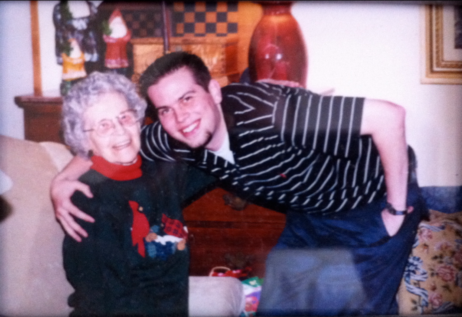

## Example: Objectives

1\. Get acquainted with each other

2\. Become familiar with the syllabus

Mark important dates

Understand the assignments

3\. Be ready to share one conclusion and the evidence behind it.

::: {.notes}
Editable pattern: Objects Duplicate this slide to outline objectives. Adjust the number of objectives, timing, grouping instructions, and visible emphasis for the specific activity. Keep the title descriptive and preserve the reading order: title, then steps.
:::

## Example: Prompt and Outcome Callout

<!-- REVIEW: Slide 2 | Text fields/soft breaks in shape 3: verify formatting and links. -->

<!-- REVIEW: Slide 2 | Text fields/soft breaks in shape 4: verify formatting and links. -->

:::: {.columns}

::: {.column width="67%"}

Prompt Using the study scenario, identify the exposure, outcome, and comparison you would need to estimate an association.

:::

::: {.column width="33%"}

Expected outcome Be ready to name:

A plausible exposure

A plausible outcome

The comparison group

One question your group would need to resolve

:::

::::

::: {.notes}
Editable pattern: Prompt plus expected-outcome callout Duplicate this slide when learners need a focused prompt plus a concise statement of what they should produce. Adapt the prompt, response mode, and sidebar length for the activity. Keep the reading order: title, main prompt, then expected-outcome callout.
:::

## Example: Two-Panel Comparison

<!-- REVIEW: Slide 3 | Text fields/soft breaks in shape 14: verify formatting and links. -->

<!-- REVIEW: Slide 3 | Text fields/soft breaks in shape 16: verify formatting and links. -->

:::: {.columns}

::: {.column width="50%"}

Concept A

Describe the first concept, approach, or option. Add a short implication, strength, or limitation.

:::

::: {.column width="50%"}

Concept B

Describe the second concept, approach, or option. Add a short implication, strength, or limitation.

:::

::::

::: {.notes}
Editable pattern: Two-panel comparison Duplicate this slide when two concepts, approaches, populations, or options need a side-by-side comparison. Replace both headings and all panel text; use meaningful headings rather than relying on the yellow and green rules to convey the distinction. 
Keep the panel backgrounds and top rules decorative. Confirm the reading order is: title, left-panel heading and text, then right-panel heading and text. Use a different structure for dense comparisons or true tabular data.
:::

## Example: Image-Supported Profile or Explanation

:::: {.columns}

::: {.column width="57%"}

Use this space for a concise profile, case description, or explanation. Keep the text focused on the information learners need to understand before or while viewing the image.

:::

::: {.column width="43%"}

<!-- source-004-shape-5.jpg -->
{fig-alt="" .nostretch width="279" style="max-width:100%;height:auto;"}
<!-- REVIEW: source-004-b002 | Inspect image and author contextual alt text or record decorative status. -->

:::

::::

::: {.notes}
Editable pattern: Image-supported profile or explanation Duplicate this slide when an image helps introduce a person, setting, case, or concept. Replace the image and accompanying text together; do not use an image merely to fill space. 
Crop the image to the right-side frame. Add concise alt text when it conveys information not already available in the text; mark it decorative only when the text fully conveys its purpose. Keep the reading order: title, main text, then image.
:::

## Example: Full Screen Image with Hidden Title

<!-- REVIEW: Slide 5 | Image in shape 3 has crop/rotation; extracted original needs visual review. -->

<!-- source-005-shape-3.png -->
{fig-alt="A picture of Brad posing for a picture with his great-grandmother." .nostretch width="611" style="max-width:100%;height:auto;"}

::: {.notes}
Editable pattern: Full-screen Image with Hidden Title Duplicate this slide to display a full-screen image. A title and alt text are required for screen readers.
:::
