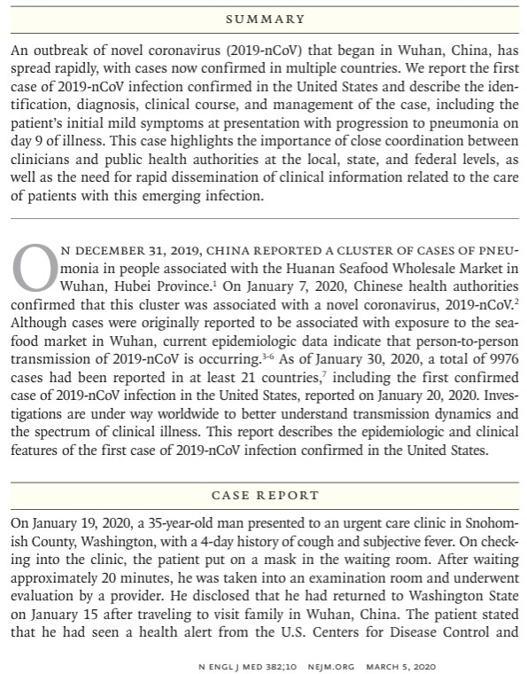

## Case Reports: Example

<!-- REVIEW: Slide 1 | Grouped object 2: verify transformed position and order. -->

<!-- REVIEW: Slide 1 | Text fields/soft breaks in shape 9: verify formatting and links. -->

<!-- REVIEW: Slide 1 | Automatic layout declined: Grouped content uses untransformed child coordinates. Extracted content retained in source drawing order; manually arrange and check for overflow. -->

<!-- source-001-shape-3.png -->
{fig-alt="" .nostretch width="230" style="max-width:100%;height:auto;"}
<!-- REVIEW: source-001-b001 | Inspect image and author contextual alt text or record decorative status. -->

<!-- source-001-shape-4.jpg -->
{fig-alt="" .nostretch width="328" style="max-width:100%;height:auto;"}
<!-- REVIEW: source-001-b002 | Inspect image and author contextual alt text or record decorative status. -->

<!-- source-001-shape-5.png -->
{fig-alt="" .nostretch width="614" style="max-width:100%;height:auto;"}
<!-- REVIEW: source-001-b003 | Inspect image and author contextual alt text or record decorative status. -->

7

[Source: https://www.nejm.org/doi/full/10.1056/nejmoa2001191](<https://www.nejm.org/doi/full/10.1056/nejmoa2001191>)

- **Scan the text and answer:**

    - **How many cases are described in detail?**

        - Where do you see evidence to support this is a *single case*?

    - **Person**

        - What basic characteristics of the patient are provided?

    - **Place**

        - Where did this case occur?

        - Where did the outbreak begin?

    - **Time**

        - When was this case identified relative to the outbreak timeline?

    - **What is being described vs. inferred?**

        - Which parts describe *this patient*?

        - Which parts reference *broader context*?

First case of COVID-19 in USA
